> 
>
> 这份文档不讨论「AI 会不会取代人类」这种无法验证的命题，
> 只回答三个能落地的问题：**AI 实际给了什么 / 什么会被重写 / 我该把力气放在哪。**
>
> 文中图表用 Mermaid 绘制。VS Code 需装 *Markdown Preview Mermaid Support*；GitHub / Typora 原生渲染。
> 标注「示意」的图不含实测数据，只用于表达形状与对比。
>
> 配色统一为浅色系，四种含义固定不变：
> **琥珀**＝判据 / 关键结论　**红**＝危险 / 反例　**绿**＝安全 / 增长　**灰**＝中性过程
>

---

## 0. 三个结论先放前面


1. **AI 平权的是「产出」，不是「判断」。** 它和印刷术同级，不和义务教育同级 —— 印刷术没让任何人变得会写字，它只让复制变便宜。
2. **不是岗位消失，是岗位被重写。** 危险度只看一个指标：你的交付物里，「中等质量的第一版」占多大比例。
3. **判据是唯一能复利的资产。** 你多写一千行代码，AI 明天写一万行；你写下一条判据，AI 之后每次生成都遵守。

第三条是全文的落点，值得先看清它的机制：

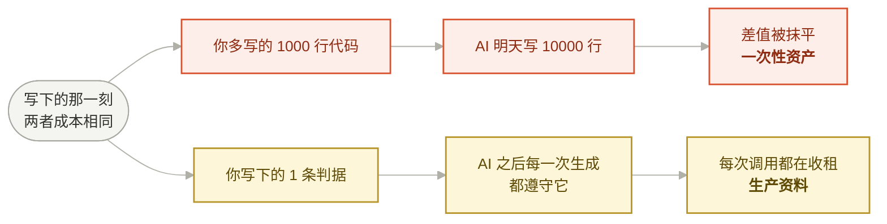
```mermaid
%%{init:{"theme":"base","themeVariables":{"background":"#ffffff","primaryColor":"#f4f4f1","primaryBorderColor":"#a8a8a0","primaryTextColor":"#33332f","secondaryColor":"#fbfbf9","tertiaryColor":"#fbfbf9","lineColor":"#b0b0a8","textColor":"#33332f","edgeLabelBackground":"#ffffff","clusterBkg":"#fafaf8","clusterBorder":"#d4d4cc","fontFamily":"-apple-system,Segoe UI,Microsoft YaHei,sans-serif","fontSize":"14px"}}}%%
flowchart LR
    S([写下的那一刻<br/>两者成本相同])

    S --> A1["你多写的 1000 行代码"]
    A1 --> A2["AI 明天写 10000 行"]
    A2 --> A3["差值被抹平<br/><b>一次性资产</b>"]

    S --> B1["你写下的 1 条判据"]
    B1 --> B2["AI 之后每一次生成<br/>都遵守它"]
    B2 --> B3["每次调用都在收租<br/><b>生产资料</b>"]

    classDef bad fill:#fdeeea,stroke:#d9522f,color:#8f2c12,stroke-width:1.5px
    classDef acc fill:#fdf6d9,stroke:#b8952a,color:#5f4a06,stroke-width:1.5px
    classDef base fill:#f4f4f1,stroke:#a8a8a0,color:#33332f
    class A1,A2,A3 bad
    class B1,B2,B3 acc
    class S base
```

*两条路在起点几乎重合 —— 差别不在**写的时候**，在**写完之后**。*

---

## 1. 平权阶梯：这件事在历史上分四级发生过

一个常见的直觉是把历史压成三级：**道理平权 → 文字平权 → 计算机语言平权**。

方向对，但中间那级被压扁了。「文字平权」实际是**四件互不相同的事**，跨度两千年：

| 平权的对象 | 代表事件 | 结果 | 没有解决的事 |
|---|---|---|---|
| **载体成本** | 竹简 → 纸 | 抄得起 | 仍然只有少数人会写 |
| **复制成本** | 毕昇（约 1040）/ 谷登堡（约 1450） | 传得开 | 仍然只有少数人会读 |
| **读写能力** | 义务教育，19–20 世纪 | 人人会写 | 发布仍需许可 |
| **发布许可** | 互联网 / 社交媒体 | 不经许可即可公开 | 没有解决可信度 |

这一刀很重要，因为它决定 AI 落在哪一级：

> **AI 降低的是产出成本，不是判断成本。它在「复制成本」那一级，不在「读写能力」那一级。**


```text
解释权  →  复制  →  读写  →  发布  →  形式化
（春秋）  （印刷）  （教育）  （互联网）  （AI）
```

把这条链画开，能看到每一级**拆掉了什么、又留下了什么**：

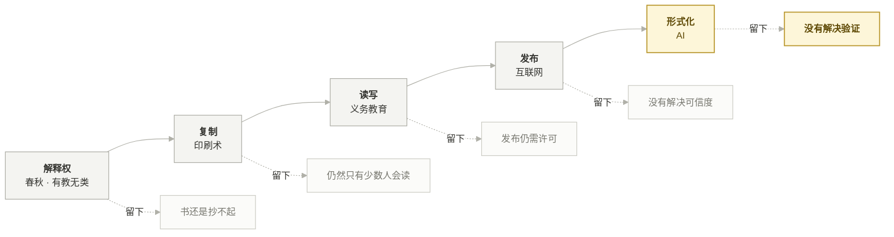
```mermaid
%%{init:{"theme":"base","themeVariables":{"background":"#ffffff","primaryColor":"#f4f4f1","primaryBorderColor":"#a8a8a0","primaryTextColor":"#33332f","secondaryColor":"#fbfbf9","tertiaryColor":"#fbfbf9","lineColor":"#b0b0a8","textColor":"#33332f","edgeLabelBackground":"#ffffff","clusterBkg":"#fafaf8","clusterBorder":"#d4d4cc","fontFamily":"-apple-system,Segoe UI,Microsoft YaHei,sans-serif","fontSize":"14px"}}}%%
flowchart LR
    L1["<b>解释权</b><br/>春秋 · 有教无类"] --> L2["<b>复制</b><br/>印刷术"] --> L3["<b>读写</b><br/>义务教育"] --> L4["<b>发布</b><br/>互联网"] --> L5["<b>形式化</b><br/>AI"]

    L1 -.留下.-> R1["书还是抄不起"]
    L2 -.留下.-> R2["仍然只有少数人会读"]
    L3 -.留下.-> R3["发布仍需许可"]
    L4 -.留下.-> R4["没有解决可信度"]
    L5 -.留下.-> R5["<b>没有解决验证</b>"]

    classDef acc fill:#fdf6d9,stroke:#b8952a,color:#5f4a06,stroke-width:1.5px
    classDef base fill:#f4f4f1,stroke:#a8a8a0,color:#33332f
    classDef gap fill:#fbfbf9,stroke:#c9c9c1,color:#77776f
    class L1,L2,L3,L4 base
    class L5 acc
    class R1,R2,R3,R4 gap
    class R5 acc
```

*每一级都只解决了「产出/流通」一侧，从没有一级解决过「判断」一侧。AI 是这条链上的第五级，不是例外。*

### 1.2 平权的对象从来不是「能力」，是「许可」

四级里没有任何一级是靠赋予能力完成的，全部是**拆掉一个门卫**：

- 印刷术没让人会写作，它让「不经许可就复制」成为可能。
- 社交媒体没让人会表达，它让「不经许可就发布」成为可能。
- **AI 没让人会做系统，它让「不经许可就产出代码」成为可能。**

许可崩了，能力没跟上 —— 这就是「人人挥舞 AI 大棒、肆意挥动」的准确机制。

一张图说清「门卫」和「门槛」的区别：

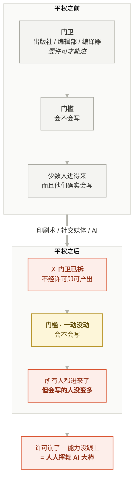
```mermaid
%%{init:{"theme":"base","themeVariables":{"background":"#ffffff","primaryColor":"#f4f4f1","primaryBorderColor":"#a8a8a0","primaryTextColor":"#33332f","secondaryColor":"#fbfbf9","tertiaryColor":"#fbfbf9","lineColor":"#b0b0a8","textColor":"#33332f","edgeLabelBackground":"#ffffff","clusterBkg":"#fafaf8","clusterBorder":"#d4d4cc","fontFamily":"-apple-system,Segoe UI,Microsoft YaHei,sans-serif","fontSize":"14px"}}}%%
flowchart TB
    subgraph BEFORE["平权之前"]
        direction TB
        G1["<b>门卫</b><br/>出版社 / 编辑部 / 编译器<br/><i>要许可才能进</i>"]
        T1["<b>门槛</b><br/>会不会写"]
        O1["少数人进得来<br/>而且他们确实会写"]
        G1 --> T1 --> O1
    end

    subgraph AFTER["平权之后"]
        direction TB
        G2["✗ <b>门卫已拆</b><br/>不经许可即可产出"]
        T2["<b>门槛 · 一动没动</b><br/>会不会写"]
        O2["所有人都进来了<br/><b>但会写的人没变多</b>"]
        G2 --> T2 --> O2
    end

    BEFORE ==>|"印刷术 / 社交媒体 / AI"| AFTER
    O2 --> X["许可崩了 + 能力没跟上<br/>= <b>人人挥舞 AI 大棒</b>"]

    classDef acc fill:#fdf6d9,stroke:#b8952a,color:#5f4a06,stroke-width:1.5px
    classDef bad fill:#fdeeea,stroke:#d9522f,color:#8f2c12,stroke-width:1.5px
    classDef base fill:#f4f4f1,stroke:#a8a8a0,color:#33332f
    class G1,T1,O1 base
    class G2 bad
    class T2 acc
    class O2,X bad
```

*拆门卫改变的是「谁能进来」，不是「进来的人会什么」。*

---

## 2. 这次真正的新东西：不对称

历史上读和写是**同步**长起来的。学校同时教你读和写，两条能力一起爬。

这一次，**只有「写」跳跃式抬高，「读」（验证、证伪）一点没动。**

> **相当于人人分到一台印刷机，但没人学过认字。**

这是本文的核心论点。它有一个直接推论：**AI 时代的瓶颈从表达迁移到了验证。**

前几波编程平权（BASIC 1964、SQL、Excel、no-code）降低的是「把**已经想清楚的**意图翻译成形式语言」的成本。
AI 降低的是**形式化本身**的成本 —— 你不需要先想清楚。

| | 前几波平权 | AI |
|---|---|---|
| 降低了什么 | 表达成本 | 形式化成本 |
| 是否强迫你结构化 | **强迫**（Excel 逼你把想法拆成单元格） | **不强迫** |
| 失败产物的形态 | 烂，但**明显烂**、可读 | **看起来对**、貌似合理 |
| 瓶颈落在 | 表达 | **验证** |

「明显烂」和「看起来对」之间的差别，就是整个问题的所在。

两条曲线的斜率不一样，这是全文唯一需要记住的形状：

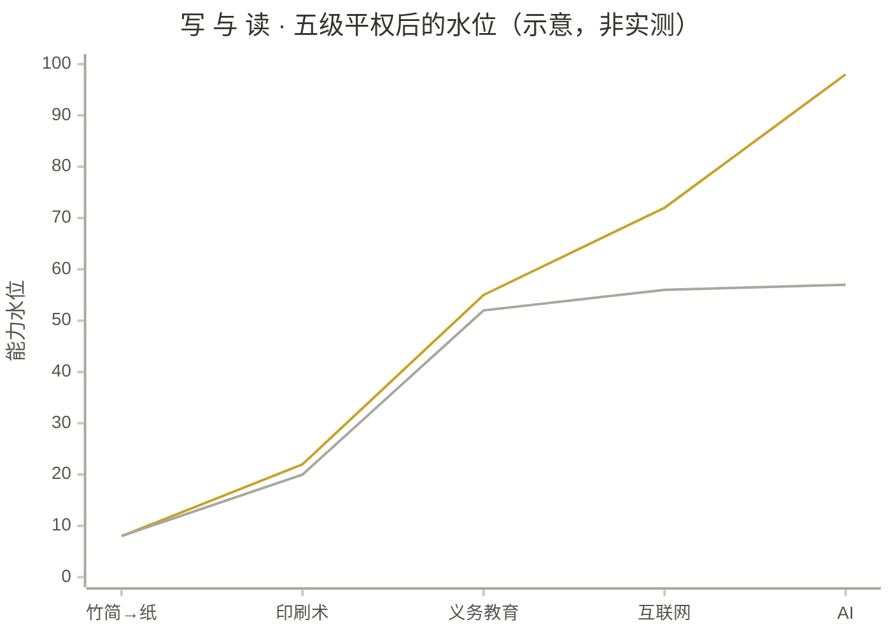
```mermaid
%%{init:{"theme":"base","themeVariables":{"background":"#ffffff","fontFamily":"-apple-system,Segoe UI,Microsoft YaHei,sans-serif","fontSize":"14px","xyChart":{"backgroundColor":"#ffffff","titleColor":"#33332f","xAxisLabelColor":"#55554f","xAxisTitleColor":"#55554f","xAxisTickColor":"#c9c9c1","xAxisLineColor":"#a8a8a0","yAxisLabelColor":"#55554f","yAxisTitleColor":"#55554f","yAxisTickColor":"#c9c9c1","yAxisLineColor":"#a8a8a0","plotColorPalette":"#c9a227,#a8a8a0"}}}}%%
xychart-beta
    title "写 与 读 · 五级平权后的水位（示意，非实测）"
    x-axis ["竹简→纸", "印刷术", "义务教育", "互联网", "AI"]
    y-axis "能力水位" 0 --> 100
    line [8, 22, 55, 72, 98]
    line [8, 20, 52, 56, 57]
```

*上面那条陡然拉起的是**写（产出）**，下面那条几乎压平的是**读（验证、证伪）**。
前四级两条线是并行上升的，第五级第一次分叉 —— 缺口就是这一轮所有麻烦的来源。*

### 2.1 平权的第一产物是洪水，不是启蒙

印刷术早期的畅销书里既有哥白尼，也有《女巫之锤》（1487）。放大的是**音量**，不是质量。

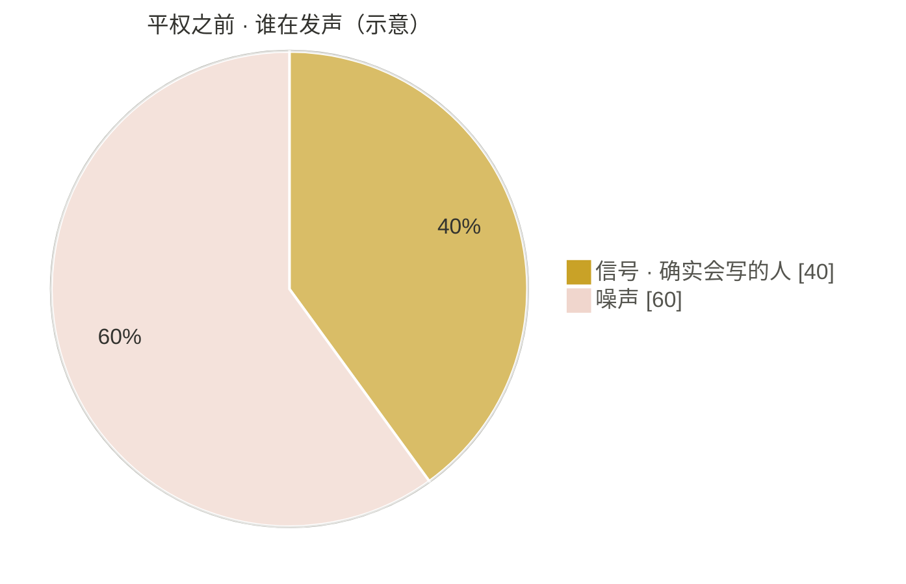
```mermaid
%%{init:{"theme":"base","themeVariables":{"background":"#ffffff","pie1":"#c9a227","pie2":"#f0d6cd","pie3":"#e6e6e0","pieOuterStrokeColor":"#a8a8a0","pieOuterStrokeWidth":"1.5px","pieStrokeColor":"#ffffff","pieStrokeWidth":"2px","pieTitleTextColor":"#33332f","pieTitleTextSize":"17px","pieSectionTextColor":"#33332f","pieLegendTextColor":"#55554f","fontFamily":"-apple-system,Segoe UI,Microsoft YaHei,sans-serif","fontSize":"14px"}}}%%
pie showData
    title 平权之前 · 谁在发声（示意）
    "信号 · 确实会写的人" : 40
    "噪声" : 60
```

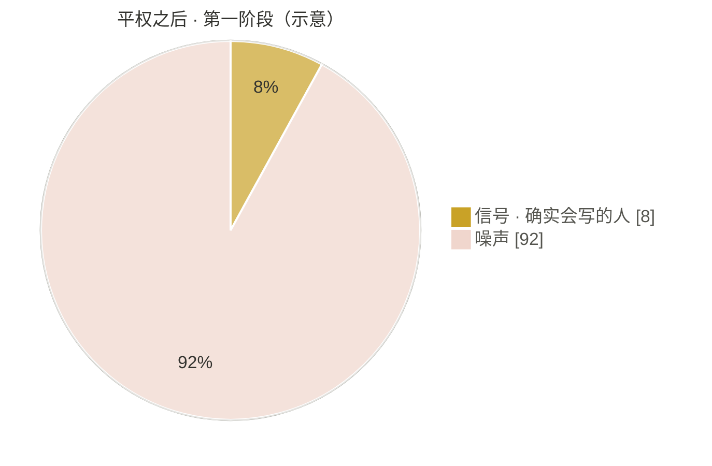
```mermaid
%%{init:{"theme":"base","themeVariables":{"background":"#ffffff","pie1":"#c9a227","pie2":"#f0d6cd","pie3":"#e6e6e0","pieOuterStrokeColor":"#a8a8a0","pieOuterStrokeWidth":"1.5px","pieStrokeColor":"#ffffff","pieStrokeWidth":"2px","pieTitleTextColor":"#33332f","pieTitleTextSize":"17px","pieSectionTextColor":"#33332f","pieLegendTextColor":"#55554f","fontFamily":"-apple-system,Segoe UI,Microsoft YaHei,sans-serif","fontSize":"14px"}}}%%
pie showData
    title 平权之后 · 第一阶段（示意）
    "信号 · 确实会写的人" : 8
    "噪声" : 92
```

*会写的人**绝对数量没有减少**，甚至还多了一点 —— 但分母炸了十倍。
这就是「洪水」的准确含义：不是质量下降，是**信噪比崩塌**。*

真正解决问题的东西全部是**后补的制度**：编辑、引注规范、版权法（安妮法令 1710）、学术期刊与同行评议。

由此得到一个可检验的预测：

> **AI 时代缺的不是更强的模型，是缺「引注规范」和「同行评议」的等价物。**

落到本项目非常具体：

| 历史上的制度 | 本项目的等价物 |
|---|---|
| 引注规范（判据成文、可追溯） | `AGENTS.md` —— 判据一旦写下，AI 每次生成都遵守 |
| 同行评议（可复现的证伪程序） | `Tools\StartTest_*.bat` + 独立客户端验证 |
| 编辑（决定什么不发） | 人做减法：「武器不做耐久」这类判决 |

---

## 3. 岗位：会被重写，不会被删除

必须分两层说，混着说必错。

### 3.1 任务级 ≠ 岗位级

岗位是**任务的捆绑包**。AI 替代任务，然后捆绑包**重新打包**。新包可能人更少，也可能更多 —— 决定方向的是**需求弹性**：产出变便宜后需求暴涨的行业，岗位反增；不涨的，减。

### 3.2 四个案例

| 案例 | 数据 | 真正的教训 |
|---|---|---|
| **ATM 与银行柜员** | ATM 从 1970 年代初约 0 → 1990 约 10 万 → 2010 约 40 万；同期美国柜员从约 50 万（1980）**升到约 55 万**（2010）。但城市单个分行的柜员从约 21 人降到约 13 人，靠**分行数 +43%** 撑住了总量 | **替代与增长可以先后发生。** 2010 年后随数字银行普及，柜员确实开始下降 —— **短期结论会骗人** |
| **手工织工 vs 纺织业** | 织工工种毁灭，产业工人暴增 | 个体毁灭与总量增长**同时成立**，不矛盾 |
| **电话接线员** | 1920 年代接线员约占年轻白人本土女性劳动力 4%；自动拨号使 16–25 岁在位接线员岗位**下降 50–80%**；在位者更多退出劳动力市场或转入其他低薪服务业，新进入者转向文秘、零售 | **工种可以真的归零**，而且**在位者与新进入者承受的方式不同** |
| **铅字排字工** | 桌面出版摧毁整个工种 | 和当下最像：**工具让下游直接做了上游的活** |

第一个案例值得画出来，因为它是**最容易被引错的那一个**：

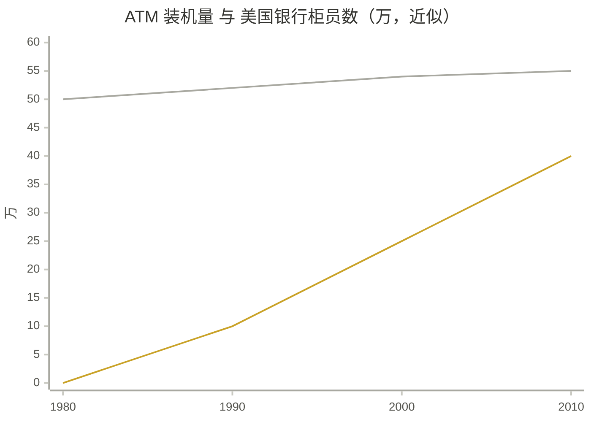
```mermaid
%%{init:{"theme":"base","themeVariables":{"background":"#ffffff","fontFamily":"-apple-system,Segoe UI,Microsoft YaHei,sans-serif","fontSize":"14px","xyChart":{"backgroundColor":"#ffffff","titleColor":"#33332f","xAxisLabelColor":"#55554f","xAxisTitleColor":"#55554f","xAxisTickColor":"#c9c9c1","xAxisLineColor":"#a8a8a0","yAxisLabelColor":"#55554f","yAxisTitleColor":"#55554f","yAxisTickColor":"#c9c9c1","yAxisLineColor":"#a8a8a0","plotColorPalette":"#c9a227,#a8a8a0"}}}}%%
xychart-beta
    title "ATM 装机量 与 美国银行柜员数（万，近似）"
    x-axis ["1980", "1990", "2000", "2010"]
    y-axis "万" 0 --> 60
    line [0, 10, 25, 40]
    line [50, 52, 54, 55]
```

*上升的那条是 **ATM 装机量**（0 → 40 万），几乎水平的那条是**柜员总数**（50 万 → 55 万）。*

但总数骗人 —— 拆开看是两个相反的力：

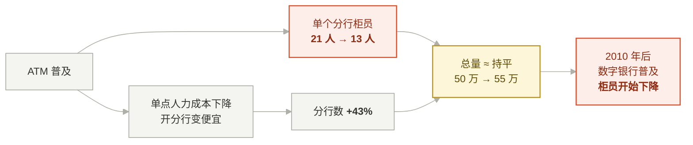
```mermaid
%%{init:{"theme":"base","themeVariables":{"background":"#ffffff","primaryColor":"#f4f4f1","primaryBorderColor":"#a8a8a0","primaryTextColor":"#33332f","secondaryColor":"#fbfbf9","tertiaryColor":"#fbfbf9","lineColor":"#b0b0a8","textColor":"#33332f","edgeLabelBackground":"#ffffff","clusterBkg":"#fafaf8","clusterBorder":"#d4d4cc","fontFamily":"-apple-system,Segoe UI,Microsoft YaHei,sans-serif","fontSize":"14px"}}}%%
flowchart LR
    A["ATM 普及"] --> B["单个分行柜员<br/><b>21 人 → 13 人</b>"]
    A --> C["单点人力成本下降<br/>开分行变便宜"]
    C --> D["分行数 <b>+43%</b>"]
    B --> E["总量 ≈ 持平<br/>50 万 → 55 万"]
    D --> E
    E --> F["2010 年后<br/>数字银行普及<br/><b>柜员开始下降</b>"]

    classDef bad fill:#fdeeea,stroke:#d9522f,color:#8f2c12,stroke-width:1.5px
    classDef acc fill:#fdf6d9,stroke:#b8952a,color:#5f4a06,stroke-width:1.5px
    classDef base fill:#f4f4f1,stroke:#a8a8a0,color:#33332f
    class A,C,D base
    class B bad
    class E acc
    class F bad
```

*如果 2005 年做这张图，结论会是「ATM 不但没抢走工作，还让柜员变多了」。**再等五年就翻转。**
Bessen 本人强调这不是普适规律。*

四个案例落在两条轴上，没有一个落在同一格：

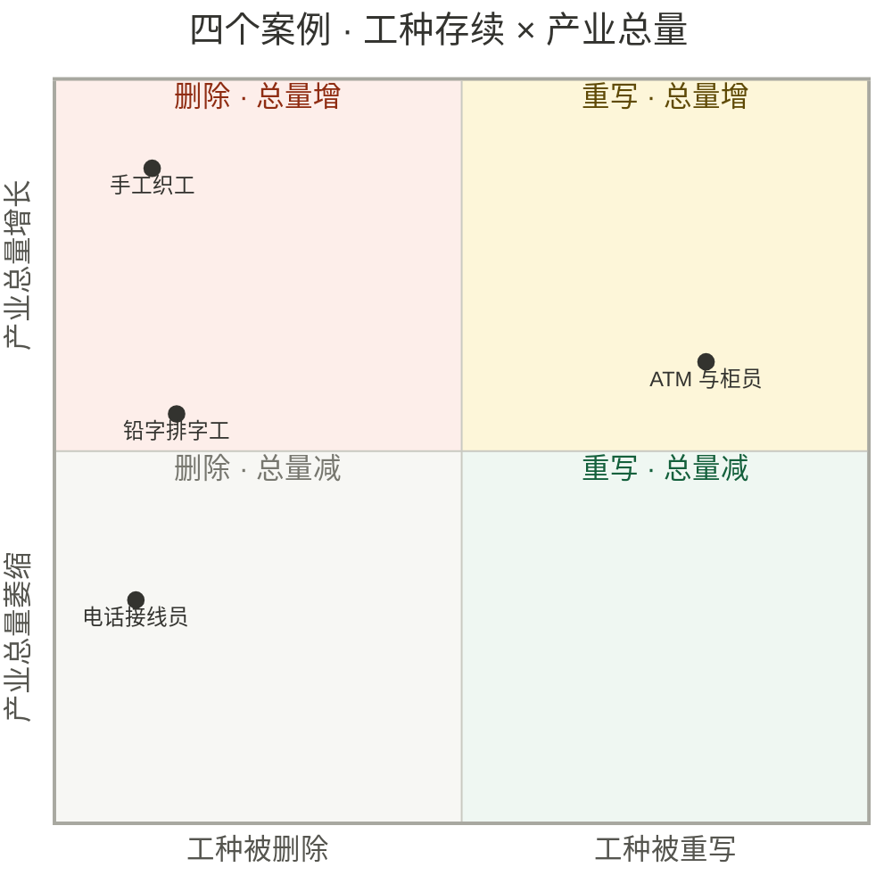
```mermaid
%%{init:{"theme":"base","themeVariables":{"background":"#ffffff","fontFamily":"-apple-system,Segoe UI,Microsoft YaHei,sans-serif","fontSize":"14px","quadrant1Fill":"#fdf6d9","quadrant2Fill":"#fdeeea","quadrant3Fill":"#f7f7f4","quadrant4Fill":"#eff7f2","quadrant1TextFill":"#5f4a06","quadrant2TextFill":"#8f2c12","quadrant3TextFill":"#77776f","quadrant4TextFill":"#14603c","quadrantPointFill":"#33332f","quadrantPointTextFill":"#33332f","quadrantXAxisTextFill":"#55554f","quadrantYAxisTextFill":"#55554f","quadrantTitleFill":"#33332f","quadrantInternalBorderStrokeFill":"#c9c9c1","quadrantExternalBorderStrokeFill":"#a8a8a0"}}}%%
quadrantChart
    title 四个案例 · 工种存续 × 产业总量
    x-axis "工种被删除" --> "工种被重写"
    y-axis "产业总量萎缩" --> "产业总量增长"
    quadrant-1 "重写 · 总量增"
    quadrant-2 "删除 · 总量增"
    quadrant-3 "删除 · 总量减"
    quadrant-4 "重写 · 总量减"
    "手工织工": [0.12, 0.88]
    "铅字排字工": [0.15, 0.55]
    "电话接线员": [0.10, 0.30]
    "ATM 与柜员": [0.80, 0.62]
```

*所以「历史证明技术不会造成失业」这句话，**对宏观成立，对具体工种完全不成立**。*


### 3.3 三条我认为最硬的规律

**① 被替代的是「可规格化的部分」，不是「难的部分」。**
高薪不等于安全。详见 §4 的莫拉维克悖论。

**② 净岗位数不是问题，转移成本才是。**
长期总量大概不减 —— 历史上没有出现持续性技术失业。但**代价全部由具体的人承担**，且转移窗口常常长于一个人的职业生涯。

> 所以「历史上重演过很多次」这句话，**对宏观是对的，对个人是残忍的**。用它安慰人是耍流氓。

同一件事，两个视角的形状完全不同：

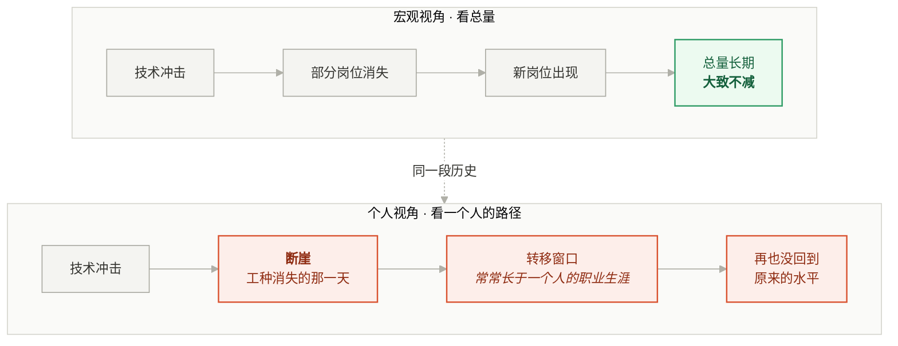
```mermaid
%%{init:{"theme":"base","themeVariables":{"background":"#ffffff","primaryColor":"#f4f4f1","primaryBorderColor":"#a8a8a0","primaryTextColor":"#33332f","secondaryColor":"#fbfbf9","tertiaryColor":"#fbfbf9","lineColor":"#b0b0a8","textColor":"#33332f","edgeLabelBackground":"#ffffff","clusterBkg":"#fafaf8","clusterBorder":"#d4d4cc","fontFamily":"-apple-system,Segoe UI,Microsoft YaHei,sans-serif","fontSize":"14px"}}}%%
flowchart TB
    subgraph MACRO["宏观视角 · 看总量"]
        direction LR
        M1["技术冲击"] --> M2["部分岗位消失"] --> M3["新岗位出现"] --> M4["总量长期<br/><b>大致不减</b>"]
    end

    subgraph MICRO["个人视角 · 看一个人的路径"]
        direction LR
        P1["技术冲击"] --> P2["<b>断崖</b><br/>工种消失的那一天"] --> P3["转移窗口<br/><i>常常长于一个人的职业生涯</i>"] --> P4["再也没回到<br/>原来的水平"]
    end

    MACRO -.->|"同一段历史"| MICRO

    classDef good fill:#ecfaf0,stroke:#2f9c66,color:#14603c,stroke-width:1.5px
    classDef bad fill:#fdeeea,stroke:#d9522f,color:#8f2c12,stroke-width:1.5px
    classDef base fill:#f4f4f1,stroke:#a8a8a0,color:#33332f
    class M1,M2,M3 base
    class M4 good
    class P1 base
    class P2,P3,P4 bad
```

*宏观那条平滑的线，救不了微观那个掉下断崖的人。净岗位数不是问题，**转移成本才是**。*

**③ 新岗位无法被预先命名。**
1990 年没人写得出「SEO 专员」的招聘要求。所以「AI 会创造新岗位」大概率对，但**不可行动** —— 它不能告诉你下周做什么。

---

## 4. 莫拉维克悖论：为什么高薪不等于安全

### 4.1 原始表述

汉斯·莫拉维克（Hans Moravec）在《Mind Children》（Harvard University Press, 1988）中写道：

> **"…it is comparatively easy to make computers exhibit adult-level performance on intelligence tests or playing checkers, and difficult or impossible to give them the skills of a one-year-old when it comes to perception and mobility."**
>
> 让计算机在智力测试或下棋上表现出成人水平相对容易；要给它们一岁幼儿的感知与运动技能，却困难甚至不可能。

莫拉维克本人给的解释是**进化时长**：感知与运动经过数亿年优化、深埋于无意识；抽象推理是很晚才出现的能力，反而容易形式化。

一句话版本：**硬的变软，软的变硬。**

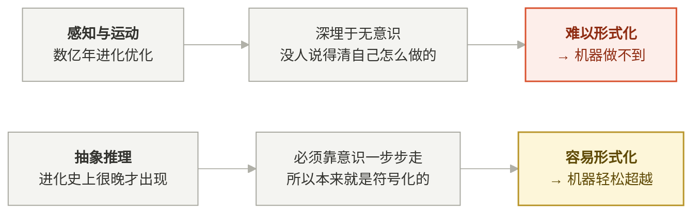
```mermaid
%%{init:{"theme":"base","themeVariables":{"background":"#ffffff","primaryColor":"#f4f4f1","primaryBorderColor":"#a8a8a0","primaryTextColor":"#33332f","secondaryColor":"#fbfbf9","tertiaryColor":"#fbfbf9","lineColor":"#b0b0a8","textColor":"#33332f","edgeLabelBackground":"#ffffff","clusterBkg":"#fafaf8","clusterBorder":"#d4d4cc","fontFamily":"-apple-system,Segoe UI,Microsoft YaHei,sans-serif","fontSize":"14px"}}}%%
flowchart LR
    E1["<b>感知与运动</b><br/>数亿年进化优化"] --> E2["深埋于无意识<br/>没人说得清自己怎么做的"] --> E3["<b>难以形式化</b><br/>→ 机器做不到"]
    F1["<b>抽象推理</b><br/>进化史上很晚才出现"] --> F2["必须靠意识一步步走<br/>所以本来就是符号化的"] --> F3["<b>容易形式化</b><br/>→ 机器轻松超越"]

    classDef bad fill:#fdeeea,stroke:#d9522f,color:#8f2c12,stroke-width:1.5px
    classDef acc fill:#fdf6d9,stroke:#b8952a,color:#5f4a06,stroke-width:1.5px
    classDef base fill:#f4f4f1,stroke:#a8a8a0,color:#33332f
    class E1,E2 base
    class E3 bad
    class F1,F2 base
    class F3 acc
```

*注意因果方向：不是「推理比感知简单」，是**推理本来就已经被人类自己形式化过一遍了**。*

### 4.2 悖论在职场上的两个投射

| | 放射科读片 | 护工 / 养老看护 |
|---|---|---|
| **薪资** | 高（美国 2025 年均约 52.6–57.2 万美元） | 低（传统视角下门槛低、被归为低技能） |
| **为什么高/低薪** | 需要长期医学训练、培养成本高 | 不要求高学历 |
| **自动化难度** | **低** —— 本质是模式识别 + 数据比对，有海量数字化影像可训练，规则高度规格化 | **高** —— 非规格化的物理与情感互动 |
| **难点在哪** | 几乎没有技术难点 | 依体重、骨骼脆弱度、面部表情**实时调整力度**；突发情绪、滑倒风险、含糊表达；眼神安抚与语气 |

**结论：技能的稀缺性正在倒置。** 过去认为「坐办公室动脑」的高薪白领最安全，现在发现它们最容易被规模化自动化；而「动用双手与身体」的工作反而成了壁垒。

把这两个岗位放到「薪资 × 自动化难度」的坐标里，倒置一眼可见：

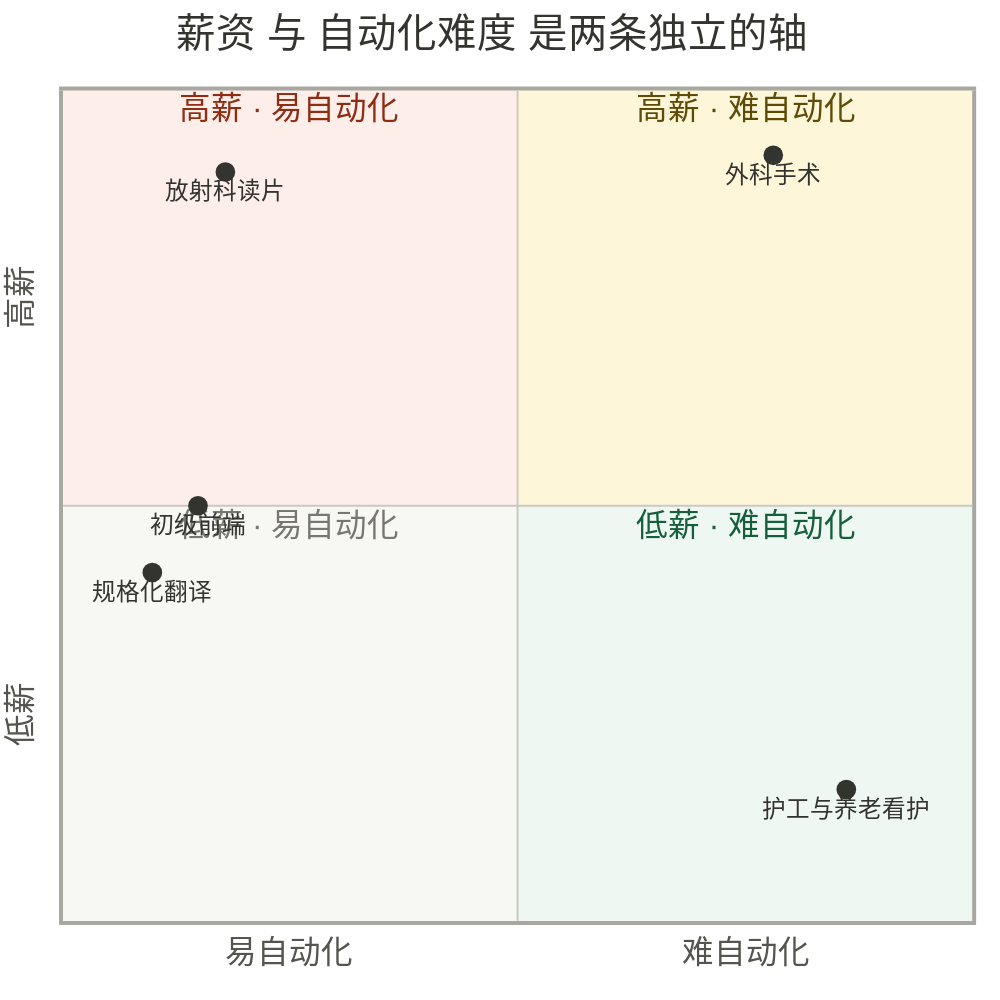
```mermaid
%%{init:{"theme":"base","themeVariables":{"background":"#ffffff","fontFamily":"-apple-system,Segoe UI,Microsoft YaHei,sans-serif","fontSize":"14px","quadrant1Fill":"#fdf6d9","quadrant2Fill":"#fdeeea","quadrant3Fill":"#f7f7f4","quadrant4Fill":"#eff7f2","quadrant1TextFill":"#5f4a06","quadrant2TextFill":"#8f2c12","quadrant3TextFill":"#77776f","quadrant4TextFill":"#14603c","quadrantPointFill":"#33332f","quadrantPointTextFill":"#33332f","quadrantXAxisTextFill":"#55554f","quadrantYAxisTextFill":"#55554f","quadrantTitleFill":"#33332f","quadrantInternalBorderStrokeFill":"#c9c9c1","quadrantExternalBorderStrokeFill":"#a8a8a0"}}}%%
quadrantChart
    title 薪资 与 自动化难度 是两条独立的轴
    x-axis "易自动化" --> "难自动化"
    y-axis "低薪" --> "高薪"
    quadrant-1 "高薪 · 难自动化"
    quadrant-2 "高薪 · 易自动化"
    quadrant-3 "低薪 · 易自动化"
    quadrant-4 "低薪 · 难自动化"
    "放射科读片": [0.18, 0.90]
    "护工与养老看护": [0.86, 0.16]
    "规格化翻译": [0.10, 0.42]
    "初级前端": [0.15, 0.50]
    "外科手术": [0.78, 0.92]
```

*直觉会把「高薪」和「难自动化」当成同一条轴 —— 于是左上角（高薪 · 易自动化）这一格在直觉里不存在。
**它恰恰是最拥挤的一格。***

### 4.3 但这里有一个必须讲的反例 —— 它比悖论本身更重要

2016 年，深度学习先驱 Geoffrey Hinton 公开说：

> **"People should stop training radiologists now. It's just completely obvious that within five years deep learning is going to do better than radiologists."**

**十年后（2026）的实际情况：放射科医生不但没被取代，反而持续短缺。**

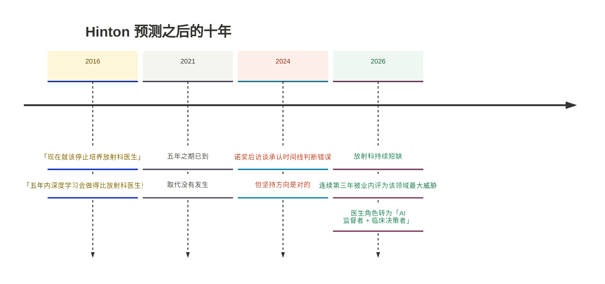
```mermaid
%%{init:{"theme":"base","themeVariables":{"background":"#ffffff","fontFamily":"-apple-system,Segoe UI,Microsoft YaHei,sans-serif","fontSize":"14px","cScale0":"#fdf6d9","cScaleLabel0":"#5f4a06","cScale1":"#f4f4f1","cScaleLabel1":"#33332f","cScale2":"#fdeeea","cScaleLabel2":"#8f2c12","cScale3":"#eff7f2","cScaleLabel3":"#14603c","lineColor":"#b0b0a8","textColor":"#33332f"}}}%%
timeline
    title Hinton 预测之后的十年
    2016 : 「现在就该停止培养放射科医生」 : 「五年内深度学习会做得比放射科医生更好」
    2021 : 五年之期已到 : 取代没有发生
    2024 : 诺奖后访谈承认时间线判断错误 : 但坚持方向是对的
    2026 : 放射科持续短缺 : 连续第三年被业内评为该领域最大威胁 : 医生角色转为「AI 监督者 + 临床决策者」
```

- Hinton 本人在 2024 年获诺贝尔奖后的访谈中承认**时间线判断错误**，但坚持方向是对的。
- 「放射科医生短缺」连续第三年被业内评为放射学领域最大威胁。
- 影像检查量年增 3–4%（人口老龄化），抵消了 AI 带来的效率提升。
- 医生角色转向 **「AI 监督者 + 临床决策者」**，而非单纯的图像解读。

失手的原因有四条，每一条都不是技术问题：

```text
① 临床整合复杂性：要接工作流、法规、责任认定
② 监管与信任门槛：医疗 AI 部署需严格验证，采纳速度慢于能力
③ 需求侧增长抵消了效率提升
④ 责任不可转移：签字的人还是人
```

**这个反例给出本文最硬的一条边界：**

> **「可规格化」决定了 AI 能不能做，「谁承担后果」决定了岗位会不会消失。两者是独立的。**

放射科同时满足「高度可规格化」和「后果极重」—— 所以它被**重写**（读片变成筛查+复核），而不是被删除。

两条轴独立，就一定有四种命运：

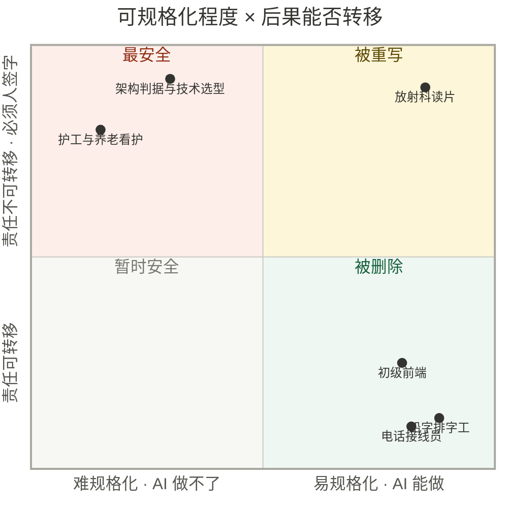
```mermaid
%%{init:{"theme":"base","themeVariables":{"background":"#ffffff","fontFamily":"-apple-system,Segoe UI,Microsoft YaHei,sans-serif","fontSize":"14px","quadrant1Fill":"#fdf6d9","quadrant2Fill":"#fdeeea","quadrant3Fill":"#f7f7f4","quadrant4Fill":"#eff7f2","quadrant1TextFill":"#5f4a06","quadrant2TextFill":"#8f2c12","quadrant3TextFill":"#77776f","quadrant4TextFill":"#14603c","quadrantPointFill":"#33332f","quadrantPointTextFill":"#33332f","quadrantXAxisTextFill":"#55554f","quadrantYAxisTextFill":"#55554f","quadrantTitleFill":"#33332f","quadrantInternalBorderStrokeFill":"#c9c9c1","quadrantExternalBorderStrokeFill":"#a8a8a0"}}}%%
quadrantChart
    title 可规格化程度 × 后果能否转移
    x-axis "难规格化 · AI 做不了" --> "易规格化 · AI 能做"
    y-axis "责任可转移" --> "责任不可转移 · 必须人签字"
    quadrant-1 "被重写"
    quadrant-2 "最安全"
    quadrant-3 "暂时安全"
    quadrant-4 "被删除"
    "放射科读片": [0.85, 0.90]
    "铅字排字工": [0.88, 0.12]
    "电话接线员": [0.82, 0.10]
    "护工与养老看护": [0.15, 0.80]
    "初级前端": [0.80, 0.25]
    "架构判据与技术选型": [0.30, 0.92]
```

***Hinton 只算了横轴，没算纵轴。** 放射科的可规格化程度他没判断错 —— 但「签字的人必须是人」，
于是它从「被删除」那一格向上跳到了「被重写」。*

失手四条原因，逐条挂回这张图：

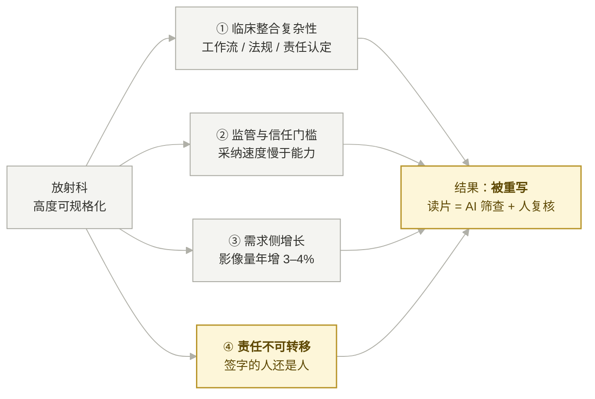
```mermaid
%%{init:{"theme":"base","themeVariables":{"background":"#ffffff","primaryColor":"#f4f4f1","primaryBorderColor":"#a8a8a0","primaryTextColor":"#33332f","secondaryColor":"#fbfbf9","tertiaryColor":"#fbfbf9","lineColor":"#b0b0a8","textColor":"#33332f","edgeLabelBackground":"#ffffff","clusterBkg":"#fafaf8","clusterBorder":"#d4d4cc","fontFamily":"-apple-system,Segoe UI,Microsoft YaHei,sans-serif","fontSize":"14px"}}}%%
flowchart LR
    R["放射科<br/>高度可规格化"] --> C1["① 临床整合复杂性<br/>工作流 / 法规 / 责任认定"]
    R --> C2["② 监管与信任门槛<br/>采纳速度慢于能力"]
    R --> C3["③ 需求侧增长<br/>影像量年增 3–4%"]
    R --> C4["④ <b>责任不可转移</b><br/>签字的人还是人"]
    C1 --> O["结果：<b>被重写</b><br/>读片 = AI 筛查 + 人复核"]
    C2 --> O
    C3 --> O
    C4 --> O

    classDef acc fill:#fdf6d9,stroke:#b8952a,color:#5f4a06,stroke-width:1.5px
    classDef base fill:#f4f4f1,stroke:#a8a8a0,color:#33332f
    class R,C1,C2,C3 base
    class C4,O acc
```

*四条里**没有一条是技术问题**。这是本文最容易被跳过、但最该记住的一句。*


---

## 5. 悖论今天正在漂移

经典表述是「推理容易，感知运动难」。在当前节点，它演变成：

> **生成容易，鲁棒很难。虚拟容易，现实很难。**

### 5.1 LLM 侧：高级智力被商品化

大语言模型证明了人类的「高级智力表现」（写代码、写文案、法条分析、通过医学考试）甚至**不需要复杂的符号逻辑推理** —— 海量数据 + 下一个词预测就能达到。

**后果：过去门槛极高的脑力技能，一夜之间变成低成本的公共基础设施（commodity）。**

有一个实证结果值得单独记住 —— Brynjolfsson、Li、Raymond《Generative AI at Work》（NBER w31161, 2023；QJE 2025，约 5,000 名客服坐席的随机对照实验）：

- 整体生产力提升约 **14%**（每小时解决问题数）
- **新手与低技能员工提升高达 34–35%**，资深员工获益小得多
- 客户满意度上升，离职率下降

这条颠覆了一个长期规律。以往技术进步是 **skill-biased**（加强高技能者），这一次方向相反：**AI 压缩的是中间层的技能溢价**。

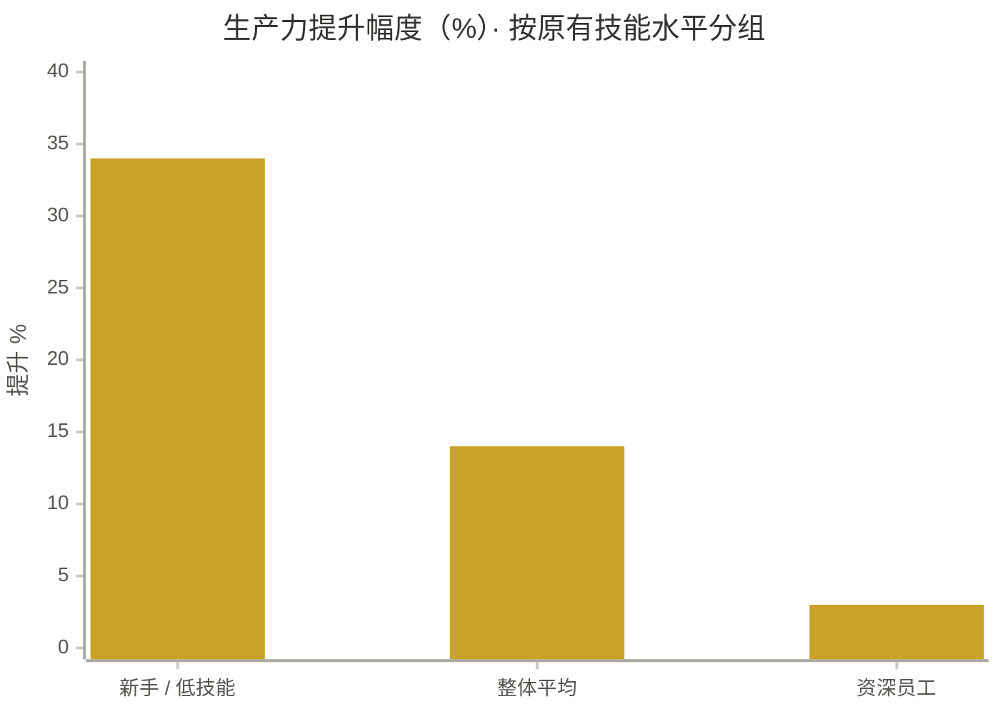
```mermaid
%%{init:{"theme":"base","themeVariables":{"background":"#ffffff","fontFamily":"-apple-system,Segoe UI,Microsoft YaHei,sans-serif","fontSize":"14px","xyChart":{"backgroundColor":"#ffffff","titleColor":"#33332f","xAxisLabelColor":"#55554f","xAxisTitleColor":"#55554f","xAxisTickColor":"#c9c9c1","xAxisLineColor":"#a8a8a0","yAxisLabelColor":"#55554f","yAxisTitleColor":"#55554f","yAxisTickColor":"#c9c9c1","yAxisLineColor":"#a8a8a0","plotColorPalette":"#c9a227,#a8a8a0"}}}}%%
xychart-beta
    title "生产力提升幅度（%）· 按原有技能水平分组"
    x-axis ["新手 / 低技能", "整体平均", "资深员工"]
    y-axis "提升 %" 0 --> 40
    bar [34, 14, 3]
```

*以往每一次技术进步都是把这张图**从右往左**抬（工具放大高手）。这一次是**从左往右**抬。
中间层的技能溢价被压扁了 —— 你多年积累的「比平均水平好」，正好是 AI 免费给出的那一档。*

> **推论：「比平均水平好」这件事不再值钱了。**

### 5.2 具身智能侧：悖论正在被硬核破局，但没破完

近年「LLM 作大脑 + 多模态 + 端到端控制」的路线确实在跨越莫拉维克悖论 —— 机器人正在学会人类一岁就会的物理本能。

但截至 2026 年 9 月，**壁垒转移了，没有消失**：

| 维度 | 成熟度（业内评估） |
|---|---|
| 感知理解 | 较成熟，多模态模型有较强零样本泛化 |
| 运动控制 | 中等，端到端提升迭代速度，复杂操作稳定性待验证 |
| **任务泛化** | **弱 —— 长尾场景迁移是核心瓶颈** |
| 自主进化 | 早期探索 |
| 商业落地 | 工业 / 物流先行，**家庭场景仍需 3–5 年** |

主要瓶颈是三个工程问题，不是智能问题：

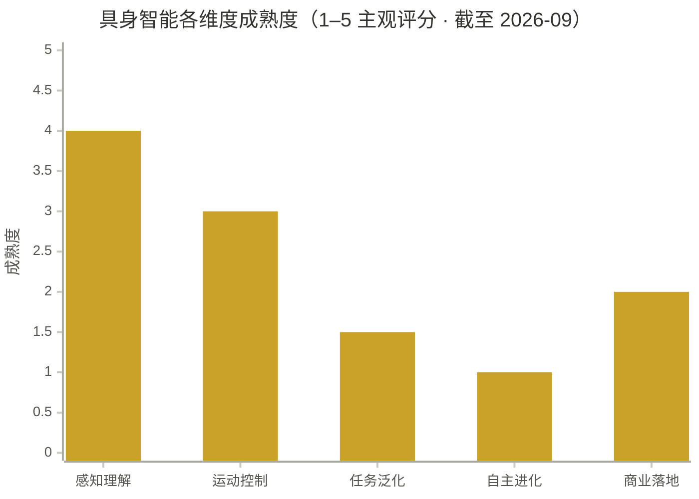
```mermaid
%%{init:{"theme":"base","themeVariables":{"background":"#ffffff","fontFamily":"-apple-system,Segoe UI,Microsoft YaHei,sans-serif","fontSize":"14px","xyChart":{"backgroundColor":"#ffffff","titleColor":"#33332f","xAxisLabelColor":"#55554f","xAxisTitleColor":"#55554f","xAxisTickColor":"#c9c9c1","xAxisLineColor":"#a8a8a0","yAxisLabelColor":"#55554f","yAxisTitleColor":"#55554f","yAxisTickColor":"#c9c9c1","yAxisLineColor":"#a8a8a0","plotColorPalette":"#c9a227,#a8a8a0"}}}}%%
xychart-beta
    title "具身智能各维度成熟度（1–5 主观评分 · 截至 2026-09）"
    x-axis ["感知理解", "运动控制", "任务泛化", "自主进化", "商业落地"]
    y-axis "成熟度" 0 --> 5
    bar [4, 3, 1.5, 1, 2]
```

*最低的那两根不是「智能不够」，是**数据 / 泛化 / Sim2Real** 三个工程缺口。*

```text
数据瓶颈　真机采集成本极高，仿真数据无法完全替代物理世界
泛化瓶颈　训练分布之外表现差，零样本能力有限
Sim2Real　仿真与真实的域差异，策略迁移稳定性不足
```

**对个人的含义：** 「护工型工作是永久壁垒」这个判断，时间窗大约是**家庭场景落地之前**。它是一道很厚的墙，但不是永久的墙。别把职业规划押在「机器永远做不到」上，要押在「**做到之后，谁来承担后果**」上。


---

## 6. 我的判断：3–5 年内会发生什么

> **大规模岗位消失不会发生，大规模岗位重写会发生。**

危险度只看一个指标：**你的交付物里，「中等质量的第一版」占多大比例。**

| | 岗位类型 | 原因 |
|---|---|---|
| **最危险** | 初级设计、初级前端、通稿撰写、规格化翻译、基础美术产能 | 交付物几乎全是「中等质量第一版」 |
| **较安全** | ① 要签字承担后果的<br>② 有物理介入的<br>③ **握有稀缺上下文的**<br>④ 能证伪 AI 输出的 | ①③④ 不可外包，② 有厚工程壁垒 |

其中第 ③ 条最容易被低估：**知道「这个项目为什么这么定」的人**，其价值在 AI 时代是上升的，因为这是 AI 唯一拿不到的输入。

把你自己放到这根尺子上：


```mermaid
%%{init:{"theme":"base","themeVariables":{"background":"#ffffff","primaryColor":"#f4f4f1","primaryBorderColor":"#a8a8a0","primaryTextColor":"#33332f","secondaryColor":"#fbfbf9","tertiaryColor":"#fbfbf9","lineColor":"#b0b0a8","textColor":"#33332f","edgeLabelBackground":"#ffffff","clusterBkg":"#fafaf8","clusterBorder":"#d4d4cc","fontFamily":"-apple-system,Segoe UI,Microsoft YaHei,sans-serif","fontSize":"14px"}}}%%
flowchart LR
    D1["初级设计"] --> D2["初级前端"] --> D3["通稿撰写"] --> D4["规格化翻译"] --> D5["基础美术产能"] --> M["⟨ 分界 ⟩<br/>交付物里<br/>「中等质量第一版」占比"] --> S1["④ 能证伪 AI 输出"] --> S2["③ 握有稀缺上下文"] --> S3["② 有物理介入"] --> S4["① 要签字承担后果"]

    L["<b>最危险</b><br/>占比 → 100%"] -.-> D1
    S4 -.-> R["<b>较安全</b><br/>占比 → 0%"]

    classDef bad fill:#fdeeea,stroke:#d9522f,color:#8f2c12,stroke-width:1.5px
    classDef good fill:#ecfaf0,stroke:#2f9c66,color:#14603c,stroke-width:1.5px
    classDef acc fill:#fdf6d9,stroke:#b8952a,color:#5f4a06,stroke-width:1.5px
    classDef gap fill:#fbfbf9,stroke:#c9c9c1,color:#77776f
    class D1,D2,D3,D4,D5,L bad
    class S1,S3,S4,R good
    class S2 acc
    class M gap
```

*左边五个的共同点：交付物几乎全部是「先给个初版」—— 而这正是 AI 成本降到近零的那一段。
右边四条里，**③ 稀缺上下文**是唯一在升值的那条，也是唯一你今天就能主动积累的那条。*

### 6.1 最危险的自我安慰

> 「我这行靠创意 / 靠经验，AI 替代不了。」

**创意的表层恰恰是 AI 最强的地方**（§5.1）。安全的不是创意，是**判据** —— 你能说出「为什么这个方案不行」，并且这句话可被验证。

### 6.2 价值公式

结合 §4.3 的边界和 §2 的不对称：

> **AI 时代的岗位价值 = 承担后果的能力 × 证伪的能力**

两项都不能外包给 AI，且两项都是乘法关系 —— 任一为零，整体为零。

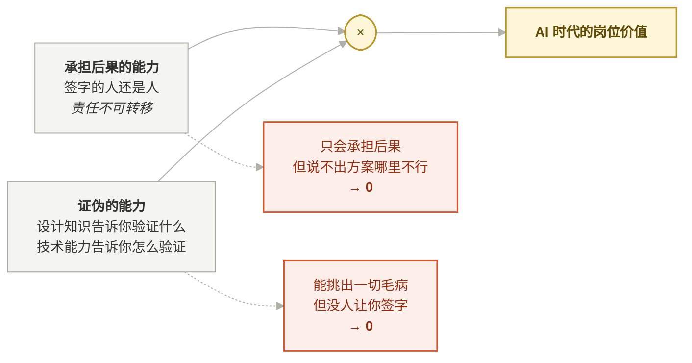
```mermaid
%%{init:{"theme":"base","themeVariables":{"background":"#ffffff","primaryColor":"#f4f4f1","primaryBorderColor":"#a8a8a0","primaryTextColor":"#33332f","secondaryColor":"#fbfbf9","tertiaryColor":"#fbfbf9","lineColor":"#b0b0a8","textColor":"#33332f","edgeLabelBackground":"#ffffff","clusterBkg":"#fafaf8","clusterBorder":"#d4d4cc","fontFamily":"-apple-system,Segoe UI,Microsoft YaHei,sans-serif","fontSize":"14px"}}}%%
flowchart LR
    A["<b>承担后果的能力</b><br/>签字的人还是人<br/><i>责任不可转移</i>"] --> X(["×"])
    B["<b>证伪的能力</b><br/>设计知识告诉你验证什么<br/>技术能力告诉你怎么验证"] --> X
    X --> V["<b>AI 时代的岗位价值</b>"]

    A -.-> Z1["只会承担后果<br/>但说不出方案哪里不行<br/>→ <b>0</b>"]
    B -.-> Z2["能挑出一切毛病<br/>但没人让你签字<br/>→ <b>0</b>"]

    classDef acc fill:#fdf6d9,stroke:#b8952a,color:#5f4a06,stroke-width:1.5px
    classDef bad fill:#fdeeea,stroke:#d9522f,color:#8f2c12,stroke-width:1.5px
    classDef base fill:#f4f4f1,stroke:#a8a8a0,color:#33332f
    class A,B base
    class X,V acc
    class Z1,Z2 bad
```

*落点：把「我会什么」换成「**我能证伪什么**」。*

---

## 7. 方向：从「技能对口」到「生态对口」

### 7.1 三个值得布局的象限

| 象限 | 覆盖领域 | 逻辑 |
|---|---|---|
| **硬核科技派**<br><span>物理与数字世界的连接者</span> | 机器人工程、智能制造、传感器、微电子、生物医疗工程、材料 | 人类最终生活在物理世界。造芯片、做传感器、让机器人更灵活 —— **AI 无法隔空完成**（且正是 §5.2 的瓶颈所在） |
| **超级应用派**<br><span>用 AI 解决垂直痛点</span> | 计算化学、计算生物、数字金融、智慧农业等交叉学科 | 纯「写基础代码」在稀释，**「计算机 + X」在暴涨**。你要成为懂行业痛点、并能把痛点翻译成 AI 能执行的任务的人 |
| **人文与服务派**<br><span>垄断人际连接与情感价值</span> | 心理学、高级护理、体验设计、文化创意、复杂项目管理 | 机器可以模拟共情，但人在面对生命、危机、深度孤独时**天然信任同类**。高情感密度 + 高物理互动 = 生命力最强 |

三个象限不是三个行业清单，它们是**同一个动作的三个方向** —— 绕开同一个定义域：

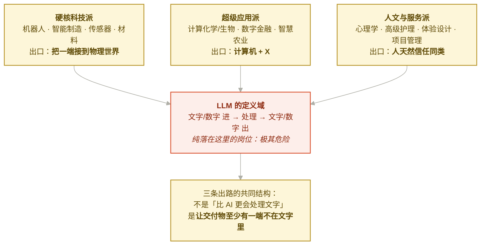
```mermaid
%%{init:{"theme":"base","themeVariables":{"background":"#ffffff","primaryColor":"#f4f4f1","primaryBorderColor":"#a8a8a0","primaryTextColor":"#33332f","secondaryColor":"#fbfbf9","tertiaryColor":"#fbfbf9","lineColor":"#b0b0a8","textColor":"#33332f","edgeLabelBackground":"#ffffff","clusterBkg":"#fafaf8","clusterBorder":"#d4d4cc","fontFamily":"-apple-system,Segoe UI,Microsoft YaHei,sans-serif","fontSize":"14px"}}}%%
flowchart TB
    LLM["<b>LLM 的定义域</b><br/>文字/数字 进 → 处理 → 文字/数字 出<br/><i>纯落在这里的岗位：极其危险</i>"]

    A["<b>硬核科技派</b><br/>机器人 · 智能制造 · 传感器 · 材料<br/>出口：<b>把一端接到物理世界</b>"] --> LLM
    B["<b>超级应用派</b><br/>计算化学/生物 · 数字金融 · 智慧农业<br/>出口：<b>计算机 + X</b>"] --> LLM
    C["<b>人文与服务派</b><br/>心理学 · 高级护理 · 体验设计 · 项目管理<br/>出口：<b>人天然信任同类</b>"] --> LLM

    LLM --> K["三条出路的共同结构：<br/>不是「比 AI 更会处理文字」<br/>是<b>让交付物至少有一端不在文字里</b>"]

    classDef bad fill:#fdeeea,stroke:#d9522f,color:#8f2c12,stroke-width:1.5px
    classDef acc fill:#fdf6d9,stroke:#b8952a,color:#5f4a06,stroke-width:1.5px
    class LLM bad
    class A,B,C,K acc
```

*这就是「技能对口」换成「**生态对口**」的意思：选的不是技能本身，是这个技能所处的位置。*


### 7.2 技能的升值与贬值

评价标准正在从「你掌握了多少知识」变成「**你调动资源解决问题的能力有多强**」。

```text
   贬值中（旧核心技能）                升值中（新核心技能）
 ────────────────────────         ────────────────────────
   规格化外语翻译        ━━━━━>    跨文化沟通与冲突调解
   基础程序代码编写      ━━━━━>    系统架构设计 + 判据表达（prompt 只是形式）
   海量文献资料检索      ━━━━━>    批判性思维与真伪辨别
   标准化图纸设计        ━━━━━>    审美判断与同理心捕捉
```

三项具体能力：

**① 问题定义能力（Problem Framing）**
AI 擅长解答，不擅长**提问**。谁能精准发现现实痛点、并把它转成 AI 能理解的任务，谁就在核心位置。
> 本项目的对应物：把「感染」选为唯一核心变量，是人做的；把它扇形展开成六类来源，是 AI 做的。

**② 证伪能力**
见 §2 的不对称 —— 这是当前最稀缺的一项。设计知识告诉你**该验证什么**，技术能力告诉你**怎么验证**，缺一不可。

**③ 全栈式破局能力**
组织会大幅扁平化。要学着主导一个完整项目，而不是只负责其中一环。


### 7.3 一条反直觉的提醒

如果你的工作是纯粹的「接收文字/数字 → 处理 → 输出文字/数字」，那它**极其危险** —— 因为这正好是 LLM 的定义域。

多参与需要现场决策、物理协调、即时应变的复杂实践。

---

## 8. 落到本项目：我们这两个月实际在做的事

这份文档的所有结论，在 MetaProject 上都有对应物：

| 本文结论 | 项目里的落地 |
|---|---|
| 判据是唯一能复利的资产 | `AGENTS.md` 每写一条，AI 之后每次生成都遵守 |
| 瓶颈在验证，不在产出 | `Tools\StartTest_*.bat` 起独立客户端 —— 监听服务器测不出一整类 bug |
| AI 不会做减法 | 「武器不做耐久」这类判决必须人做；AI 倾向把每个系统都做全 |
| AI 会展开，人要选变量 | 人选定「感染」为唯一核心变量，AI 负责扇形展开 |
| 稀缺上下文是护城河 | 「为什么感染必须是 AttributeSet 而不是 float」—— 这个理由不在代码里 |
| 一条自信的错误结论比没有结论更危险 | 注释规范：涉及引擎默认行为的结论必须注明验证方式 |

### 8.1 一条值得单独讲的引用

Peter Naur，《Programming as Theory Building》（1985，发表于 *Microprocessing and Microprogramming*）：

> **程序的本体不是源码，而是开发者头脑中共享的「理论」** —— 关于它为什么这样工作、为什么这样设计的理解。源码只是这个理论的一种**传达手段**。
>
> 因此：程序员离开，理论就可能随之消失，哪怕代码完好；而**"Revival of a program is the rebuilding of its theory by a new programmer team."**

这条正面回答了「AI 都能写完了，为什么还需要人」：

**AI 能产出代码，但不能持有理论。** 而理论正是「判据成文」要抢救的东西 —— 把头脑里的理论写进共享文件，是唯一能让它在人员流动和 AI 接手之后仍然存活的办法。

> 顺带一个两千四百年前的版本：柏拉图《斐德罗篇》里，苏格拉底反对**书写** —— 说它让人健忘、给出智慧的**表象**而无真正理解，而且「文本无法回答追问」。这是「AI 一本正经胡说八道」的原始版本。△ 这条我凭记忆写，落入正式稿前需核对原文段落号。

---


### 9 引用

| 引用 | 出处 | 核查要点 |
|---|---|---|
| 莫拉维克悖论原文 | Hans Moravec, *Mind Children*, Harvard University Press, 1988 | 原句已核对；不同来源在 "perception and mobility" / "or" 上有标点差异，以哈佛原版为准 |
| Hinton 放射科预测 | 2016 年多伦多会议发言 | 原话已核对；2024 年他本人承认时间线判断错误 |
| 放射科 2025–2026 就业现状 | ACR Bulletin / AuntMinnie / Neiman HPI / BLS | 持续短缺；影像量年增 3–4%；均薪约 52.6–57.2 万美元 |
| ATM 与柜员数据 | James Bessen, "Toil and Technology", IMF *Finance & Development*, 2015-03；《Learning by Doing》Yale UP, 2015 | ATM 约 0→10 万→40 万；柜员约 50 万→55 万；单分行 21→13 人；分行 +43%。Bessen 本人强调这**不是普适规律**，取决于需求弹性 |
| 生成式 AI 生产力实验 | Brynjolfsson, Li & Raymond, *Generative AI at Work*, NBER w31161 (2023)；QJE 140(2), 2025 | 约 5,000 名坐席 RCT；整体 +14%；新手 +34–35%。不同来源 14%/15% 有口径差异 |
| 电话接线员研究 | Feigenbaum & Gross, *Answering the Call of Automation*, QJE 2024；NBER w28061 | 占年轻白人本土女性劳动力约 4%；在位 16–25 岁岗位降 50–80%；转向文秘、零售 |
| Naur 程序即理论 | Peter Naur, *Programming as Theory Building*, 1985 | 论点与 "Revival of a program…" 一句已核对 |
| 具身智能 2026 现状 | 2026-09 前公开产业信息汇总 | 泛化/长尾是核心瓶颈；家庭场景仍需 3–5 年。**技术迭代快，引用须注明时点** |
| 《论语》两条 | 「有教无类」《卫灵公》；「八佾舞于庭」《八佾》 | 常规文献，置信度高 |
