---

## 0. 这篇文章想解决的问题

关于"AI 写代码"的分享已经很多了，但绝大多数停留在**单点任务**：帮我写个排序、帮我补个单测、帮我解释这段正则。这些场景里 AI 的表现确实好，好到让人产生一种错觉——似乎只要提示词写得够好，工程问题就能被逐个击破。

真实的工程不是这样的。

我们这个项目现在的规模：

| 维度 | 数字 |
|---|---|
| 代码模块 | 11 个（`BioExtractionCore` / `AI` / `Inventory` / `Ability` / `Mission` / `Motion` / `Online` / `Spawn` / `UI` / `Developer` / `MetaProject`）|
| C++ 文件 | 426 个 `.h`/`.cpp` |
| 代码行数 | 38,479 行 |
| 设计文档 | 10 篇，5,396 行 |
| 引擎 | UE 5.8，GAS + 网络多人 |

在这个体量下，"提示词写得好"几乎不产生边际收益。真正决定产出质量的是另一件事：

> **AI 写代码的瓶颈从来不是生成能力，而是约束供给。**

一个没有约束的 AI 会写出**语法正确、编译通过、看起来非常专业、但在你的系统里是错的**代码。而且它错得很自信——因为它确实按照"通用最佳实践"写的，只是你的系统不通用。

所以"用 AI 构建系统性工程"的核心命题，不是怎么让 AI 写得更多，而是**怎么把一个工程的隐性约束，变成 AI 能消费的显性输入**。

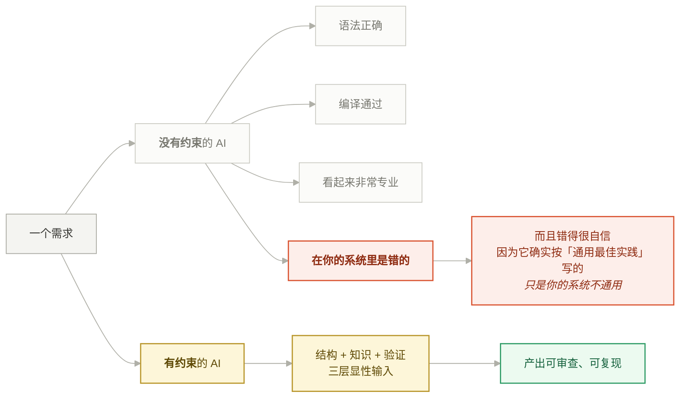

*提示词写得好，动的是左边那条线的措辞；约束供给，换的是整条线。体量上去之后只有后者还有边际收益。*

本文把这件事拆成三层约束来讲，每一层都配真实案例（包括我和 AI 意见不一致、以及 AI 把事情做错了的案例）：

1. **结构约束**（§1）—— 让代码库自己会说话
2. **知识约束**（§2）—— 注释是人机共享的长期记忆
3. **验证约束**（§3）—— 没跑起来的代码不算完成

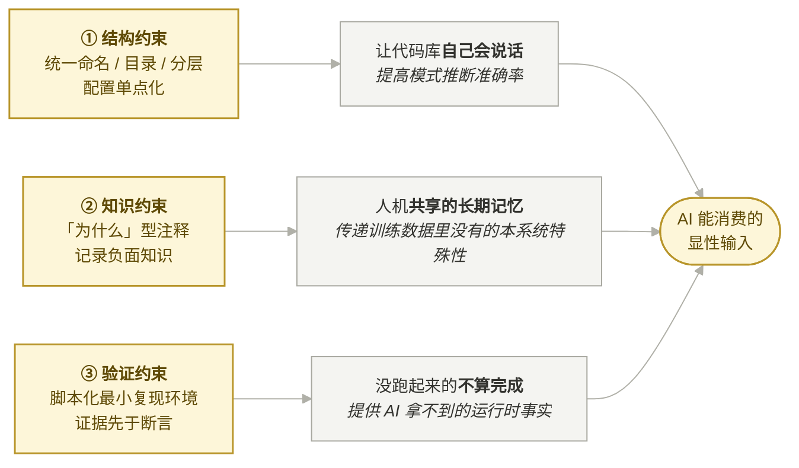

*三层各自补的是不同缺口：结构补「找得到」，知识补「知道不能怎么写」，验证补「事实」。缺任意一层，另外两层的收益都会被吃掉。*

然后是两块实战内容：

- **§4 分歧怎么解决** —— 一次完整的 bug 排查复盘，从一句话现象到改设计
- **§6 沟通范式** —— 反过来看，人这边什么样的表达信息密度最高

最后 §7 给行动项，§8 是一页纸总结。

> 本文提到的所有约定，已经固化成仓库根目录的 **`AGENTS.md`**（见 §7.1）。这篇文章是它的"为什么"，那份文件是它的"怎么做"。

---

## 1. 结构约束：让代码库自己会说话

### 1.1 AI 的工作方式决定了结构的价值

AI 读代码库的方式和人不一样。人会先看 README、再看架构图、再挑一个入口点顺着读。AI 是**检索驱动**的：它 grep 一个符号、读几个文件、然后基于**局部样本**推断全局模式。

这意味着一件事：**你的代码库有多一致，AI 推断出的模式就有多准。**

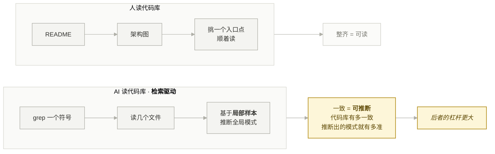

*AI 从来看不到全局，它只看到你给它 grep 到的那几个样本 —— 所以一致性不是洁癖，是采样质量。*

我们项目的结构约定是这样的：

```
Source/BioExtractionInventory/
├── Public/
│   ├── Abilities/      Animation/    Catalog/
│   ├── Components/     Debug/        Definitions/
│   ├── Effects/        Feedback/     Instance/
│   ├── Loadout/        Pickups/      Profile/
│   └── Weapons/
├── Private/            （镜像 Public 的目录结构）
└── BioExtractionInventory.Build.cs
```

`BioExtractionCore` 也是同样的切法：`Components / Definitions / Instance / Feedback / Debug / Abilities / Animation` 这套一级目录在模块之间是复用的。类名统一 `BE` 前缀，模块统一 `BioExtraction*` 前缀。

这套约定对人来说是"整齐"，对 AI 来说是**极大降低了上下文熵**。当我说"给武器定义加一个 Unequip 蒙太奇配置"，AI 不需要问"配置放哪儿"——`Definitions/BEWeaponDefinition.h` 里已经有 `CharacterEquipMontage`，新字段就紧挨着放。它能一次找对，是因为结构本身编码了答案。

反过来，如果同样的配置在这个模块叫 `Config`、那个模块叫 `Settings`、还有一个直接硬编码在 `.cpp` 里，AI 每次都要重新猜，而且**每次猜的结果可能不一样**——这就是所谓的 context drift。

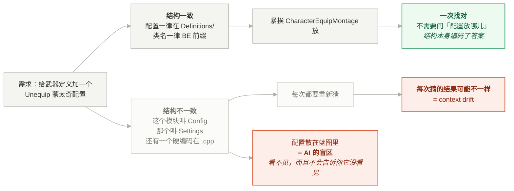


### 1.2 单点配置原则

一个具体例子。武器的外观、动画、音效、Cue 标签全部集中在 `UBEWeaponDefinition` 这一个数据资产里，代码从它往下推：

```cpp
// 通用武器表现 actor：由代码从武器定义推入 body mesh / AnimBP（配置单点）。
if (ABEWeaponVisual* WeaponVisual = Cast<ABEWeaponVisual>(NewActor))
{
    WeaponVisual->InitFromDefinition(Cast<UBEWeaponDefinition>(Def));
    WeaponVisual->NotifyAttached(bBuildActive);
    WeaponVisual->ApplyAttachments(Instance->GetAttachments());
}
```

这个设计的收益在 AI 协作场景下被放大了：**新增一种武器行为只需要改一个地方，AI 不需要在 N 个蓝图之间做一致性维护**——而蓝图恰恰是 AI 读不了的盲区。凡是配置散落在蓝图里的系统，AI 的命中率会断崖式下降。

> **结构约束小结**
> - 目录/命名的一致性 = AI 的模式匹配准确率
> - 配置单点化 = 把 AI 的盲区（蓝图/资产）收敛到代码可达的边界内
> - 这些事对人的收益是"可读"，对 AI 的收益是"可推断"，后者的杠杆更大

---

## 2. 知识约束：注释是人机共享的长期记忆

### 2.1 "为什么"型注释

这是我们项目里我认为最有价值的一条实践。看几段真实的注释：

**例 1** —— `BioExtractionInventory/Private/Abilities/BEGA_WeaponFire.cpp:344`

```cpp
// 必须走 ApplyGameplayEffectSpecToOwner 而不是 ASC->ApplyGameplayEffectSpecToSelf：
// 后者不带预测键，而 GAS 对「客户端 + 无预测键 + 非 Instant GE」是直接拒绝的 ——
// 冷却标签在客户端根本没加上，ActivationBlockedTags 形同虚设。
// 从按下到服务器冷却标签复制回来的那一个 RTT 里，能力每帧激活一次 ——
// 一次扣扳机打出好几发、抛好几个壳。
// 单机/监听服务器上因为本地就是权威、GE 立刻生效，所以看不到；
// 只有连独立服务器的客户端会犯。
```

**例 2** —— `BioExtractionAI/Private/Monster/BEMonsterVariantComponent.cpp:477`

```cpp
// 第二个参数 bReinitPose 必须是 false。传 true（SetSkeletalMeshAsset 的默认行为）
// 会走 InitAnim(true)，把 AnimInstance 重初始化、播放时钟归零 ——
// 一波怪同时跨过边界就是一排走路动画倒回第 0 帧。
Body->SetSkeletalMesh(Target, /*bReinitPose=*/false);
```

**例 3** —— `BioExtractionAI/Private/Data/BEMonsterVariantSet.cpp:25`

```cpp
// 先摇速率再摇条目：两次取数的顺序必须固定，否则同一 seed 在不同端会算出不同结果。
OutPlayRate = Stream.FRandRange(PlayRateRange.Min, PlayRateRange.Max);
```

这三段注释的共同点：**它们记录的不是"代码做了什么"，而是"为什么不能换一种写法，以及换了会怎么死"**。

对人来说，这类注释的价值是省下一次 debug。对 AI 来说，价值大得多：**这是它唯一能拿到的、关于这个系统的负面知识**。AI 的训练数据里全是"正确的写法"，但"在我们这个系统里哪些正确写法是错的"，只能靠注释传递。

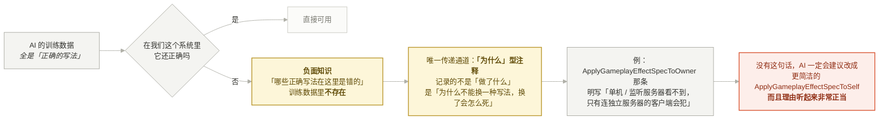


例 1 那段注释尤其典型——它明确写了"单机/监听服务器上看不到，只有连独立服务器的客户端会犯"。这一句话直接决定了下一轮 AI 改这块代码时会不会建议"用更简洁的 `ApplyGameplayEffectSpecToSelf`"。没有这句话，它一定会建议，而且理由听起来非常正当。

### 2.2 反面案例：错误的注释会污染后续所有工作

这是本项目里真实发生的一次事故，也是我觉得最值得讲的一个点。

掉落物 `ABESpawnedPickup` 的构造函数里有这么一段：

```cpp
bReplicates = true;
// 物理只在服务器模拟（见 StartDropPhysics），客户端完全靠移动复制拿落点。
// 不开这个，掉落物在纯客户端上会原地悬空不动。
SetReplicateMovement(true);
```

注释写得斩钉截铁，还带了因果和症状描述——完全符合上一节说的"好注释"的形式。

问题是它是**错的**。

`AActor::bReplicateMovement` 在 `AActor` 构造函数里的默认值就是 `true`。这行 `SetReplicateMovement(true)` 是个**空操作**。也就是说，当初写下这行代码和这段注释的人（或 AI），在"掉落物客户端悬空"这个 bug 上做出了一个错误的归因，写了一个没有效果的修复，然后把这个错误归因**以注释的形式固化进了代码库**。

后果是：这个 bug 一直没被修好，但代码里有一段看起来很权威的注释宣称它被修好了。任何后续接手的人——包括 AI——都会跳过这块，因为"这里已经处理过了"。

我在这一轮排查时，正是因为读到这段注释先入为主地信了半分钟，直到意识到 `bReplicateMovement` 的默认值。

> **教训**：注释是知识资产，也是知识污染源。AI 会**无条件继承**代码库里的既有假设。一条自信的错误注释，比没有注释危害大得多。
>
> **实践建议**：涉及"引擎默认行为"的注释，必须写清楚**验证方式**（哪个版本、怎么观察到的），而不只是结论。


*注释是知识资产，也是知识污染源。AI 会**无条件继承**代码库里的既有假设 —— 一条自信的错误注释，比没有注释危害大得多。*

---

## 3. 验证约束：没跑起来的代码不算完成

### 3.1 案例：武器挂载 notify 的第一版是错的，而且看起来很对

需求很清楚：

> "把 ShowWeapon 这个 notify 的机制修改成为，不是显示武器，而是在这个消息的时机真正在做 attach 模型的行为，不需要勾选当前是装备还是不装备，这里自动判定。"

AI 的第一版实现思路是这样的：装备状态变化时，如果角色**正在播蒙太奇**，就把挂点切换挂起等 notify；如果没在播，说明这把武器没配装备动画，当场挂上。代码大致是：

```cpp
if (IsPlayingMontage())
{
    PendingAttachSlots.Add(Key);   // 等 notify
}
else
{
    AttachSlotVisual(Slot, V, bActive);   // 当场挂
}
```

这个逻辑读起来无懈可击。编译通过。然后测试反馈来了：

> "目前编译后测试 发现效果不对啊，武器是从第一帧就挂在手上了，而不是等 触发了 notify。"

根因是**时序**：

- 装备状态通过**属性复制**（`OnRep_Active`）到达客户端
- 装备蒙太奇通过 **GameplayCue** 播放，而且因为 `LinkAnimClassLayers` 的重链问题，cue 还被刻意 `SetTimerForNextTick` 延后了一帧
- 两条路径的到达顺序**没有任何保证**

所以在"挂起"的那一刻去问 `IsPlayingMontage()`，答案**几乎永远是 false**。这个同步判断在逻辑上完全正确，在时序上完全无效。

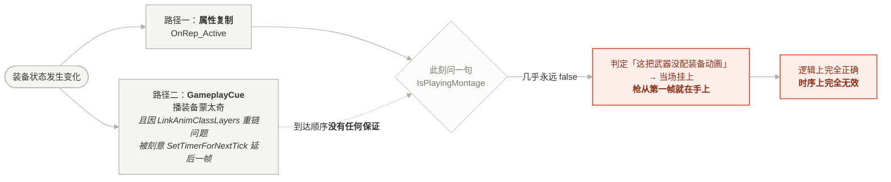

*这不是写错了，是**问错了时间**。编译通过、没有警告、代码审查也看不出来 —— 因为逻辑本身自洽。*

最终的修复思路变成了"双向兜底"：

```cpp
// 不能在这儿直接问"在播蒙太奇吗" —— 装备状态走复制、蒙太奇走 GameplayCue，
// 两条路到达的先后没有保证，挂起的这一刻多半还没开始播，问了永远是否，
// 结果就是枪在第一帧就挂到手上了。改成轮询等它起来。
PendingAttachGraceEnd = World->GetTimeSeconds() + PendingAttachGraceSeconds;
World->GetTimerManager().SetTimer(PendingAttachTimerHandle, this,
    &UBEEquipmentVisualizationComponent::TickPendingAttach, 0.02f, /*bLoop=*/true);
```

- **复制先到、动画后到**：20ms 轮询一个宽限窗（0.25s），期间动画起来了就交给 notify；窗口内一直没动画，说明这把武器压根没配蒙太奇，当场挂上
- **notify 先到、复制后到**（本地预测的动画 + 慢一步的复制）：用 `LastCommitNotifyTime` 时间戳兜住，发现"该等的那一帧刚过"就立即提交
- **蒙太奇里忘了摆 notify**：动画播完时一次性兜底提交

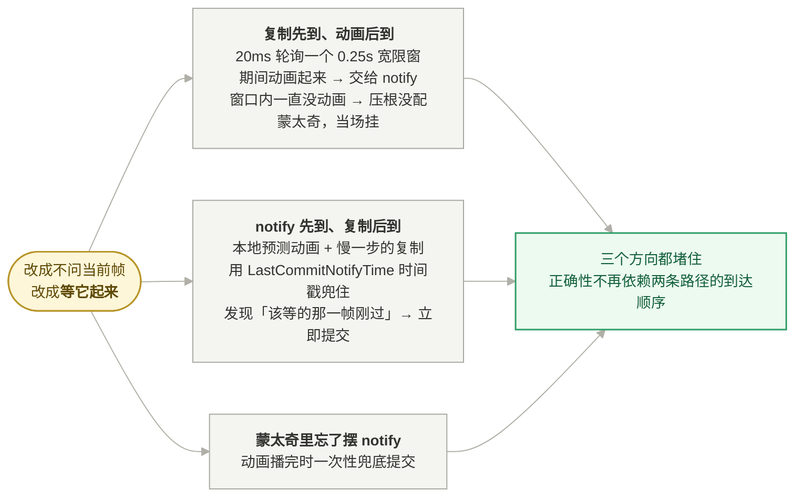


### 3.2 这个案例说明了什么

**AI 的默认直觉是"当前帧可观测状态"。** 它会写 `if (当前在播动画)`，因为在单机、同步的心智模型里这就是对的。而分布式系统、异步事件、复制时序——这些地方"当前帧的可观测状态"根本不是真相。

这是 AI 在游戏网络代码里最稳定的失效模式，没有之一。

而且注意一个关键事实：**这个 bug 只能通过运行时验证暴露**。它编译通过、没有警告、代码审查也看不出问题（因为逻辑本身是自洽的）。只有真的跑一遍、看到枪在第一帧就在手上，才能发现。

> **推论**：在 AI 协作里，**运行时验证不是"质量保证环节"，而是"信息输入环节"**。人在这个闭环里提供的不是"批准"，而是 AI 拿不到的那部分事实。

### 3.3 验证闭环断掉的时候，必须明说

这个项目里有个很现实的问题：UE 的 Live Coding 会阻塞完整编译。

```
Unable to build while Live Coding is active. Exit the editor and game,
or press Ctrl+Alt+F11 if iterating on code in the editor or game
Result: Failed (OtherCompilationError)
```

而只要改动了头文件（新增成员、新增 `UPROPERTY`、新增枚举值），`Ctrl+Alt+F11` 就不够用，必须关掉编辑器。在武器装备/卸下那几轮里，连续三次改动都涉及头文件，结果是**连续三轮代码没有被编译过**。

这时候唯一正确的做法是：**在总结里明确写"本轮代码未编译、未验证"**，而不是因为代码写完了就说"已完成"。

这一点后来被固化成了团队里的一条硬规则：

> 不要在没有跑过验证命令的情况下说"修好了 / 完成了 / 测试通过了"。证据先于断言。

这条规则听起来像废话，但在 AI 协作里它是**最容易被违反的**——因为 AI 输出的最后一段天然倾向于是一个总结，而总结天然倾向于是正面的。

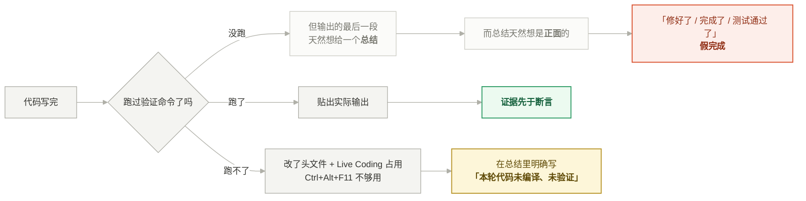

*最危险的不是「没跑」，是「没跑但说完成了」。第三条路径 —— 明说没验证 —— 才是这种情况下唯一正确的输出。*

### 3.4 把验证脚本化

我们在 `Tools/` 下放了一个启动脚本，一键拉起 1 个监听服务器 + N 个独立客户端：

```bat
set "MAP=/Game/Maps/GameLoop/L_Lobby"
set "PORT=7787"
set "CLIENTS=2"

start "BE Server" "%UE_EXE%" "%PROJECT%" "%MAP%?listen" -game -log -port=%PORT% ...
timeout /t 12 /nobreak >nul
for /L %%i in (1,1,%CLIENTS%) do call :launch_client %%i
```

这个脚本的意义远不止"省几次点击"。上面 §2.1 例 1 那条注释说得很清楚：**"单机/监听服务器上看不到，只有连独立服务器的客户端会犯"**。也就是说，**如果验证环境不对，一整类 bug 是永远测不出来的**。

包括本文 §4 要讲的掉落物悬空 bug——它在监听服务器上完全正常，只在独立客户端上出现。

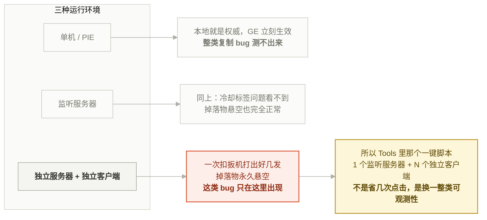

*如果验证环境不对，一整类 bug 是**永远**测不出来的。把「能复现问题的最小环境」脚本化放进仓库，是 AI 协作里性价比最高的基建 —— 因为 AI 能调用它，而 AI 没法帮你在编辑器里点十下鼠标。*

> **实践建议**：把"能复现问题的最小环境"脚本化，放进仓库。这是 AI 协作里性价比最高的基建之一——因为 AI 可以调用它，而 AI 没法帮你在编辑器里点十下鼠标。

---

## 4. 分歧怎么解决：一次完整的排查复盘

这一节讲最近一个 bug 的完整过程，因为它把"人机分工"体现得最清楚。

### 4.1 输入：一句话

用户的完整描述是：

> "在客户端下 spawned pickup 类的物理似乎没有模拟，模型悬浮在空中，在 listen server 下运行则是正常的。"

这句话信息量其实非常大，包含了三个关键事实：

1. 现象：模型悬浮在空中（= 停在初始位置，既没有本地物理，也没有收到位置更新）
2. 条件：客户端复现
3. 对照组：监听服务器正常（= 服务器端物理逻辑本身是对的，问题在复制链路）

**这是人能提供而 AI 提供不了的东西**：一个带对照组的现象观察。

### 4.2 第一步：收集事实，而不是猜

AI 做的第一件事不是提方案，而是派了一个探索子 agent，明确要求它只回答事实性问题：

- pickup actor 的类名和路径
- 构造函数里 root component 是什么、有没有物理设置
- 复制相关：`bReplicates` / `bReplicateMovement` / `GetLifetimeReplicatedProps`
- spawn 调用点在哪、是不是只在服务器执行
- `BeginPlay` / `OnRep` 里有没有按 net role 分支

并且在 prompt 里明确写了"**只输出这些，不要提修复方案**"。

> 这是一个刻意的动作。让 AI 在收集事实的阶段就开始提方案，会导致它**为了支撑方案而选择性收集事实**。把"取证"和"推理"分开，是对抗这个倾向的有效手段。

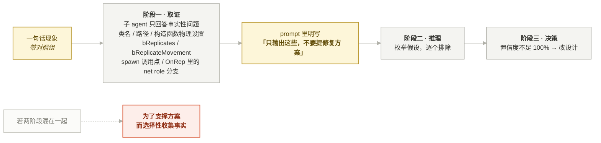


### 4.3 第二步：枚举假设并逐个排除

拿到事实后，候选原因其实非常多。排查过程中被认真考虑并排除掉的假设包括：

| 假设 | 为什么排除 |
|---|---|
| 根组件 Mobility 是 Static | 那样服务器也会失效，与"监听服务器正常"矛盾 |
| `bNetTemporary` / `DORM_Initial` 导致只有初始复制 | 代码里没设，且蓝图不太可能改 |
| 网络相关性 / Cull Distance | 掉落物就在玩家面前 |
| `ItemDefinition` 对象引用在客户端解析失败 | 那样客户端连模型都看不到，与"模型悬浮"矛盾 |
| 客户端物理跑起来了但被服务器校正拉住 | 那样落点会接近地面，不会停在出生高度 |
| `SetReplicateMovement(true)` 没生效 | 见 §2.2 —— 这行本来就是空操作，注释是错的 |

最后收敛到的结论是引擎的一个一次性初始化逻辑：

```
客户端 actor 刚 spawn 时，Mesh 还没 StaticMesh、还是构造函数设的 NoCollision → 没有刚体
        ↓
引擎 AActor::PostNetReceive() → SyncReplicatedPhysicsSimulation() 恰好在这一刻跑
SetSimulatePhysics(true) 静默失败，且被 bNetCheckedInitialPhysicsState 守着，只跑一次不重试
        ↓
服务器一路报 bRepPhysics = true，客户端于是一直走物理校正分支
（PostNetReceivePhysicState → ConditionalApplyRigidBodyState）
        ↓
这条分支对"不在模拟的刚体"是空操作，位置分支 PostNetReceiveLocationAndRotation 轮不到
        ↓
客户端道具永远停在初始复制位置 = 悬空
```

### 4.4 第三步：当推理无法 100% 收敛时，改设计而不是赌假设

这是我认为整个过程里最关键的决策。

上面那个根因分析的置信度大概是 80%——它能解释所有已观察到的现象，但我**没有引擎源码可读**（这台机器上 UE 5.8 只装了二进制），无法逐行确认 `OnRep_ReplicatedMovement` 的分支条件到底是看 `bRepPhysics` 还是看 `IsSimulatingPhysics()`。

有两种选择：

- **A：赌假设。** 按根因做一个精确的小修复，比如在客户端拿到 mesh 之后手动重新同步一次物理状态。改动最小，但如果假设错了，白改一轮。
- **B：改设计，让结论不依赖那个假设。** 落点的正确性**不再押在引擎的物理复制通道上**，服务器物理停下时显式复制一份静止变换过来。

选了 B：

```cpp
/** 服务器物理停下时的落点（权威）。 */
UPROPERTY(Replicated)
FVector_NetQuantize100 RestLocation;

/** 落定标志。放在最后一个复制属性上做通知，保证回调时落点与朝向都已就位。 */
UPROPERTY(ReplicatedUsing=OnRep_RestState)
bool bHasRested = false;
```

```cpp
void ABESpawnedPickup::OnRep_RestState()
{
    if (!bHasRested) return;

    // 客户端本地这一遍落体到此为止，剩下的以服务器落点为准。
    World->GetTimerManager().ClearTimer(PhysicsTimerHandle);
    Mesh->SetSimulatePhysics(false);
    Mesh->SetCollisionEnabled(ECollisionEnabled::NoCollision);
    bDropPhysicsStarted = true;
    SetActorLocationAndRotation(FVector(RestLocation), RestRotation, /*bSweep=*/false);
}
```

现在客户端的本地物理**降级成纯表现**：起得来，落体过程好看；起不来，最坏也就是悬 2 秒然后被校正到地面，**不会永久悬空**。

同时顺手补了两条防御：`Mesh->SetMobility(Movable)`（Static 根既模拟不了物理也吃不进复制位置）和 `WakeAllRigidBodies()`（刚体是在 NoCollision 状态下重建的，可能生成即休眠），并在 `StartDropPhysics` 里加了日志打 `auth / role / simulating`——**下一轮能直接从日志看出客户端本地模拟到底起没起**。

> **方法论**：
> - 当根因分析置信度不足 100%，且"改设计"的成本可接受时，**选择让正确性不依赖该假设的方案**
> - 同时埋下能证伪/证实原假设的观测点（日志），把这一轮的不确定性转化成下一轮的确定性
>
> 这条在 AI 协作里格外重要，因为 AI 的根因分析**听起来的置信度永远高于实际置信度**。它会用非常确定的语气讲一个 80% 的结论。人的职责是给这个结论打折，并据此选择方案的鲁棒性等级。

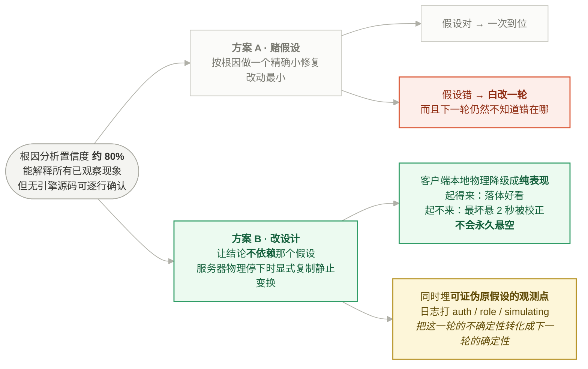

*人的职责不是复核 AI 的推理链，是**给它的置信度打折**，并据此选择方案的鲁棒性等级。*

---

## 5. 任务粒度与边界

### 5.1 "对称扩展"是发现既有 bug 的高效手段

需求：

> "在武器配置中再增加 Unequip 的动画配置以及对应的逻辑，和 equip 一样。"

这是一个典型的"照着旁边那个再来一份"的任务，AI 做这种事效率极高。但真正的收获是——**在做对称扩展的过程中，AI 连带发现了三个既有的隐性 bug**：

1. **Cue 解析武器定义的方式是错的。** 原来走 `Equipment->GetActiveWeaponDefinition()`，对"刚被收起的那把"必然拿不到（它已经不是 active 了），只会拿到 null 或下一把枪。武器 mesh 的解析（`GetActiveWeaponMesh()`）有同样的问题。修复是改走 `FGameplayCueParameters.SourceObject` 指明的物品实例。
2. **`PlayEquipCue()` 会在手持项没变时误播。** 往空槽里塞一件装备（同时手上已经拿着别的枪）也会触发一次"拔枪"动画。
3. **`Server_Unequip` 之后 `LastCueActiveItem` 会变脏。** 那个函数把 `ActiveItem` 置空但不播 cue，缓存的旧实例可能在之后驱动一个"模型已经销毁了的武器"的收起动画——空手在那儿比划。

这三个 bug 在"只有 Equip"的时候是**观察不到的**，因为单向流程恰好绕过了它们。一旦要求双向对称，它们全部暴露。

> **实践建议**：如果一个系统只实现了单向（只有 A→B 没有 B→A、只有 add 没有 remove、只有 enter 没有 exit），那么补齐对称路径几乎一定会挖出既有 bug。这类任务特别适合交给 AI，因为它做对称比较不知疲倦。

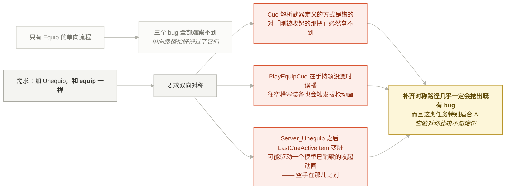


### 5.2 用"不做什么"约束 AI 的自作主张

AI 的一个稳定倾向是**顺手多做一点**：顺手重构一下、顺手加个错误处理、顺手补个抽象层。在单点任务里这叫"贴心"，在系统性工程里这叫**不可控的 diff**。

我们的做法是在长期上下文里维护一份显式的"暂缓清单"：

```
Explicitly deferred (do NOT start unprompted):
  维度三 director 动态调整；对象池化；区域状态持久化；
  ReleasePoint 与任务物品的接线
```

以及一份"待办但不要主动开始"的清单（设计文档更新、验收验证、某个 ClientTravel 卡顿等）。

这两份清单的价值不在于"记住要做什么"——那是任务管理工具的事——而在于**明确告诉 AI 哪些它已经看到的问题是"已知且故意不做的"**。没有这个，AI 每轮都会重新发现同一批问题，每轮都会重新建议一遍，消耗上下文也消耗你的注意力。

### 5.3 边界感：一个小例子

最近一个极小的任务：

> "修改这个 Tools 的 bat 文件，只需要运行 2 个客户端就行了。"

改动是一行：`set "CLIENTS=3"` → `set "CLIENTS=2"`，外加同步更新一行注释。

但这里有个诱惑：文件名叫 `StartTest_1S4C.bat`（1 服务器 4 玩家），改完之后名不副实了，要不要顺手改名？

**没有改。** 因为改文件名可能打断别人桌面上的快捷方式、别人的 CI 脚本、别人的肌肉记忆——这些都是 AI 看不见的依赖。正确做法是**改完之后主动提一句"文件名现在名不副实了，要改说一声"**，把决策权交回去。

> **原则**：AI 应该承担"发现问题"的责任，但不应该独自承担"改变外部契约"的决策。凡是跨出本次任务边界、可能影响仓库外部依赖的改动（文件名、接口签名、配置默认值），提出来，不要顺手做。

### 5.4 不确定时，做决定 + 把后果写进使用现场

AI 面对"没说清楚的地方"有两个选择：停下来问，或者做个决定往下走。**默认应该是后者**——前提是把决定和它的后果记下来。

真实案例：武器蒙太奇的 A 换 B 场景里，两条角色蒙太奇会打在同一个 mesh 上，后播的 Equip 会盖掉 Unequip。这是个无法两全的设计问题，AI 没有问"你要哪种"，而是**做了决定 + 把决定和它的后果写进了属性注释**：

```cpp
/**
 * 收起：角色 mesh 蒙太奇。留空跳过。
 *
 * A 换 B 这种情况下两条角色蒙太奇打同一个 mesh，后播的装备动画会盖掉收起动画 ——
 * 换枪的完整动作请放在装备那条里。本条真正独占的场景是"收回空手"。
 */
```

这比停下来问一句更好，因为**决定被记录在了使用现场**——下一个配置这个字段的策划会在属性面板的 tooltip 里直接读到它。如果当时只是在对话里问一句、得到一个口头答复，这条知识三天后就蒸发了。

关于"什么时候该问、什么时候不该问"的判断标准，见 §6.6。

---

## 6. 沟通范式：什么样的一句话价值最高

前面几节讲的都是"怎么约束 AI"。这一节反过来讲：**在这次协作里，哪些表达方式被证明信息密度最高**。

这些例子全部是真实对话原文。它们的共同特点是——**很短，但每个字都在缩小搜索空间**。

### 6.1 报 bug 带对照组

> "在客户端下 spawned pickup 类的物理似乎没有模拟，模型悬浮在空中，在 listen server 下运行则是正常的。"

38 个字，包含三层信息：

| 层 | 内容 | 作用 |
|---|---|---|
| 现象 | 模型悬浮在空中 | 排除了"落点偏了""穿地了"等一大类，指向"完全没动过" |
| 复现条件 | 客户端 | 指向客户端侧 |
| **对照组** | 监听服务器正常 | **决定性**：服务器端物理逻辑本身没问题，问题在复制链路 |

第三层是关键。没有对照组，排查范围是"物理系统 + 复制系统 + 资产配置"；有了对照组，范围直接缩到"复制链路上客户端侧的那一段"。

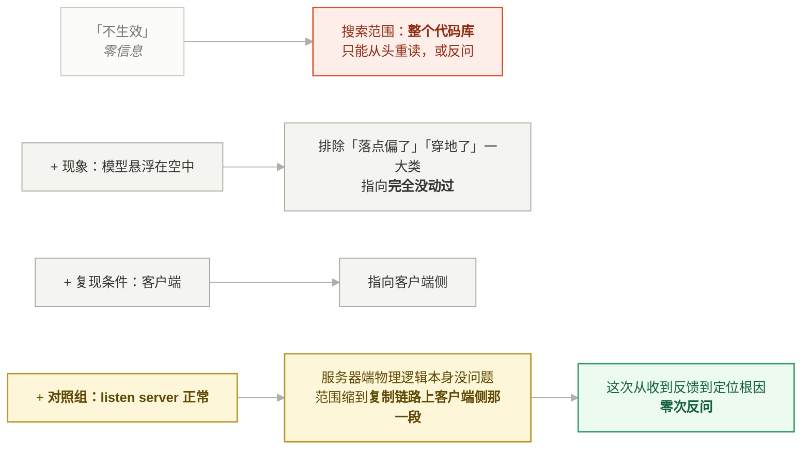

*38 个字，三层信息，第三层是决定性的。**报 bug 时多花五秒钟想一句「那在什么情况下是正常的」** —— 这一句的价值通常超过前面所有描述。*

**这是人能提供而 AI 提供不了的东西**——AI 跑不了游戏，看不到画面，也做不了 A/B 对照。

> **给人的建议**：报 bug 时多花五秒钟想一句"那在什么情况下是正常的"，这一句的价值通常超过前面所有描述。

### 6.2 说偏差，不说"不对"

> "目前编译后测试 发现效果不对啊，武器是从第一帧就挂在手上了，而不是等 触发了 notify。"

这句话的结构是：**实际值 + 预期值 + 精确时间点**。

对比一下几种常见的反馈方式：

| 反馈 | AI 能做什么 |
|---|---|
| "不生效" | 只能从头重读全部代码，或反问 |
| "武器挂载有问题" | 缩到武器挂载模块，但不知道是位置错、时机错还是没挂上 |
| **"从第一帧就挂在手上了，而不是等触发 notify"** | **立刻定位到"挂起判定失效"这一个点** |

第三种直接告诉了 AI：挂载逻辑跑通了（否则不会挂上），问题在"延迟提交"那一步没生效。剩下的只需要回答一个问题——为什么挂起没生效。答案就是复制与 Cue 的时序。

这次从收到反馈到定位根因，中间没有任何一次反问。

### 6.3 给约束，不给实现

> "把 showweapon 这个 notify 的机制修改成为，不是显示武器，而是在这个消息的时机真正在做 attach 模型的行为，**不需要勾选当前是装备还是不装备，这里自动判定**。"

加粗那半句是一条**设计约束**，不是实现方案。它没有说"用 `IsInstanceActive()` 去查"，只说了"我不要那个勾选框"。

这种表达方式好在两点：

1. **保留了实现空间**。AI 选择在提交时现问装备组件，并给出了理由——"拿 notify 上的勾选来分辨的话，快速切枪时那个勾选会和真实状态错位"。这个理由如果由人来想，未必第一时间想到。
2. **约束本身携带了意图**。"不要勾选"背后的真实诉求是"不要让美术/策划在蒙太奇上维护一份可能和运行时状态不一致的冗余信息"。AI 接到约束之后，把这个意图写进了注释：

```cpp
// 装备还是卸下在这儿现问 —— 挂到哪个 socket 只取决于"这件是不是当前手持的"。
// 拿 notify 上的勾选来分辨的话，快速切枪时那个勾选会和真实状态错位。
```

> **一般规律**：告诉 AI **"要什么性质"**，比告诉它 **"怎么写"** 产出质量更高——前提是你同时要求它**解释为什么这么实现**，否则你就失去了审查的抓手。

### 6.4 用参照物压缩规格

> "在武器配置中在增加 Unequip 的动画配置以及 对应的逻辑，和 equip 一样。"

"和 equip 一样"五个字，实际指定了四件事：

1. 配置字段加在 `BEWeaponDefinition.h` 里 `CharacterEquipMontage` 旁边，命名对称（`WeaponUnequipMontage` / `CharacterUnequipMontage`）
2. `EBEWeaponCueAction` 枚举追加 `Unequip`（而且要追加在末尾，避免改变既有数值）
3. 播放路径复用同一个 `UGameplayCueNotify_Static`，通过 `RawMagnitude` 传 action
4. 蒙太奇里复用同一个 `Attach Weapon` notify

**这种压缩之所以成立，前提是代码结构本身足够一致**（§1 讲的结构约束）。如果 equip 的实现是散在三个模块里的特例代码，"和 equip 一样"就什么都没指定。

> **结构约定的复利在这里体现得最直接**：一致的结构让"参照物式需求"成为可能，而参照物式需求是人机沟通里压缩比最高的形式。

### 6.5 对称扩展顺带挖 bug —— 以及 AI 该怎么汇报

上面那个"和 equip 一样"的任务，最后交付的不只是 Unequip 功能，还附带了三个既有 bug 的发现（§5.1 详述）。

这里值得单独说的是**汇报方式**。AI 没有默默把三个 bug 一起修了塞进同一个 diff，而是：

- 在总结里把"新功能"和"顺带发现的既有 bug"**分开列**
- 每个 bug 说清楚：它在什么场景下才会触发、为什么在只有 equip 的时候观察不到
- 对其中一个无法两全的设计问题（A 换 B 时两条角色蒙太奇打同一个 mesh，后播的 Equip 会盖掉 Unequip），**不是偷偷选一个，而是做了决定 + 说明后果 + 写进属性注释**：

  > "一个要注意的：A 换 B 时两条角色蒙太奇打同一个 mesh，后播的 Equip 会盖掉 Unequip。**换枪的完整动作放 Equip 那条**，Unequip 真正独占的场景是「收回空手」。"

> **原则**：顺带发现的问题要**显式浮出水面**，不要混进主 diff。人需要知道"这次改了什么"和"这次发现了什么"分别是什么。

### 6.6 何时止损：拒绝一次无效澄清

写这篇文章时，AI 先弹了一个选择题问"受众和场合是哪种"，三个选项。用户**直接拒绝了这个选择题**，然后回了一句：

> "先按照团队内部来写。"

这个动作很有意思。它传达了两件事：

1. 选择题本身是合理的（受众确实决定了文章形态）
2. 但**走选择题的交互成本高于直接说**

这是人机协作里一个容易被忽略的维度：**澄清是有成本的，而成本主要落在人身上**。AI 问一个问题几乎零成本，人回答一个问题要切换上下文。所以判断标准不该是"AI 想不想确认"，而是"**不问的话返工代价有多大**"：

- 返工代价大（架构选型、数据结构、外部接口）→ 必须问
- 返工代价小（命名、文案、默认值）→ 直接做，并说明假设

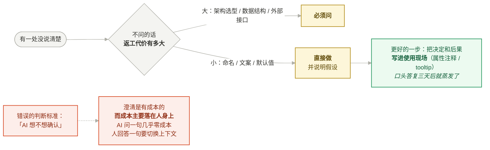


### 6.7 AI 交还决策权

> "修改这个 Tools 的 bat 文件，只需要运行 2 个客户端就行了。"

改动是一行 `CLIENTS=3` → `CLIENTS=2`。但文件名 `StartTest_1S4C.bat` 因此名不副实了。

AI 的处理是——**改了配置，没改文件名，然后主动说明**：

> "`CLIENTS=3` → `2`。现在 1 个 listen server + 2 个客户端，共 3 名玩家。
> 文件名 `StartTest_1S4C.bat` 没动（4C 指玩家总数，现在名不副实）。要改名说一声。"

不改的理由：文件名可能被别人的桌面快捷方式、CI 脚本、肌肉记忆依赖——**这些依赖 AI 看不见**。

> **边界原则**：AI 承担"发现问题"的责任，但不独自承担"改变外部契约"的决策。凡是可能影响仓库外部依赖的改动（文件名、接口签名、配置默认值、资产路径），提出来，不要顺手做。

### 6.8 遇到阻碍时不要绕，要诊断

武器那几轮的编译一直被 Live Coding 挡着：

```
Unable to build while Live Coding is active.
```

面对这个阻碍，有很多"绕过去"的诱惑路径：改用别的构建目标、加各种跳过参数、只编译单个模块、或者干脆声称"代码写完了应该没问题"。

实际采取的是最朴素的做法：**诊断出根因（改了头文件，热重载不够用），然后明确告诉人"关编辑器我编译"**，并在总结里标注本轮代码未经验证。

> **原则**：遇到阻碍先诊断根因，不要为了绕开阻碍而升级到破坏性或不可控的操作。这条在涉及 `git reset --hard`、`--force`、`--no-verify`、删文件的时候是**红线**。

---


## 7. 一页纸总结

如果这篇文章只能留下一页，是这一页。

### 核心命题

> AI 写代码的瓶颈不是生成能力，是**约束供给**。
> 系统性工程 = 把隐性约束变成 AI 能消费的显性输入。

### 三层约束

| 层 | 做什么 | 对 AI 的作用 |
|---|---|---|
| **结构** | 统一命名/目录/分层，配置单点化 | 提高模式推断准确率，把盲区（蓝图）收敛到代码边界内 |
| **知识** | "为什么"型注释，记录负面知识 | 传递 AI 训练数据里没有的"本系统特殊性" |
| **验证** | 脚本化最小复现环境，证据先于断言 | 提供 AI 拿不到的运行时事实 |

### AI 的稳定失效模式（重点盯防）

1. **同步直觉**：用"当前帧可观测状态"判断异步/复制时序的事。→ 网络代码里几乎必错。
2. **自信的 80% 结论**：根因分析的语气置信度永远高于实际置信度。→ 人要打折，并据此选方案的鲁棒等级。
3. **继承错误假设**：无条件相信代码库里既有的注释。→ 错误注释比没注释危害大。
4. **顺手多做**：不受控的 diff 膨胀。→ 用显式"暂缓清单"和边界规则约束。
5. **正面总结倾向**：最后一段天然想说"完成了"。→ 硬规则：没跑过验证不许说修好了。

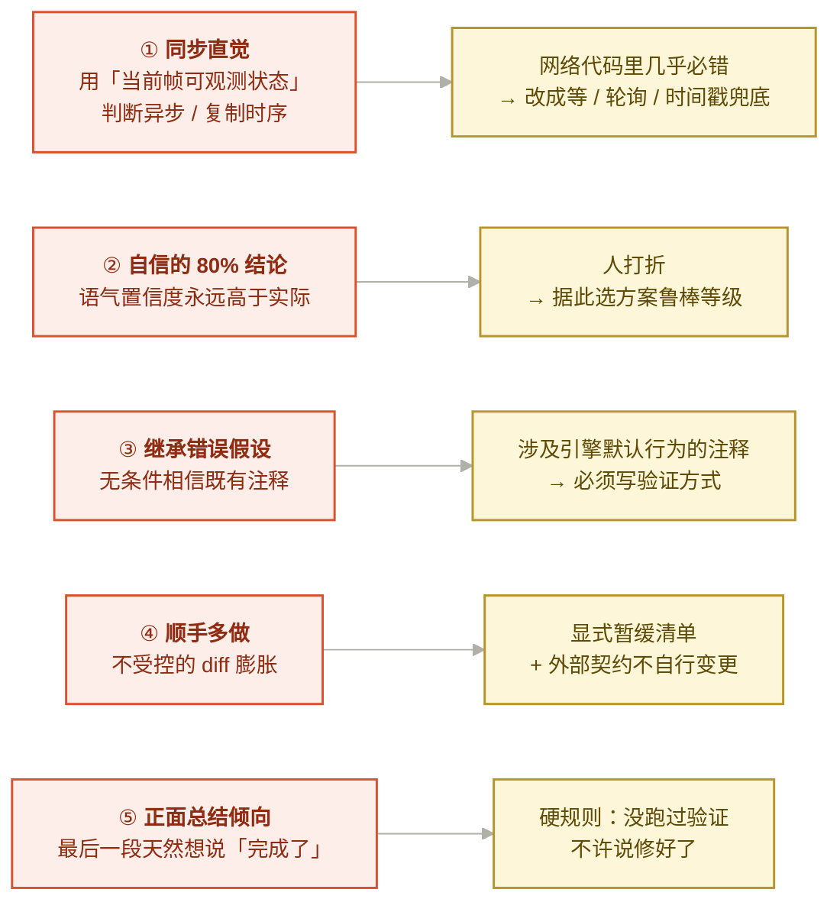

*五条里有四条不是能力问题，是**默认倾向**问题 —— 所以对策全都是「写下一条规则」，不是「换个更强的模型」。*

### 高信息密度的表达（人这边的五个动作）

| 动作 | 例句 | 为什么有效 |
|---|---|---|
| 报 bug 带**对照组** | "客户端悬浮，listen server 正常" | 把范围从"物理系统"缩到"复制链路" |
| 说**偏差**不说"不对" | "第一帧就挂手上了，而不是等 notify" | 实际值+预期值+时间点，零次反问定位 |
| 给**约束**不给实现 | "不需要勾选，这里自动判定" | 保留实现空间，同时携带了意图 |
| 用**参照物**压缩规格 | "和 equip 一样" | 五个字指定四件事（前提：结构一致） |
| 明确说**不要做什么** | 暂缓清单 | 防止 AI 每轮重新发现同一批问题 |

### 人在闭环里的不可替代职责

- 提供**带对照组的现象观察**——AI 跑不了游戏，做不了 A/B 对照
- 给 AI 的结论**打置信度折扣**，并决定方案的鲁棒等级
- 决定**外部契约**的变更（文件名、接口、默认值）
- 维护**暂缓清单**，防止上下文被重复噪音消耗


*一句话：**AI 承担「发现问题」的责任，人承担「决定赌不赌」的责任。***
