> 本章不讲「怎么做搜打撤」，讲**从一句意图长出一个闭环的方法**，以及这套方法里 AI 能干什么、不能干什么。
>
> 标注「示意」的图不含实测数据。

---

## 0. 十个问题

1. 起点是什么？—— 意图，一切的根源
2. 一句意图怎么长成一个循环？—— 选核心变量 + 扇形展开
3. 什么叫闭环？怎么判定它闭上了？
4. 利弊选择怎么设计出来的？
5. 钩子挂在哪里才有效？
6. 规则怎么代替内容制造新鲜感？
7. 玩法规则设计的目的到底是什么？
8. 什么叫「有趣的设计」？能不能判定？
9. 这一整章里，AI 的能力边界在哪？
10. 不是策划的人为什么必须懂这些？

这十个问题不是并列的，是一条链 —— 前一个的答案是后一个的输入：


*任何一环缺失，后面全部悬空 —— 尤其是第 ①②，缺了它们后面每一步都变成「比谁经验多」。*

---

## 1. 意图是一切的根源

> **明确意图，才有方向。**
> 所有设计决定，最终都在回答同一个问题：我要的体验是什么。玩法、系统、数值、美术，都是这个答案的下游。

### 1.0 立论：为什么从意图开始

Jesse Schell 把这件事放在整本书的第二个透镜上 —— **Lens #2: The Lens of Essential Experience（本质体验透镜）**，只有三个问题：

> 1. What experience do I want the player to have?
> 2. What is essential to that experience?
> 3. How can my game capture that essence?
>
> —— Jesse Schell, *The Art of Game Design: A Book of Lenses*

同一章里还有一句更硬的断言：

> **"The game is not the experience. It is the facilitator of the experience."**
> 游戏本身不是体验，它只是体验的促成者。

**MDA 框架给出了同一件事的因果方向。** Hunicke、LeBlanc、Zubek 在 2004 年的论文里写：

> "From the designer's perspective, the mechanics give rise to dynamic system behavior, which in turn leads to particular aesthetic experiences. From the player's perspective, aesthetics set the tone, which is born out in observable dynamics and eventually, operable mechanics."
>
> —— *MDA: A Formal Approach to Game Design and Game Research* (2004)

这段话的实践含义：

```text
设计者的实现顺序：机制 → 动态 → 体验
玩家的感受顺序：  体验 → 动态 → 机制
两者相反。
所以设计者必须先站到玩家那一端，把「体验（Aesthetics）」定义清楚，
再倒着走回来写机制 —— 这个「站过去定义体验」的动作，就是明确意图。
```

跳过这一步的后果不是「设计不够好」，而是**没有判据**：任何机制争论都变成比谁的经验多，因为没人能说清「我们要的体验是什么」。

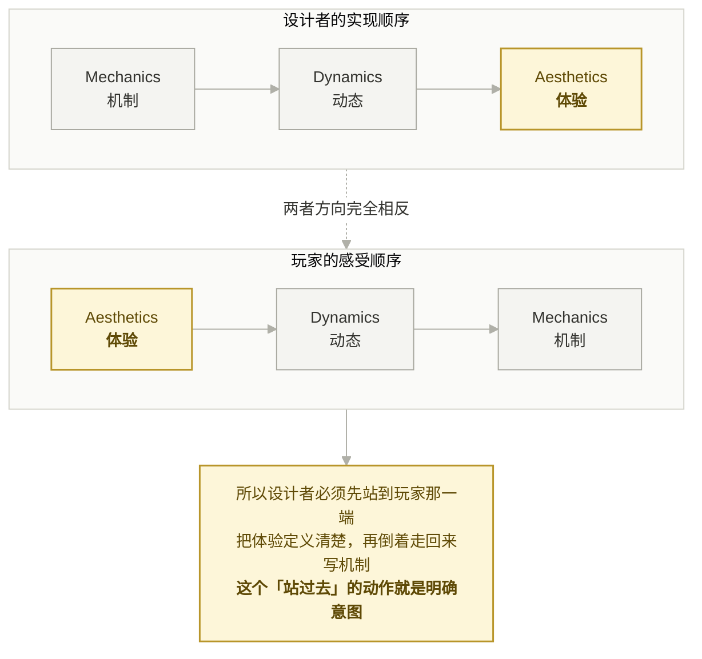

*跳过这一步不是「设计不够好」，是**没有判据** —— 争论只能比经验。*

还有一条反直觉的说法 —— Mark Rosewater（《万智牌》首席设计师）的口头禅：

> **"Restrictions breed creativity."**
> 约束催生创造力。
>
> —— Mark Rosewater, *Making Magic* 专栏（他自己也说不确定是否原创，但由他在设计圈推广）

**意图是设计者给自己下的第一条约束。** 它不是限制想象力，它是让想象力有靶子。

### 1.1 意图是双列的 [图 01]

| 美术表现空间 | 开发互动参与感 |
|---|---|
| 节奏 — 慢 | 框架稳固 — 便于扩展 |
| 探索 — 空间立体 | 功能独立 / 循环清晰 |
| 氛围 — 阴暗，压力，恐惧，紧张 | 资产规范 — 谁都可以参与 |
| | 敏捷迭代 — 面向目标的开发迭代 |

**关键：右列不是玩法需求，是工程需求。**
一个 Demo 的意图里同时写进「我要验证什么体验」和「我要验证什么协作方式」—— 这是这个项目从第一天起就没有做成「一堆能跑的功能」的原因。

### 1.2 意图 → 体验关键词 → 品类选择

推导方向是**从意图往下**，不是从品类往上：

```text
「节奏慢 + 空间立体」        → 玩家要有理由在一个地方待久、反复经过 → 搜刮 + 任务链
「阴暗 / 压力 / 恐惧 / 紧张」 → 需要一个持续恶化的压力源，而非一次性惊吓 → 感染
「框架稳固 / 循环清晰」      → 需要一个系统间强耦合、但模块可独立开发的玩法 → 有中心变量的循环
「资产规范 / 谁都可以参与」   → 内容单位必须格式化（怪物、武器、任务都要有固定字段）
```

结论：**品类是意图的解，不是前提。**
先说「我要做搜打撤」，然后所有讨论都变成「别人怎么做搜打撤」；先说「我要慢节奏立体探索 + 持续压力」，搜打撤才是被推导出来的、可以随时被替换的一个实现。

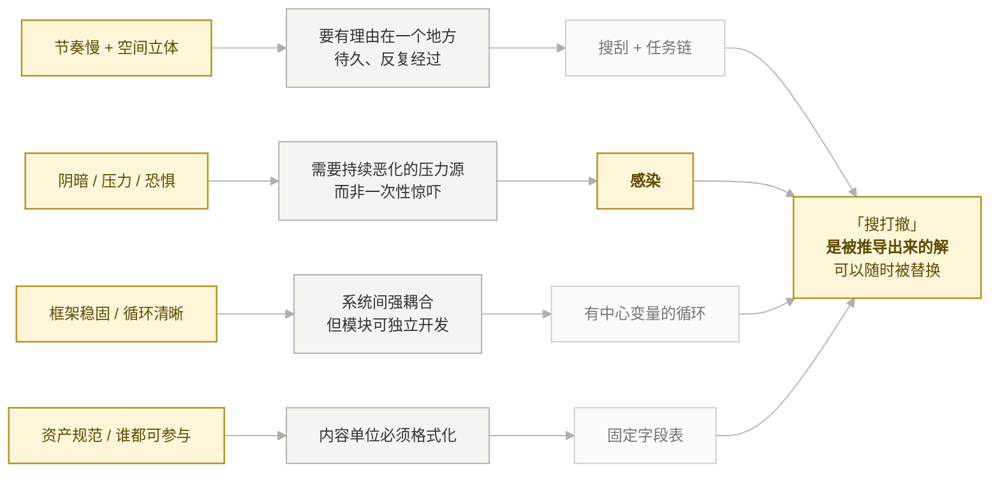

*推导方向只能是从左往右。反过来 —— 先定品类 —— 所有讨论都会变成「别人怎么做搜打撤」。*


---

## 2. 选一个核心变量承载意图

### 2.0 立论：为什么好的设计要围绕一个核心变量

从设计、经济、体验、工程四个角度各看一遍。

#### 好想法的标志是一次解决多个问题

宫本茂的持论（经岩田聪在「社长が訊く」中转述并由宫本本人确认）：

> 「アイデアというのは、複数の問題を一気に解決するものである」
> 所谓好想法，是能一次性解决多个问题的东西。
>
> —— 宫本茂，转述自《超级马力欧 25 周年 社长が訊く》Vol.1（2010）

**反向使用这条判据**：如果一个机制只解决一个问题，它就不是好想法，只是一个功能。
「感染」之所以立得住，是因为它同时解决了：压力来源、路线动机、资源意义、协作理由、撤离时机、经济锚点 —— 六个问题，一个变量。

Schell 把这条做成了可量化的透镜 —— **Lens #43: The Lens of Elegance**：

> "What are the elements of my game? What are the purposes of each element? Count these up to give the element an 'elegance rating.'"
> 数一数每个元素服务了几个目的，这个数就是它的优雅度评分。

核心变量就是**全项目 elegance rating 最高的那个元素**。选它的过程，就是找「一个能被最多系统复用的东西」。

#### 内部经济需要一条主干资源

Ernest Adams 与 Joris Dormans 在《Game Mechanics: Advanced Game Design》里给内部经济下的定义是：

> "All economies revolve around the flow of resources."
> 一切经济都围绕资源的流动。

并区分了两类反馈回路：

> "Negative feedback tends to damp out effects and produce equilibrium."
> "Positive feedback creates exponential curves."

**多变量的问题在这里暴露**：饥饿、口渴、体温、理智四个变量各自形成小回路，彼此不交换资源，游戏就变成四条互不相干的独立流水线，玩家分四次注意力，四个都感觉不到。
单一核心变量则让所有系统的正反馈与负反馈**汇总到同一条曲线**上 —— 玩家只需要盯一个仪表盘，却能感受到全部系统的合力。

对应本项目：感染是唯一的主干资源，抑制剂是唯一的负反馈阀门。

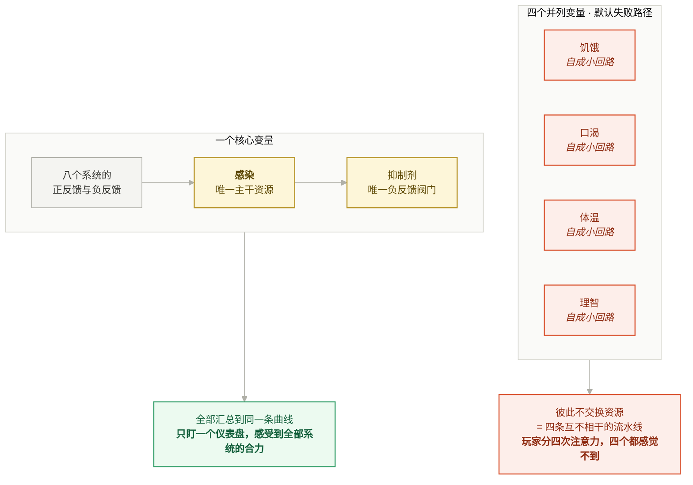

*「加一个新变量」永远比「把新需求接到现有变量上」容易 —— 所以它是**默认失败路径**。*

#### 玩家只能学一条主要因果链

Raph Koster 的核心论断：

> "That's what games are, in the end. Teachers. **Fun is just another word for learning.**"
>
> —— Raph Koster, *A Theory of Fun for Game Design* (2004)

如果乐趣来自掌握，那么**变量数量直接决定学习曲线的陡峭程度**。四个并列变量 = 四条要同时学的因果链，玩家学不完就会退回「凭感觉玩」，机制再精巧也感受不到。
一条主链则可以反复被强化：每一局、每一个区域、每一个怪物都在教同一件事 —— 高收益行为会推高感染。

Doug Church 的 FADT 给了这条链能被学会的前置条件：

> **Perceivable Consequence**: "A clear reaction from the game world to the action of the player."
>
> —— Doug Church, *Formal Abstract Design Tools* (Gamasutra, 1999)

**核心变量天然满足「可感知后果」** —— 因为所有行为都指向同一个读数，玩家能立刻看到自己做的事产生了什么。分散到四个变量上，每个变化都太小，后果就不可感知了。

#### 核心变量是模块解耦的接口

回到图 01 意图右列的「功能独立 / 循环清晰」：

```text
任务模块不需要认识怪物模块，它们都只读写感染。
怪物模块不需要认识武器模块，它们都只读写感染。
```

**核心变量就是公共总线。** 系统之间通过一个共享状态间接耦合，而不是互相调用 —— 这既是设计上涌现的前提（`§9.3`），也是工程上模块能独立开发、独立交付的前提。技术上它对应「感染必须是 AttributeSet 而非某个类里的一个 float」。

> **「加一个新变量」永远比「把新需求接到现有变量上」容易，所以它是默认失败路径。**
> 每次有人提议加一个新的状态值，先问：它能不能表达为现有核心变量的一个来源或一个去处？

### 2.1 感染 = 决策动作的结果 [图 02]

原图上的一行字是整个设计的枢轴：

```text
感染：决策动作的结果
感染增长来源不只是时间压力，而是所有高收益行为的代价。
```

六类感染源，全部挂在**玩家主动选择的行为**上：

| 来源 | 触发行为 |
|---|---|
| 区域感染 | 进入医院地下、实验室、尸潮区、孢子区 |
| 接触感染 | 被咬、被喷吐、踩入污染液、接触尸体样本 |
| 战斗感染 | 近战击杀、被血液喷溅、使用污染武器、开枪引发尸潮 |
| 道具感染 | 拾取病毒样本、感染器官、实验材料、高价值原液 |
| 任务感染 | 主动进入污染源、启动实验设备、搬运样本箱 |
| 队友感染 | 队友高感染产生「共队风险」：咳嗽噪声、吸引怪物、污染附近空间 |

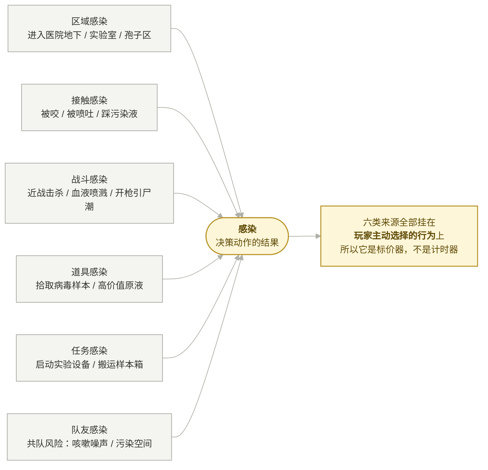

*如果六类只剩「时间」一条，同一个变量就退化成倒计时 —— 玩家只会加快速度，没有选择。*

### 2.2 为什么这一步是「目的导向」

顺序不能颠倒：

```text
① 先定体验目的：让玩家不断评估「我还能不能继续贪」
② 再选一个变量去承载它：感染
③ 再把所有高收益行为接到这个变量上：六类感染源
④ 最后才是数值
```

跳过了 —— 直接做「饥饿值 + 口渴值 + 中毒值 + 理智值」四个变量，每个都只承载一小段体验，玩家一个都记不住，系统之间也接不起来。

**一个核心变量的价值：它是所有系统的公共总线。** 任务、怪物、武器、道具、地图、撤离全都读写同一个值，模块之间不需要互相认识。

### 2.3 决定性的一手：把惩罚做成另一种收益 [图 02 右]

高感染收益：

```text
可以感知隐藏样本
可以看到污染痕迹
短时间提高近战伤害
通过某些怪物区域不被立刻攻击
撤离后会产生更高研究积分
```

**如果感染只是负债，最优策略永远是「感染越低越好」，取舍就消失了。** 让高感染同时是一条 build，「贪」才有正反馈，玩家才会主动往危险里走 —— 而这正是意图里「压力、紧张」的来源。

> **纯惩罚机制不产生决策，只产生规避。** 想让玩家主动承担风险，风险必须自带一条收益边。

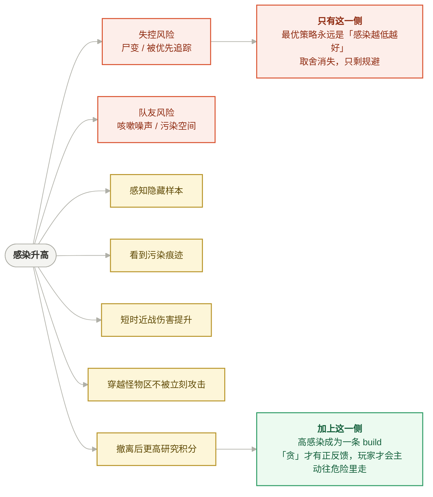

*这一手是全套设计里最高级的一步：把惩罚做成另一种收益，于是「压力、紧张」不再靠数值堆，靠玩家自己往里走。*

---

## 3. 从核心变量扇形展开玩法循环

### 3.0 立论：扇形展开的必要性

选定核心变量只完成了一半。**一个变量如果只有一个来源和一个去处，它不是核心变量，只是一个计时器。**
扇形展开 —— 让每个系统都回答「我和核心变量是什么关系」—— 解决的是下面五件事。

#### 必要性一：没有展开，核心变量就只是倒计时

对照实验（同一个变量，两种展开度）：

| | 只有时间一个来源 | 六类来源都接上 [图 02] |
|---|---|---|
| 玩家的感受 | 「我被计时器追着」 | 「我做的每个选择都在标价」 |
| 玩家的应对 | 加快速度，没有选择 | 选路线、选战法、选带什么 |
| 设计的可能性 | 只能调数值 | 每一类来源都是一个调节旋钮 |

**同一个变量，展开度决定它是压力还是决策。** 这就是图 02 上那句「感染增长来源不只是时间压力，而是所有高收益行为的代价」的分量所在。

#### 必要性二：内部经济需要多个 source 和 drain

Adams / Dormans 的内部经济模型里，一个资源要形成经济，必须有产出（source）、消耗（drain）、转换（converter）、交易（trader）。

```text
感染的 source：六类感染源
感染的 drain：抑制剂（且抑制剂被撤离经济争夺）
转换：高感染 → 感知能力 / 研究积分（把负债转成收益，见 §2.3）
```

**扇形展开在工程上就是在补齐 source 和 drain 的数量。** 数量不足 → 经济不成立 → 玩家没有可操作空间。

#### 必要性三：涌现的体积由展开宽度决定

Will Wright 的两句话（分别出自 MasterClass 教学与 2001 年 Game Studies 访谈）：

> "Start with simple rules. A simple game rules layer within your gameplay system can create incredibly complex, unpredictable outcomes."

> "Well, actually, the way to put it is that I'm trying to build the maximum possibility space in your head, not on the computer."

**关键在于：简单规则要能产生复杂结果，前提是规则足够多、且共享同一状态。**
三条规则挂在感染上 → 撞出 3 种意料之外的局面；十条规则挂在感染上 → 撞出几十种。
可能性空间的体积 ≈ 展开宽度的组合数，而不是内容数量的加和。这条直接支撑 `§7`「用规则代替内容」。

#### 必要性四：展开产出的是「格式化的内容单位」

扇形展开的副产品是一张**字段表**：每个特殊怪都有「能力 / 协作反制 / 设计价值 / 适合区域」四栏 [图 16]，每个任务都有「奖励 / 代价」两栏 [图 05]。

这件事有两个下游价值：

```text
对人：资产规范成立 —— 图 01 意图右列「谁都可以参与」的前提
对 AI：给定格式，批量补全是它最强的能力（见 §10.1）
```

**先扇形展开，再谈协作分工。** 没有统一格式的内容单位，多人（含 AI）并行产内容一定跑偏。

#### 必要性五：可以只做一个扇面就验证核心假设

这是 Demo 阶段最实用的一条：

```text
展开时把所有扇面都列出来（八个系统与感染的关系）
实现时只做三个：任务 × 感染 × 抑制剂
其余扇面留接口不留实现
```

核心假设（「玩家会不会为了抑制剂主动往感染里走」）只需要这三个就能验证。
**扇形展开的完整性保证方向不错，实现的选择性保证成本可控** —— 这两件事必须同时做，只做前者变成纸上帝国，只做后者会在第四个功能上撞墙。

### 3.1 展开总表

有了核心变量，扩展方式是**扇形展开**：每个系统只回答一个问题 ——「我和感染是什么关系」。

| 系统 | 与感染的关系 | 素材 |
|---|---|---|
| 抑制剂 | 唯一的下调手段，同时是最高价值战利品 | 图 03 |
| 任务链 | 递进推高感染，同时是抑制剂的来源 | 图 03 / 图 04 |
| 怪物 | 感染的施加者 + 压力节奏器 | 图 15–16 |
| 武器 | 用不同方式规避 / 承担感染 | 图 11 / 图 13 |
| 道具 | 能力差异，且部分自带感染代价 | 图 09 |
| 双人协作 | 感染状态差异制造分工与互救 | 图 07–10 |
| 地图区域 | 区域感染 + 资源倾向 | 图 12 / 图 19 |
| 撤离 | 结算感染收益 / 决定贪的终点 | 图 05 |

**这是 AI 最擅长的一步**（详见 §10）：给定「核心变量 + 一个系统」，让它穷举这个系统与核心变量的所有接口，产出质量很高。

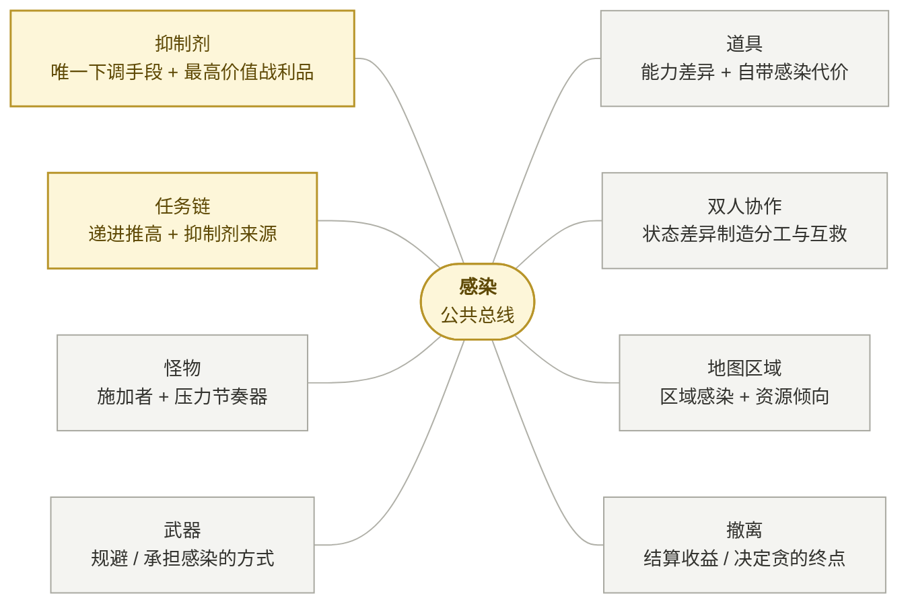

*每个系统只回答一句「我和感染是什么关系」。**展开的完整性保证方向不错，实现的选择性保证成本可控** —— Demo 只做加粗的那三个扇面，其余留接口不留实现。*

### 3.2 抑制剂的一物四用 [图 03]

| 职责 | 说明 |
|---|---|
| 生存道具 | 降低感染、压制变异、延缓尸变 |
| 高价值战利品 | 撤离后换钱、声望、研究积分、黑市货币 |
| 任务奖励锚点 | 玩家做任务的主要动力不是普通物资，而是越来越高价值的抑制剂 |
| 队友关系测试器 | 可以给自己用、给队友用，还可以私藏带出 |

**一个物品承担四个职责，取舍密度就来自这里。** 四职责两两之间都是矛盾对：用掉 vs 带出、给自己 vs 给队友、现在保命 vs 赌后续任务。

四档梯度 [图 04]：普通（降少量、易得）→ 稳定（降中量、副作用小、适合实战）→ 浓缩（降大量、但撤离价值高，玩家会舍不得用）→ 原型（超高价值，兑换巨额奖金/研究进度）。

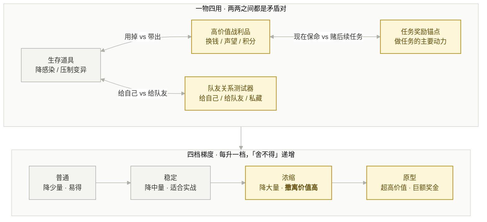

*取舍密度就来自这里：一个物品承担四个职责，四职责两两互相矛盾。梯度越高，矛盾越尖。*

---

## 4. 闭环的判定标准

### 4.1 完整闭环图 [图 18]

```text
道具/武器 → 双人协同 → 战斗 ←→ 怪物
                          ↓
                        任务 → 感染抑制剂 → 撤离收益 → （下一局入局携带）
                          ↑        ↓
                        感染 ←─────┘
```

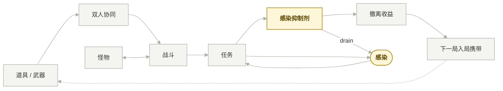

### 4.2 闭环不等于「流程图能连回起点」

先看 Daniel Cook 对「循环」的定义（*Loops and Arcs*, lostgarden, 2012）：

```text
玩家心智模型 → 决策 → 行动 → 系统反馈 → 更新心智模型 →（回到起点）
```

> "The goal of both loops and arcs is to update the player's mental model."
> 循环与弧的目标，都是更新玩家的心智模型。
>
> —— Daniel Cook, *Loops and Arcs* (2012)

Cook 还指出循环是**分形的**：「These loops are fractal and occur at multiple levels and frequencies.」—— 一次开枪是循环，一个任务是循环，一局是循环，一个赛季是循环。

注意他的定义里有「决策」这一环。**所以流程能连回起点还不够，那一环必须真的存在选择。**

**判定标准：至少有一处「同一资源被两条边争夺」。**

本项目的那一处就是抑制剂：

```text
边 A：抑制剂 → 降低感染 → 活下来 → 能继续贪
边 B：抑制剂 → 带出撤离 → 换钱   → 下一局更强
两条边消耗同一份资源，且互斥。
```

用 Adams / Dormans 的语言复述：**抑制剂同时是感染经济的 drain 和撤离经济的 source**，一份资源横跨两个经济体，玩家每次使用都在两个经济之间做转移支付。这是「争夺边」的机制学定义。

没有这种争夺边的循环只是**流水线**：采集 → 制造 → 消耗 → 再采集，每一步都只有一个最优解，玩家在执行而不是决策。

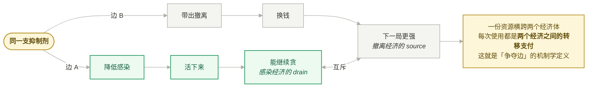

*没有争夺边的循环只是**流水线**：采集→制造→消耗→再采集，每步只有一个最优解，玩家在执行而不是决策。*


### 4.3 局内循环时间规划 [图 05]

单局体验 **25–35 分钟**，五段：

| 时段 | 设计意图 |
|---|---|
| 0–5 分钟 | 低风险搜刮，完成第 1 个任务，**建立安全感** |
| 5–12 分钟 | 进入中风险区，感染开始明显上升，获得第 2 批抑制剂 |
| 12–20 分钟 | 高价值任务出现，资源紧张，**队伍产生撤离分歧** |
| 20–28 分钟 | 地图污染加剧，撤离点变少，怪物密度上升 |
| 28 分钟后 | 强制高压期，Boss / 尸潮推动玩家撤离 |

**第一段必须是「建立安全感」。** 没有安全感，后面的压力上升就没有参照物 —— 恐惧来自落差，不来自绝对值。

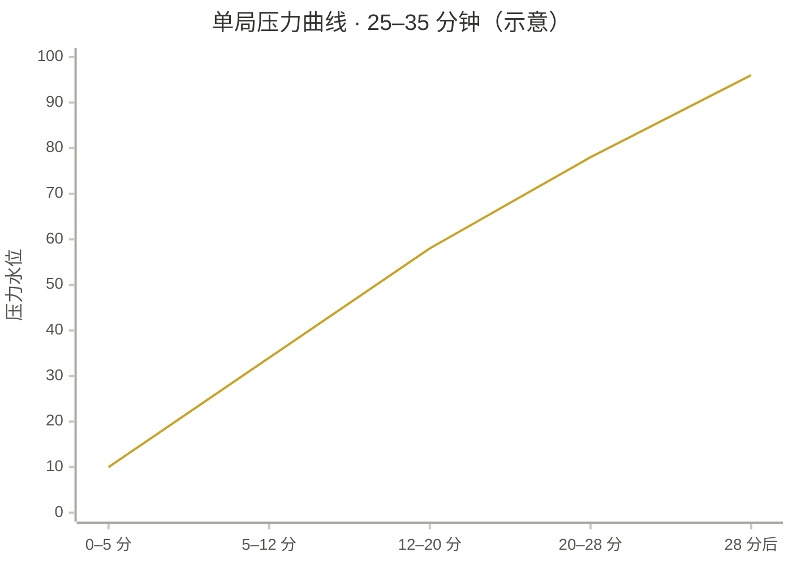

*起点被<b>刻意压到最低</b> —— 那不是「还没开始」，那是后面四段的参照物。恐惧来自落差，不来自绝对值。*

### 4.4 具体化验证：浣熊区医院 [图 05 右]

设计文档里同时写了一个**局内循环假设**（4 个任务，每个都有「奖励 + 代价」两栏）：

```text
任务 1 恢复急诊楼电力      奖励：普通抑制剂 ×1、9mm 弹药、饮水
任务 2 进入药房寻找冷藏药箱 奖励：普通抑制剂 ×2、止血剂   代价：药房孢子泄漏，感染持续上涨
任务 3 下到 B1 太平间提取样本 奖励：稳定抑制剂 ×1、高价值病毒样本  代价：携带样本后，猎杀者开始追踪小队
任务 4 打开 B2 实验室冷库，取回原型抑制剂  奖励：原型抑制剂 ×1、巨额奖金
                                       代价：启动冷库触发警报，撤离点从 3 个变成 1 个，净化门需等待 90 秒
```

**方法论价值：抽象循环必须落一份「一局的逐分钟剧本」才算验证过。** 抽象层面自洽的循环，写成剧本时才会暴露「第 3 个任务其实没有代价」这类空洞。

---

## 5. 利弊选择：取舍是怎么被设计出来的

### 5.0 立论：取舍不是难度，是游戏的本体

Greg Costikyan 在《I Have No Words & I Must Design》（1994/2002）里把这件事说到了定义层面：

> **"What makes a thing into a game is the need to make decisions."**
> 让一个东西成为游戏的，是做决定的必要性。

Sid Meier 在 GDC 2012 的演讲《Interesting Decisions》里给出了「什么样的决策才算有趣」的判据，据现场报道与整理，核心是：

```text
① 没有明显最优解
② 存在权衡取舍（强力武器 vs 移动速度；短期收益 vs 长期战略）
③ 决策有持久影响
④ 信息充分但不完全
⑤ 容纳不同的游戏风格
```


### 5.1 公式

```text
取舍的可设计性 = 资源的多义性 × 容量限制
```

- **多义性**：一份资源要能用在两个以上互斥的地方（抑制剂 = 药 + 钱）
- **容量限制**：背包格数。**这是所有取舍的物理载体** [图 02 「限制：背包格数」]

去掉任一项，取舍就消失：多义性没了 → 只剩清单化收集；容量无限 → 全都带走，不用选。

### 5.2 每个资源都要有一条负向边 [图 05 左]

| 资源 | 正向 | 负向 |
|---|---|---|
| 弹药 | 降低战斗风险 | 开枪增加噪音，**间接增加感染风险** |
| 武器 | 提供安全感 | 占背包空间，挤压抑制剂和补给 |
| 食物 | 维持体力 | 不吃会影响奔跑、搬运、近战 |
| 饮水 | — | 影响耐力恢复和感染恶化速度 |
| 医药 | 治疗血量 | **不一定降低感染** |
| 抑制剂 | 压制感染 | 有高额撤离价值（舍不得用） |

> 「医药不一定降低感染」这一条是刻意的：**不让两个系统共用一个解**，否则感染系统会被治疗系统吃掉。

### 5.3 减法比加法重要：武器不做耐久

设计文档 §2.5 的判决：

```text
武器是工具，不是核心经济。
不加入武器耐久系统，避免武器维护、维修、资产保值抢走抑制剂的核心地位。
战斗资源限制改为：弹药类型 + 携带量 + 弹药功能差异。
```

一句设计判决，删掉了维修 / 保值 / 折旧一整套系统。

**这件事在设计史上有名字。** Schell 在 Lens of Elegance 里写：

> "Often, a better question is 'What do I need to remove?'"
> 更好的问题往往是：我需要删掉什么？

上田文人（《ICO》《旺达与巨像》）的方法被总结为 **design by subtraction（减法设计）**：围绕一个核心情绪构建，删掉一切不服务于它的元素 —— 界面、数值、对话、教程。

> "I didn't hold back on removing and subtracting elements as needed. If something felt unfinished or unnecessary, I cut it."
> —— 上田文人，*ICO* 2002 开发者访谈（shmuplations 译）


Rosewater 的「Restrictions breed creativity」在这里第二次生效：**砍掉耐久系统，等于给自己加了一条约束 —— 战斗资源只能靠弹药类型和携带量做出差异 —— 于是弹药功能差异这条线被逼出来了。**

> **判断一个功能要不要做，看它是否争夺核心变量的注意力。** 耐久系统本身没问题，它的问题是会变成第二套经济，把玩家的算计从抑制剂身上拉走。
> Schell 的 elegance rating 可以直接当尺子用：耐久系统服务了几个目的？如果只服务「真实感」一个，删。

### 5.3b 一条必须提前知道的规律：玩家会把乐趣优化掉

Soren Johnson（《文明 4》主设计师）在《Game Developer》专栏里的一段，是所有取舍设计的前提：

> **"Given the opportunity, players will optimize the fun out of a game. Therefore, one of the responsibilities of the designer is to protect players from themselves."**
> 只要给机会，玩家会把游戏里的乐趣优化掉。因此设计师的责任之一，是保护玩家不受自己的伤害。
>
> —— Soren Johnson, *GD Column 17: Water Finds a Crack*（2011，原载 Game Developer 2011 年 3 月刊）

他还给了那个更形象的说法 ——「water finds a crack」：Civilization 团队用它形容「设计里任何一个缝，玩家一定会反复钻」。

**对本项目的直接推论：**

```text
如果高感染收益调得太强 → 玩家会开发出「故意保持 90% 感染」的极限流打法
如果抑制剂产出略多    → 「贪」不再有代价，取舍消失
如果撤离惩罚偏轻      → 最优策略变成「速刷第 1 个任务就撤」，25 分钟节奏塌掉
```

所以 §6.2 那组数值不是「填一下就行」，它是**堵缝**。这也是为什么数值必须由人来调（§10.2）。

### 5.4 矛盾点是可以被列举的 [图 04 右]

原图直接列了 6 条「矛盾点」：共享风险、互救机制（读条 + 暴露风险）、样本搬运（一人搬一人掩护）、任务分工、撤离分歧（**系统允许分歧产生**）、尸变风险（队友失控后变成局内威胁或掉落污染包）。

**「系统允许这种分歧产生」是设计取向的宣告** —— 不去消除玩家之间的冲突，而是给冲突提供合法场地。

---

## 6. 钩子设计

### 6.1 四类钩子（全部来自素材）

| 类型 | 素材原文 | 机理 |
|---|---|---|
| **递增钩子** | 「做到第 2 个就走？还是赌第 3 个？要不要冲第 4 个高级抑制剂？」[图 03] | push your luck：收益曲线的**感知斜率**必须陡于风险曲线 |
| **社交钩子** | 「队友感染 80%，你身上有一支高级抑制剂。你是救他，还是留着撤离换高额奖金？」[图 03] | 钩子挂在人际关系上，制作成本最低、强度最高 |
| **信息钩子** | 信息不对称型：「A 看到实验室门上的符号，B 在档案室看到符号对应的密码」[图 10] | 制造「必须交流」的时刻，交流本身就是内容 |
| **未完成钩子** | 「撤离点从 3 个变成 1 个，净化门需要等待 90 秒」[图 05] | 把「结束」变成一场遭遇，取消胜利的平滑落地 |

### 6.2 数值证据 [图 06]

```text
抑制剂价值 = 基础价值 × 纯度倍率 × 任务阶段倍率 × 污染风险倍率

任务 1：普通抑制剂 100      ←→  感染增速 +30%
任务 2：稳定抑制剂 250      ←→  怪物密度 +20%
任务 3：浓缩抑制剂 600      ←→  撤离等待时间 +15 秒
任务 4：原型抑制剂 1500     ←→  地图封锁概率 +1
```

**收益 15 倍，风险是四个「+一档」。这个不对称是故意的** —— 玩家能算清收益（1500 就是 1500），算不清风险（+30% 感速到底意味着什么？）。**可精确计算的收益 vs 模糊感知的风险 = 贪的心理基础。**

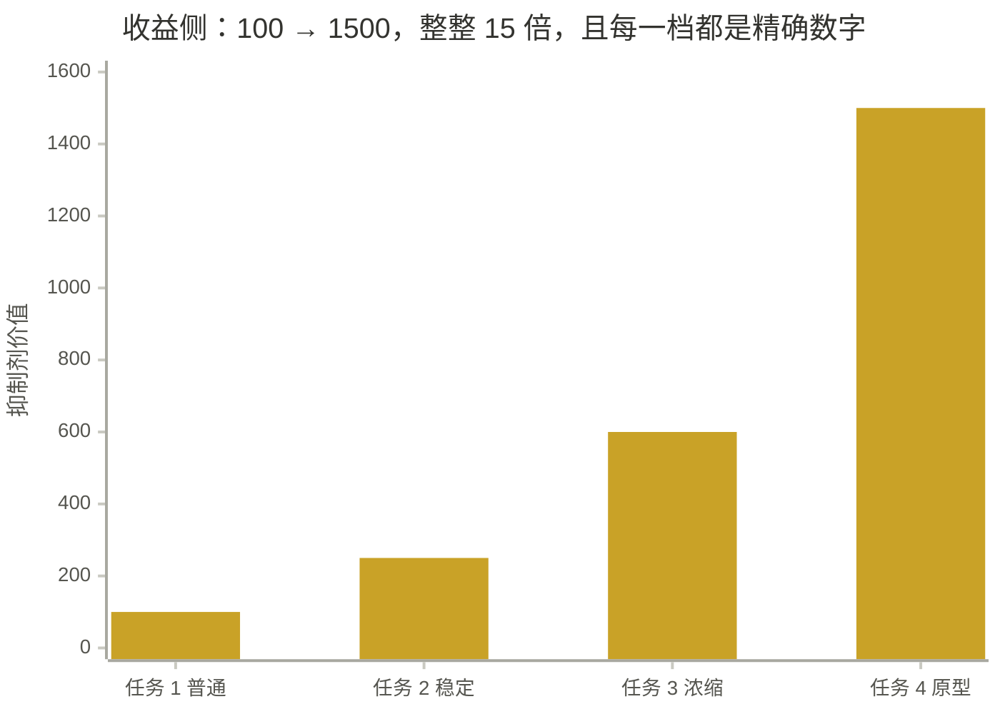

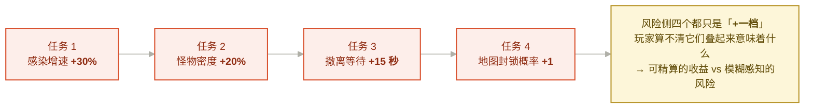

*上图陡升，下图平档 —— **这个不对称是故意的**，它就是「贪」的心理基础。*

这条正好命中 Sid Meier 判据里的第 ④ 条 —— **信息充分但不完全**：

```text
信息完全 → 玩家算期望值 → 决策变成计算 → 钩子失效
信息不足 → 玩家无法判断 → 决策变成瞎猜 → 钩子也失效
信息充分但不完全 → 玩家有直觉但没把握 → 钩子成立
```

> 反面：如果把风险也写成「死亡率 +18%」，玩家会开始算期望值，钩子立刻失效，游戏变成 Excel。

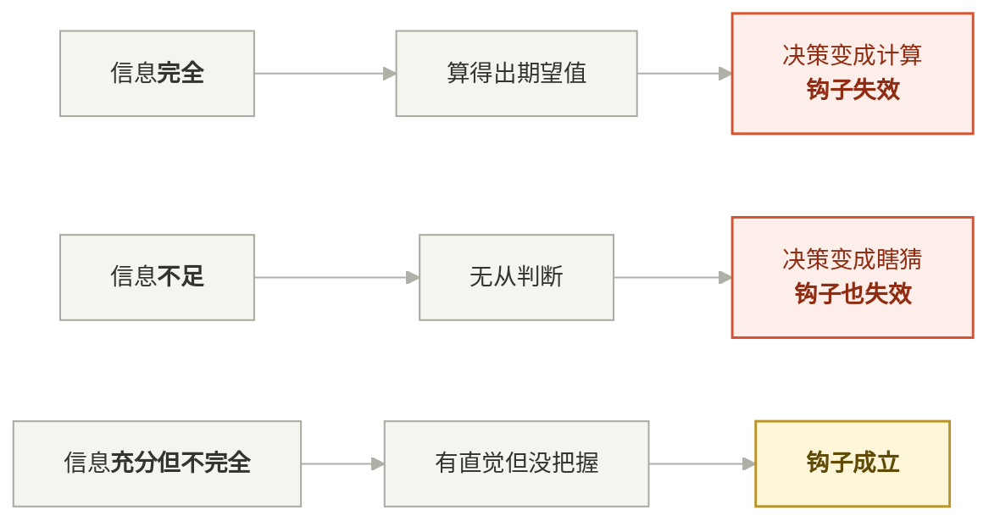

*两端都失效，只有中间那一档成立 —— 所以「把风险也写成精确百分比」是在自毁钩子。*

### 6.3 钩子设计的第一原则

> **钩子必须挂在玩家「已经拥有」的东西上，而不是承诺未来的奖励。**
> 已到手的抑制剂、还活着的队友、已经投入的 20 分钟。

这不是经验之谈，是有实验基础的 —— Kahneman 与 Tversky 的前景理论（*Prospect Theory: An Analysis of Decision under Risk*, Econometrica, 1979）提出**损失厌恶**：相对于参考点，同等幅度的损失带来的心理冲击显著大于收益带来的愉悦。后续研究给出的系数约 **λ ≈ 2.25**（Tversky & Kahneman, 1992）。

> **注意** 常被引用的「losses loom larger than gains」是对 1979 年论文核心思想的**提炼式概括**，并非逐字原文。引用时说「前景理论提出的损失厌恶」，不要说成论文原句。

**推论：同一个钩子，写成「失去」比写成「得到」强两倍以上。**

| 弱写法（收益框架） | 强写法（损失框架） | 素材原文 |
|---|---|---|
| 「再做一个任务能拿 1500」 | 「现在撤，第 4 个任务的 1500 就没了」 | [图 03] |
| 「救队友能获得协助」 | 「队友感染 80%，你手上有药」 | [图 03] |
| 「撤离点有 3 个」 | 「撤离点从 3 个变成 1 个」 | [图 05] |

素材里的钩子全部是右列写法。**「撤离点从 3 个变成 1 个」比「只有 1 个撤离点」强得多，因为它制造了一次可感知的失去。**

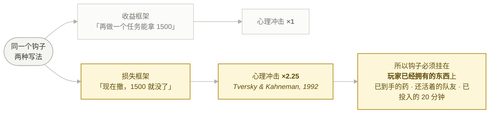

*同一个信息，换个框架强两倍以上 —— 这是可实施的写法规范，不是文案技巧。*

---

## 7. 用规则代替内容：新鲜感从哪来

### 7.0 立论：新鲜感的本质是「还有东西可学」

Koster 的论断在这一节是承重墙：

> "Fun is just another word for learning."
>
> —— Raph Koster, *A Theory of Fun for Game Design* (2004)

推论很直接：**当玩家不再学到新东西，新鲜感就结束了 —— 与内容量无关。**
Koster 在书里进一步指出，人脑会主动寻找模式，一旦模式被完全掌握，游戏就变得无聊（这也是他解释为什么井字棋对成年人无聊的方式）。

于是「新鲜感从哪来」变成一个可操作的问题：**怎么让「可学的东西」持续供应？**

两条路径，成本结构完全不同：

```text
内容型：设计者预先做好 N 个待学对象 —— 线性成本，做一个花一份钱，玩完就没了
规则型：规则交叉自动生成待学局面 —— 组合成本，N 条规则产生 N² 量级局面
```

Will Wright 把后者的目标说成了「在玩家脑子里建可能性空间」：

> "the way to put it is that I'm trying to build the maximum possibility space in your head, not on the computer."
>
> —— Will Wright，Celia Pearce 访谈，*Game Studies* (2001)

> "Encouraging emergent behaviors will enable you to produce play patterns that vary from game to game, or even moment-to-moment, to keep gameplay fresh."
>
> —— Will Wright, MasterClass 教学要点

**「不在电脑里，在你脑子里」**：可能性空间的体积由规则交叉数决定，不由资产数量决定 —— 而资产数量才是钱。

Rosewater 的《Ten Things Every Game Needs》里，第 6 条正是 **Surprise**（惊喜）—— 他把「不可预测性让玩法保持新鲜」直接列为游戏的必需品之一，而不是加分项。

Demo 阶段只有一个选择：**规则型**。下面四条是素材里的具体做法。

### 7.1 成本结构对照

| | 内容型 | 规则型 |
|---|---|---|
| 增加一份新鲜感的成本 | 一个新关卡 / 新怪 / 新剧情 | 一条新规则（可能只是一行配置） |
| 增长曲线 | 线性 | 组合（≈ 平方级） |
| 消耗方式 | 一次性，看过即失效 | 反复生效，且互相叠加 |
| 失败风险 | 做多了做不完 | 规则冲突、平衡崩塌 |
| 适合谁 | 有产能的大团队 | Demo / 小团队 |

**代价要说清楚**：规则型的风险是平衡崩塌（回到 §5.3b 的「water finds a crack」），它把成本从美术产能转移到了设计验证上。

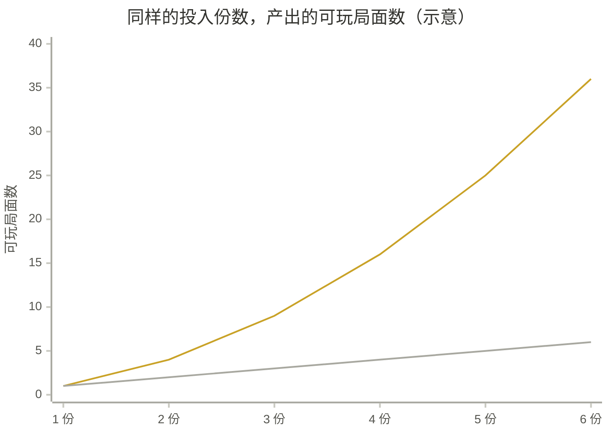

*上翘那条是**规则型**（N 条规则交叉出 N² 量级局面），压平那条是**内容型**（做一个花一份钱，玩完就没了）。
Demo 阶段只有一个选择。代价是：成本从美术产能转移到了设计验证上。*

### 7.2 区域资源倾向 → 规则生成动机 [图 12]

| 区域 | 资源倾向 |
|---|---|
| 别墅区 | 手枪、猎枪、近战武器、食物、水、私人保险箱 |
| 医院 | 医药、抑制剂、消毒喷雾、病毒检测仪、低噪音工具 |
| 警局 | 手枪、步枪、弹药、防弹衣、门禁卡、战术灯 |
| 商场 | 生存物资、工具、临时武器、背包、燃料 |
| 制药厂 | 化学弹药、毒气罐、抑制剂原液、污染样本 |
| 地下实验室 | 高级抑制剂、原型武器、实验弹药、高感染道具 |

原图右侧那四句是全套设计里最精炼的一段：

```text
我缺弹药，去警局。
我缺药，去医院。
我想赌高价值抑制剂，去制药厂。
我想低风险补给，去别墅区。
```

**同一张地图，每局因为「缺什么」不同而走出不同路线。** 新鲜感来自缺口的随机，不来自地图的数量。

### 7.3 能力差异不来自职业锁死，而来自携带限制 [图 09]

入局携带 6 类：工程 / 医疗 / 侦察 / 战斗 / 搬运 / 生存工具
局内临时道具 6 种：门禁卡 / 电池组 / 样本箱 / 消毒喷雾 / 声波诱饵 / 病毒检测仪

```text
职业系统：3 个职业 = 3 种分工，每局一样
携带系统：6 类工具选 2–3 件 = 数十种组合，且局内道具还会再变
```

而且分工是**涌现**的 —— 谁拿了电池组，谁就自动是「去恢复电力的那个人」，不需要 UI 上标一个职业。

### 7.4 感染状态本身就是 build [图 10]

| 状态 | 能力倾向 |
|---|---|
| 低感染 | 操作稳定，适合远程射击、解谜、精密操作 |
| 中感染 | 能感知污染痕迹，适合找隐藏样本和感染通道 |
| 高感染 | 近战增强、能短暂穿越污染区，但更容易失控 |
| 被压制 | 刚用过抑制剂，感染安全，但体力或感知暂时下降 |

**动态 build**：不需要玩家选，感染值一路变化，能力倾向跟着变。同一个角色一局内会经过 3–4 种状态。

### 7.5 难度不是数值曲线，是敌人种类的组合切换 [图 14–16]

```text
任务 1 阶段：普通感染体为主，少量奔跑感染者 → 玩家学习资源和感染系统
任务 2 阶段：尖啸者、肿胀者、扑击者出现 → 开始要求队友掩护和分工
任务 3 阶段：寄生者、装甲感染者、区域 Boss → 任务点更危险，奖励抑制剂更高级
最终高价值阶段：追猎者激活；撤离点被尸潮或污染影响；其他队伍遭遇概率提高
```

**难度递进 = 要求玩家掌握的新技能递进**，不是血量 ×1.5。

---

## 8. 玩法规则设计的目的是什么

### 8.1 「好玩」，是制造有意义的决策

这个说法有严格定义。Katie Salen 与 Eric Zimmerman 在《Rules of Play: Game Design Fundamentals》(MIT Press, 2004) 里提出 **meaningful play（有意义的游玩）**：

> **"Meaningful play occurs when the relationships between actions and outcomes in a game are both discernable and integrated into the larger context of the game."**
> 当游戏中行为与结果的关系既**可辨识**、又**融入游戏更大的语境**时，有意义的游玩就发生了。
>
> —— Salen & Zimmerman, *Rules of Play*, Ch.3

两个条件拆开看：

| 条件 | 含义 | 本项目对应 |
|---|---|---|
| **Discernable（可辨识）** | 玩家能看到自己的行为产生了什么结果 | 感染条是唯一读数，所有行为都指向它（同 Church 的 perceivable consequence） |
| **Integrated（已融入）** | 结果持续影响后续可能性，不是孤立反馈 | 感染影响能力倾向、怪物追踪、撤离价值、队友风险 |

**「Integrated」这条是大多数失败的系统的地方**：一个机制有反馈（数字变了），但那个数字不影响任何后续决策 —— 于是它可辨识但未融入，玩家两局之后就不再看它。

Doug Church 的两个 FADT 工具正好覆盖同样的两侧：

> **Intention**: "Making an implementable plan of one's own creation in response to the current situation in the game world and one's understanding of the game rules."
> **Perceivable Consequence**: "A clear reaction from the game world to the action of the player."
>
> —— Doug Church, *Formal Abstract Design Tools* (1999)

注意 Church 的「intention」是**玩家的意图**，和本章 §1 讲的**设计者意图**不是一回事 —— 但两者是因果关系：

```text
设计者意图（我要什么体验）
→ 规则
→ 玩家能形成自己的计划（Church 的 intention）
→ 玩家看到后果（perceivable consequence）
→ 体验产生
```

**设计者意图的成功标志，就是玩家能生成自己的意图。** 玩家只能照着提示做，说明规则没给出可规划的空间。

再加一条更古老的边界 —— Chris Crawford 在《The Art of Computer Game Design》(1984) 里用「交互」把游戏和谜题分开：没有真正的交互（系统会因你而变），那只是一道谜题，不是游戏。

综上，三条判据：

```text
① 至少两个选项都有理由（不存在唯一最优解）—— Meier 判据 ①②
② 后果可辨识，但不确定             —— Salen & Zimmerman「discernable」+ Meier 判据 ④
③ 后果影响后续，且不可撤销         —— Salen & Zimmerman「integrated」+ Meier 判据 ③
```

「救队友 vs 留抑制剂」：

| 条件 | 是否满足 |
|---|---|
| ① 两边都有理由 | ✓ 生存 vs 收益，且救他他还能继续帮你打 |
| ② 可预期不确定 | ✓ 知道大概会怎样，但不知道他撑不撑得住 |
| ③ 不可撤销 | ✓ 药用了就没了 |


**反例检验**：如果抑制剂随处可捡 → 条件 ① 失效（选择没有成本）→ 决策消失。
**所以稀缺性不是难度设计，是决策设计的前提。**

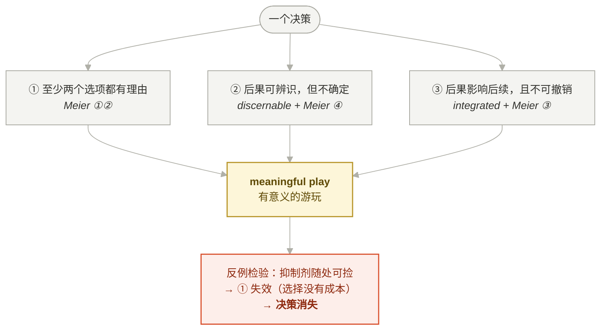

*三条同时成立才叫决策。稀缺性不是难度设计，是**决策设计的前提**。*

### 8.2 每个内容单位都必须回答：我逼玩家改变哪个行为 [图 16]

原图的标题就是判据：**「每个特殊怪都应该对应一个协作问题」**。

| 特殊怪 | 设计价值（原文） |
|---|---|
| 拖拽者 | 惩罚过度分离；制造救援时机；让霰弹枪、近战、精准射击都有用途 |
| 肿胀者 | 让玩家不能无脑近战；让击杀位置变成决策 |
| 尖啸者 | 把战斗和 PvPvE 连接起来；让开门、潜行、远程观察变得有意义 |
| 寄生者 | 让医疗工具和抑制剂有战斗价值；让感染不只是环境debuff，而是敌人能力的一部分 |
| 追猎者 | 把高价值战利品变成烫手山芋；让后期任务和撤离形成高潮 |

**没有一条写的是「血量 3000、攻击力 80」。每一条写的都是「我改变玩家的哪个行为」。**

这一栏就是给 AI 的判据（详见 §10）：写下这条规则后，AI 生成第 6 个怪时会自己补齐「设计价值」和「协作反制」两栏，而不是继续堆数值。

### 8.3 交叉绑定：规则的价值在连接处 [图 17]

四组绑定：怪物 × 武器（克制关系）、怪物 × 任务链（阶段投放）、怪物 × 感染系统（咬伤/污染喷溅/寄生/幻觉/气味追踪/尸变）、战斗资源 × 生存资源。

最后一组尤其干净：

```text
弹药   决定你能不能继续深入
药品   决定你能不能承受错误
抑制剂 决定你保命还是赚钱
食物和水 决定你能不能长时间探索
电池   决定手电、扫描器、电棒、门禁工具能不能继续用
背包空间 决定你带武器弹药，还是带高价值抑制剂
```

**每一行都是「资源 → 它约束了哪个决策」，不是「资源 → 它的数值属性」。**

---

## 9. 什么叫有趣的设计

### 9.0 立论：「有趣」是可以被拆解的，不是玄学

三家说法，指向同一件事：

| 出处 | 说法 | 落到本项目 |
|---|---|---|
| Koster《A Theory of Fun》 | 乐趣 = 学习。掌握新模式时产生愉悦，模式学完即无聊 | 每局都有新组合要学（§7） |
| Salen & Zimmerman《Rules of Play》 | 有意义的游玩 = 行为与结果的关系可辨识且已融入 | 感染是唯一读数且贯穿全局（§8.1） |
| Sid Meier（GDC 2012 判据） | 有趣的决策 = 无明显最优解 + 有取舍 + 有持久影响 + 信息不完全 | 抑制剂用 or 带出（§5） |

**三者的公共部分：有趣不是内容属性，是「玩家与系统之间关系」的属性。** 所以它能被检查。

### 9.1 可判定的标准

> **有趣 = 玩家能讲出故事。**
> 故事的最小单位：「我本来打算 X，结果因为 Y，我做了 Z。」

这句话不是修辞。用 Church 的语言翻译：「我本来打算 X」= intention 成立；「因为 Y」= perceivable consequence 成立；「我做了 Z」= 决策被迫重做，即 Salen & Zimmerman 的 integrated 成立。**能讲出这句话，三条学术判据同时满足。**

四条可判定检查项：

| # | 检查项 | 素材证据 | 理论对应 |
|---|---|---|---|
| ① | **有取舍**：不存在唯一最优解 | 抑制剂用 or 带出 | Meier 判据 ① |
| ② | **信息有代价**：不免费给情报 | 病毒检测仪能识别高价值样本，**但使用会暴露位置** [图 09] | Meier 判据 ④ |
| ③ | **失败可复述**：败因是决策，不是数值 | 「我贪了第 4 个任务」 vs 「我血少了」 | Salen & Zimmerman：integrated |
| ④ | **有涌现**：规则交叉产生设计者没写过的局面 | 开枪吸引尸潮 + 敌队交火 + 高感染被优先追踪 [图 14] | Will Wright：possibility space |

### 9.2 反判定

> **如果玩家的最优策略每局都一样，这个设计就不有趣 —— 美术再好也不行。**

这条的理论依据是 Koster：最优策略固定 = 模式已被完全掌握 = 没有东西可学 = 无聊。
它的对偶是 Soren Johnson 的警告（§5.3b）：玩家**会主动**去把策略固定下来 —— 「water finds a crack」。所以设计者不能等玩家自己保持新鲜，必须靠规则交叉持续制造未解局面。


### 9.3 「涌现」是可以被刻意制造的

制造涌现的做法只有一条：**让规则挂在同一个变量上，而不是互相调用。**

涌现全部来自感染这条总线：

```text
「携带抑制剂或高感染玩家更容易被追猎者发现」[图 17]
= 道具规则 × 感染规则 × 怪物 AI 规则

「高感染玩家会被怪物优先追踪」+「开枪吸引尸潮」+「双方交火可能惊醒 Boss」[图 14]
= 三条独立规则，产出一个没人写过的局面
```

如果这三条是靠 if-else 互相调用实现的，就只有设计者写过的那几种组合；挂在同一个变量上，组合是自动出现的。

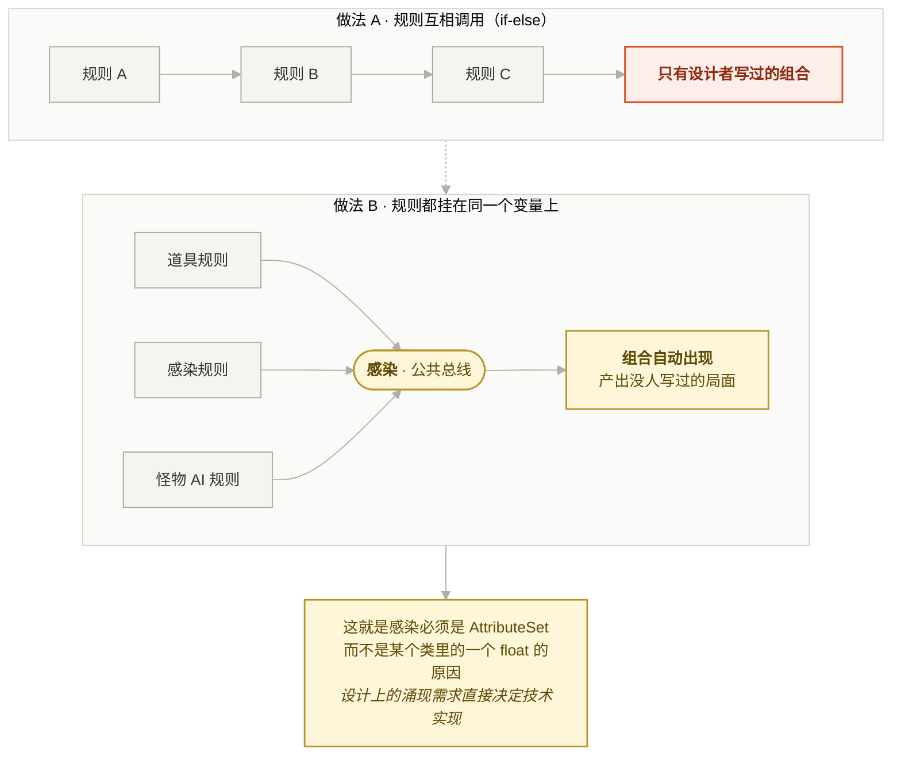


**这也是技术架构上感染必须是 AttributeSet 而不是一个 float 的原因** —— 设计上的涌现需求，直接决定了技术实现方式。这是本章通往第二章（技术架构）的接口。

---

## 10. 回到 AI：设计阶段的人机分工

### 10.1 AI 在这一章里极强的部分

| 能力 | 证据 |
|---|---|
| **扇形展开** | 给定「感染」，穷举六类感染源、六类工具、五个特殊怪、六种战斗类型、六个区域资源倾向 |
| **对称补全** | 一旦确定「每个特殊怪要有：能力 / 协作反制 / 设计价值 / 适合区域」四栏，后续每个怪都会自己补齐 |
| **一致性检查** | 「哪个资源还没有负向边」「哪个任务阶段还没有代价」这类扫描 |
| **给结构** | `抑制剂价值 = 基础 × 纯度 × 阶段 × 污染风险` 这种公式结构是可用的 |

### 10.2 AI 在这一章里极弱的部分

| 弱点 | 表现 |
|---|---|
| **不会做减法** | 「武器不做耐久」这类判决，AI 不会主动提。它倾向于把每个系统都做全 |
| **不会选核心变量** | 你说「加个生存压力」，它会给你饥饿 + 口渴 + 体温 + 理智四个变量，而不是问「哪一个能承载全部」 |
| **数值凭感觉** | 100/250/600/1500 这组数字它给得出来，但斜率是否形成钩子，它判断不了 |
| **不会拒绝需求** | 你提的每个功能它都会想办法接进来，包括那些会稀释核心体验的 |

### 10.3 分工结论

```text
人：定意图（§1）· 选核心变量（§2，只准一个）· 做减法（§5.3）· 调数值斜率（§6.2）
AI：扇形展开（§3）· 对称补全（§8.2）· 一致性扫描 · 给结构不给数值
```


*两个方向都必须存在。只有左→右，AI 会把每个系统都做全；只有右→左，人变成 AI 的校对员。*

### 10.4 关键操作：把「设计判据」写成文档，AI 才能自查

素材里的图 16 标题就是一条判据：

```text
每个特殊怪都应该对应一个协作问题。
```

这条一旦写进文档，AI 生成新怪物时会自己补「协作反制」和「设计价值」两栏；不写下来，它会给你一个属性表。

**这是本章最重要的一句：判据成文，AI 才有靶子；判据在人脑里，AI 每次都要重新猜。**

同理的判据清单（可以直接进设计文档）：

```text
每个资源必须有一条负向边。
每个任务阶段必须有奖励 + 代价两栏。
每个特殊怪必须回答：它改变玩家哪个行为。
每个新系统必须回答：它和核心变量是什么关系。
任何新机制若形成第二套经济，默认不做。
```

---

## 11. 给非策划：技术美术 / 程序为什么必须懂这些

> 本章面向在场的大多数人 —— 你不写玩法文档，不定数值，不背体验指标。
> 但下面七条说明：**在 AI 参与开发之后，不懂设计的代价从「沟通成本」升级成了「决策权丧失」。**

### 11.1 AI 把实现变便宜，把判断变贵

过去的职能分工建立在**产能稀缺**上：

```text
策划稀缺的是「想清楚」，程序稀缺的是「写出来」，美术 稀缺的是「表现出来」。
三方各守一段，靠文档和排期对接。
```

AI 把「写出来」这一段的成本压掉了一个量级。于是稀缺项只剩一个：**判断哪个方案是对的。**

```text
实现便宜  → 方案数量爆炸  → 选择成本上升  → 判断力成为唯一瓶颈
```

**结论对非策划最不友好也最重要**：如果你只会实现，AI 会把你压缩成一个转述者 —— 上游给需求，你转成 prompt，下游收代码。

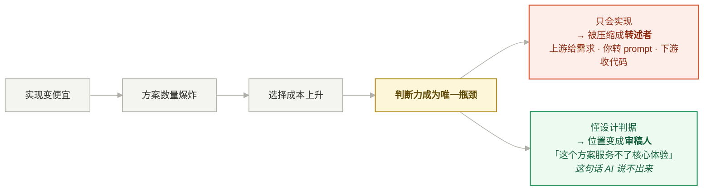

如果你懂设计判据，你在链条上的位置变成**审稿人**：你能说出「这个方案服务不了核心体验」，而这句话 AI 说不出来。

### 11.2 AI 不会拒绝需求，人必须会

§10.2 已经列过：AI 不做减法，不会拒绝需求，你提什么它都想办法接进来。

那么谁来拒绝？在小团队里就是**在场的每一个人**。而拒绝需要理由，理由只能来自设计判据：

| 没有判据时你只能说 | 有判据时你可以说 |
|---|---|
| 「这个工作量太大」 | 「这个功能会形成第二套经济，抢走抑制剂的注意力」（§5.3） |
| 「实现起来有点麻烦」 | 「它的 elegance rating 只有 1，只服务真实感一个目的」（§2.0） |
| 「我觉得不太好玩」 | 「玩家的最优策略不会因此改变，所以它不产生决策」（§9.2） |

**左列是抱怨，右列是评审意见。** 差别不在态度，在词汇 —— 而词汇就是这一章的全部内容。

### 11.3 技术选型其实是设计选型（本项目全部实证）

这是非策划读设计文档回报最高的地方。本项目每一条架构决定，背后都是一条设计判据：

| 技术决定 | 表面理由 | 真实依据（设计判据） | 不懂设计会怎么选 |
|---|---|---|---|
| 感染是 AttributeSet，不是 Character 上的 float | 「GAS 方便」 | 涌现要求规则挂在**共享状态**上而非互相调用（§9.3） | 选 float —— 更简单，且涌现永远做不出来，没人知道为什么 |
| 外观 / 动画 / 音效 / Cue 全集中在 `ItemDefinition` | 「配置方便」 | 抑制剂一物四用，要同时接背包 / GAS / 结算 / 撤离（§3.2） | 散进蓝图 —— 之后每加一个职责都要改代码 |
| 玩家数据归 PlayerState 而非 Controller | 「引擎推荐」 | 断线重连、死亡换 Pawn 后必须能恢复 | 放 Controller —— 重连后玩家资产丢失 |
| `Spawner 只负责生成，不负责决定为什么生成` | 「解耦」 | 怪物是**压力工具**，投放依据是压力/感染/任务阶段（§8.2） | 把投放逻辑写进 Spawner —— Director 层永远长不出来 |
| 感染的多个属性用最后一个 bool 触发 `OnRep_` | 「避免时序问题」 | 感染状态是一个**逻辑整体**，半个状态被读到会产生错误表现 | 每个属性各自通知 —— 客户端表现闪烁，且难复现 |

> **一句话**：架构的每一次分层，背后都是一条设计判据。判据你不知道，分层就只是「别人说要这样」，你既无法维护它，也无法在它错的时候反对它。

### 11.4 对美术：资产的意义由规则决定，不由美观决定


#### 例一：怪物的真实规格是「它改变玩家哪个行为」

图 16 的标题就是规格来源：**每个特殊怪都应该对应一个协作问题**。

```text
装甲感染者的设计价值：消耗高价值弹药，弱点在背部、腿部或头部缝隙。
→ TA 的真实需求：弱点必须在视觉上可读（造型上要有明确的「缝」），
   受击反馈必须能区分「有效/无效」，否则这个怪的设计价值为零。
→ 如果只按「高 2.5 米、抗性高」来做，玩家看不出弱点在哪，
   这个怪就退化成一个血包，设计意图在美术这一层被静默丢弃。
```

**设计判据不落到表现层，就等于没有。** 

#### 例二：感染四状态需要一条完整的视觉分级链

图 10 的四状态（低 / 中 / 高 / 被压制）不是数值分档，是**必须被玩家和队友同时读到**的信息：

```text
自己读：我现在能不能穿污染区、近战强不强、手会不会抖
队友读：他快失控了吗？我要不要现在把药给他？（§6.1 社交钩子的前提）
```

技术需求随之确定：**感染值必须驱动一条可复制、可插值、可被 GameplayCue 触发的视觉参数链**（后处理 + 材质 + VFX + 呼吸音）。
这不是"加个特效"，这是把一条设计判据实现成表现层管线 —— 而且必须在**独立客户端**上验证队友身上也可读（第三章的验证约束）。

#### 例三：把心理学判据实现错，钩子会在表现层被毁掉

§6.2 的核心：**可精算的收益 + 模糊感知的风险 = 贪的心理基础。**

翻译成表现层规格：

| 信息 | 必须的呈现方式  |
|---|------|
| 抑制剂价值 | 精确数字（1500）  |
| 感染风险 | 氛围化（画面色偏、呼吸声、视野扰动）  |

**一个进度条就能毁掉整套钩子设计。** 

#### 例四：场景辨识度是玩法规则的执行器

图 12 的四句「我缺弹药去警局，我缺药去医院」成立的前提是：**玩家能远远认出那是警局还是医院。**

```text
场景美术的辨识度不足 → 玩家认不出区域功能 → 区域资源倾向这条规则失效
→ 「规则生成动机」（§7.2）整条链断掉 → 玩家退回随机乱逛
```

**辨识度不是审美问题，是规则能否执行的问题。** 

#### 例五：Koster 那条判据其实是给表现层的

> "Fun is just another word for learning."

如果乐趣来自学习，那么**玩家学习的界面就是表现层**：他靠反馈认识因果，靠可读性建立模式。
Church 的 perceivable consequence（"A clear reaction from the game world to the action of the player."）也是同一件事 —— 而"clear reaction"这四个字，100% 是 TA 和程序的责任范围，不是策划的。

> **推论：设计判据能不能成立，最后一公里在表现层手里。**

### 11.5 懂设计 = 有资格往共享判据文件里写条目

§10.4 立过：**判据成文，AI 才有靶子。**

那么谁来写判据？**每一层的判据只有那一层的人最清楚**：

| 层 | 只有这一层的人能写出的判据 |
|---|---|
| 策划 | 每个特殊怪必须对应一个协作问题 |
| TA | 每个怪的设计价值必须在造型和受击反馈上可读 |
| 表现/UI | 收益用精确数字，风险用氛围，不做精确风险条 |
| 程序 | 任何"最终状态必须一致"的东西显式复制，不押引擎隐式通道 |
| 动画 | 装备表现走 Cue + 宽限窗，不用同帧状态判断异步事件 |

**`AGENTS.md` 是全员文件，不是程序文件。** 非策划在 AI 时代的核心贡献方式，从"实现需求"变成"往共享判据里贡献条目" —— 因为条目一旦写下，AI 会在之后的每一次生成里自动遵守，收益是复利的。

### 11.6 非策划的独占优势：能证伪 AI

AI 生成的设计**听起来的置信度永远高于实际置信度**（第三章原话）。谁能证伪它？

```text
设计知识告诉你：该验证什么
技术能力告诉你：怎么验证
两者缺一，验证都做不成
```

对照两种验证目标：

| 只有技术能力时验证的 | 懂设计判据后验证的 |
|---|---|
| 帧率、内存、有没有崩 | 3 个人各玩 5 局，路线和取舍是否趋同（§9.2） |
| 特效播出来了 | 队友身上的感染状态在**独立客户端**是否可读（§11.4 例二） |
| 数值填进表里了 | 有没有出现「故意保持 90% 感染」的极限流（§5.3b） |

右列每一条都是可脚本化的数据采集，而且**只有同时懂设计和技术的人能定义**。

> 在 AI 时代，**能证伪输出的人，比能生成输出的人稀缺。** 这是非策划最该占住的位置。

### 11.7 非策划最低限度要懂的六条（可以做成一张卡）

拿到任何一个需求时，先回答这六个问题。答不出来的，回去问：

```text
① 这个项目的核心变量是哪一个？
② 我做的东西挂在它的哪条边上？（产出 / 消耗 / 表现 / 反馈 / 约束）
③ 它要改变玩家的哪个行为？
④ 它的失败形态是什么？玩家会从哪里钻缝？
⑤ 它必须被玩家感知到的部分是什么？（perceivable consequence 的表现层责任）
⑥ 怎么验证它真的起作用了？用什么环境、看什么指标？
```

**六条全答得上 = 你可以独立判断这个需求做得对不对，不需要等策划来验收。**
这就是这一整章对非策划的意义。

### 11.8 理论支撑：这两套框架本来就是为跨职能沟通造的

不要把「学设计词汇」理解成越界。**MDA 和 FADT 的立意本身就是给跨职能团队造共同语言的。**

MDA 论文（Hunicke / LeBlanc / Zubek, 2004）：

> "Each component of the MDA framework can be thought of as a 'lens' or a 'view' of the game – separate, but causally linked."

它把设计、程序、研究者放进同一个因果链里 —— 三个视角，一套词汇。

Doug Church 写 FADT 的动机说得更直白：

> "The notion of 'Formal Abstract Design Tools' is an attempt to create a framework for such a vocabulary and a way to discuss design at a higher level of abstraction."
>
> —— Doug Church, *Formal Abstract Design Tools* (1999)

他明确希望这套词汇能帮团队**在「技术实现」和「玩家体验」之间建立清晰沟通**。

> 在 AI 加入之后，这条词汇还多了一个新用途：**它是唯一能让 AI 稳定对齐的接口。**


### 12. 引用

| 用在 | 出处 | 关键内容 |
|---|---|---|
| §1.0 | Jesse Schell, *The Art of Game Design: A Book of Lenses* — Lens #2 The Lens of Essential Experience | 三问：想给玩家什么体验 / 什么是本质 / 怎么捕捉；"The game is not the experience. It is the facilitator of the experience." |
| §1.0 | Hunicke, LeBlanc & Zubek, *MDA: A Formal Approach to Game Design and Game Research*, AAAI Workshop, 2004 | 设计者 mechanics→dynamics→aesthetics，玩家方向相反 |
| §1.0 / §5.3 | Mark Rosewater, *Making Magic* 专栏 | "Restrictions breed creativity."（他自称不确定是否原创） |
| §2.0 / §5.3 | Jesse Schell — Lens #43 The Lens of Elegance | 数元素服务的目的数 = elegance rating；"Often, a better question is 'What do I need to remove?'" |
| §2.0 / §4.2 / §3.0 | Ernest Adams & Joris Dormans, *Game Mechanics: Advanced Game Design*, 2012 | "All economies revolve around the flow of resources."；正/负反馈回路；Machinations |
| §2.0 / §7.0 / §9.0 | Raph Koster, *A Theory of Fun for Game Design*, 2004 | "That's what games are, in the end. Teachers. Fun is just another word for learning." |
| §2.0 / §8.1 | Doug Church, *Formal Abstract Design Tools*, Gamasutra, 1999 | Intention / Perceivable Consequence 的定义原文 |
| §3.0 / §7.0 | Will Wright — Celia Pearce 访谈, *Game Studies*, 2001 | "…build the maximum possibility space in your head, not on the computer." |
| §3.0 / §7.0 | Will Wright — MasterClass 教学要点 | 简单规则产生复杂不可预测结果；鼓励涌现以保持新鲜 |
| §4.2 | Daniel Cook, *Loops and Arcs*, lostgarden, 2012 | 循环 = 心智模型→决策→行动→反馈→更新；"loops are fractal" |
| §5.0 | Greg Costikyan, *I Have No Words & I Must Design*, 1994/2002 | "What makes a thing into a game is the need to make decisions." |
| §5.3b / §9.2 | Soren Johnson, *GD Column 17: Water Finds a Crack*, 2011 | "Given the opportunity, players will optimize the fun out of a game…" |
| §6.3 | Kahneman & Tversky, *Prospect Theory*, Econometrica 47(2), 1979；Tversky & Kahneman, 1992 | 损失厌恶；λ ≈ 2.25 |
| §7.0 | Mark Rosewater, *Ten Things Every Game Needs*, 2011 | 第 6 条 Surprise 是必需品，不是加分项 |
| §8.1 | Salen & Zimmerman, *Rules of Play*, MIT Press, 2004, Ch.3 | "Meaningful play occurs when the relationships between actions and outcomes… are both discernable and integrated…" |
| §8.1 | Chris Crawford, *The Art of Computer Game Design*, 1984 | 交互把游戏与谜题区分开 |
| §5.3 | 上田文人, *ICO* 2002 开发者访谈（shmuplations 译） | "I didn't hold back on removing and subtracting elements as needed…" |
| §2.0 | 宫本茂，《超级马力欧 25 周年 社长が訊く》Vol.1, 2010 | 「アイデアというのは、複数の問題を一気に解決するものである」（岩田聪/糸井重里转述，宫本本人确认） |
