> 本章讨论：在 AI 时代，美术在游戏开发里到底扮演什么角色。
> 与维度一的关系：维度一讲「意图 → 判据」，本章讲**判据如何变成可被眼睛读到的东西**。同一条脊，换一个通道。
>
> **本章定位：观点章 + 策展式取证。** 本项目美术资源全部来自商城、零自研，因此「表达价值上升」这个论点在本项目内**没有正面取证**。取证走另一条路：**选资源的过程本身就是美术决策行为**。这一点在 §4.2 说明。

---

## 0. 一页结论

1. 美术是游戏里**最通达感知的模块**。但玩家感知到的不是「精美」，是**「合适」**。
2. 合适可以定义，因此可以证伪：**玩家实际读到的信息 == 设计想让他读到的信息。**
3. 主观的「美」不是一团东西，能拆成两层：**技术层**（色彩对比、构图、剪影）和**决策层**（为什么是这个对比色、这个剪影）。
4. **AI 平权吃掉的是技术层。** 决策层它做不了 —— 它不知道你的意图。
5. 决策层由**意图**驱动，不由品味驱动。这就是维度一那套东西在图像通道上的投影。
6. 表达的空间不在约束之外：**意图约束了「要读到什么」，没约束「用什么读法」。** 表达就是在同一约束下的解空间里选路径。
7. 团队情绪一致不靠风格描述，靠**否决清单**。风格描述不可证伪，否决清单可以逐张验 —— 也是唯一能交付给 AI 的形式。
8. 与工程层不冲突：**结构先行、资产替身管的是管道，意图下的概念设计管的是内容。** 真冲突只有一种，见 §7.3。

一句话版本：

> **涨价的不是精美，是视角。而视角不是品味，是能被反向验证的决策。**

八条结论是一条链，不是八个并列观点：


*链条的承重点在 ②：只要「合适」能被定义，后面每一条才有落地方式。停在「好看」上，整条链都建不起来。*

---

## 1. 立论：美术是感知通道

### 1.1 「精美」不可证伪，「合适」可以

评审时最常听到的两句话：「这个不好看」「再精致一点」。

这两句的问题不是主观 —— 而是**不可证伪**。没有任何后续动作能证明它被满足了，所以它只能靠权威裁定，而权威裁定无法传递给第二个人，更无法传递给 AI。

换成这一句，整件事就变了：

> **玩家实际读到的信息 == 设计想让他读到的信息。**

**「合适」不是「精美」的降级，是「精美」的上级。** 精美是达成合适的手段之一，不是目标。

### 1.2 两个学术支点

- **Doug Church，FADT（Formal Abstract Design Tools）** —— 其中两个核心工具是 **Intention** 与 **Perceivable Consequence**：玩家形成意图，并且后果必须**被感知到**，玩法才成立。
  → 美术就是 Perceivable 那一半的实现者。后果发生了但玩家没读到，等于没发生。

- **Salen & Zimmerman，*Rules of Play*，meaningful play** —— 有意义的游戏行为需要两个条件：**discernable（可辨识）** 与 **integrated（与结果相连）**。
  → 设计负责 integrated，**美术负责 discernable**。

把这两条并起来，美术在结构上的位置就非常明确了：

```
设计做出后果  →  美术让后果可被读到  →  玩家形成下一次意图
                    ↑
              这一环断了，整条闭环停转
```

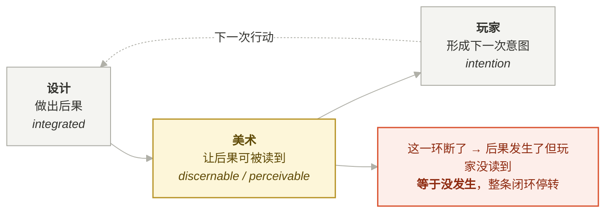

*Church 的 perceivable consequence 与 Salen &amp; Zimmerman 的 discernable，指的都是中间那一格。
设计负责 integrated，**美术负责 discernable** —— 这是分工，不是修饰关系。*

### 1.3 推论：美术不是装饰层，是判据的可读性层

维度一的结论句是：**判据不落到表现层，就等于没有。**

落到哪个表现层？主要就是图像。

所以美术承担的不是「让它好看」，是**「让设计判据在屏幕上可被读出」**。这两个职责的验收方式完全不同：

| | 「好看」 | 「可读」 |
|---|---|---|
| 谁验收 | 主美 / 制作人的眼睛 | 没玩过的人 |
| 怎么验 | 讨论 | 一眼判断 + 问一句 |
| 失败表现 | 有人不喜欢 | 玩家做错决定 |
| 可否交给 AI | 不可 | 可 —— 因为能写成判据 |

---

## 2. 把主观的「美」拆成两层

这是本章的刀。

| 层 | 内容 | 性质 |
|---|---|---|
| **技术层** | 色彩对比、构图、剪影清晰度、明度层次、材质表现、镜头语言、解剖结构 | 可训练、可外包、有相对标准答案、可以打分 |
| **决策层** | 为什么选这个对比色？为什么是这个剪影？为什么危险感靠体型而不靠颜色？ | 由**意图**决定，不由品味决定 |

两层的关系不是「高级/低级」，是**「怎么做」和「做什么」**。

技术层做得再满，决策层错了，结果是**精美的误导** —— 这比粗糙更贵。玩家会相信画面告诉他的事，画面说错了，他就做错决定，然后骂设计。

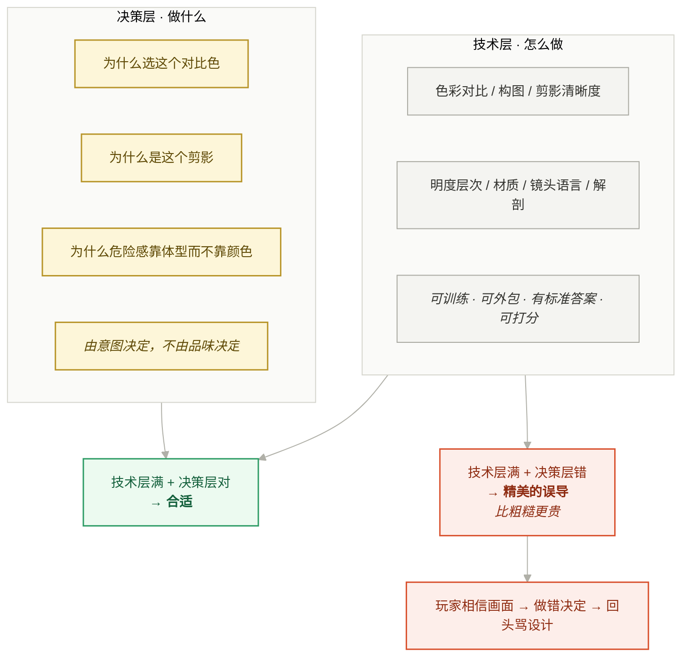

*两层的关系不是「高级 / 低级」，是「怎么做」和「做什么」。AI 只吃掉了上面那一格。*

### 2.1 阶段论错在哪：预研期压缩的是工时，不是表达

有一种常见讲法是按阶段分：预研期不看美术，正式期才看美术。**这个讲法把「要压缩什么」说错了。**

预研期真正压缩的是**技术层的工时投入**，不是审美表达。表达从第一天就在场：

- **白模不等于一堆白色 box。** 构图、灯光、关卡的空间节奏、视线引导、体量对比 —— 这些在原型阶段就已经在做美术表达了，而它们恰好是**不吃贴图和高模工时**的那一部分。
- 被砍掉的是**需要长时间投入的部分**（高模、材质精度、特效层级），**不是被砍掉判断**。砍的时候必须同时做两件事：**留好接口**，以及**心里清楚后面怎么接上**。

商城资源在这个阶段的作用也要说准 —— 它最大的问题不是质量，是**不统一**：

> 某一个部分的资产恰好符合预期，其余大部分不符合。

所以这一步的动作不是「随便拿个能跑的」，而是：

```text
挑出最接近想要表达的替代资产 → 拿它去演示 → 比较脑海里的想法与手上资产的匹配度 → 迭代
```

这个循环真正的产出不是「能跑」，是**方向被确定下来了**。方向定了再投入正式生产，**返工的代价就不存在了**。

一句话：**预研期不是「先不管美术」，是用最便宜的介质把美术方向试错完。**

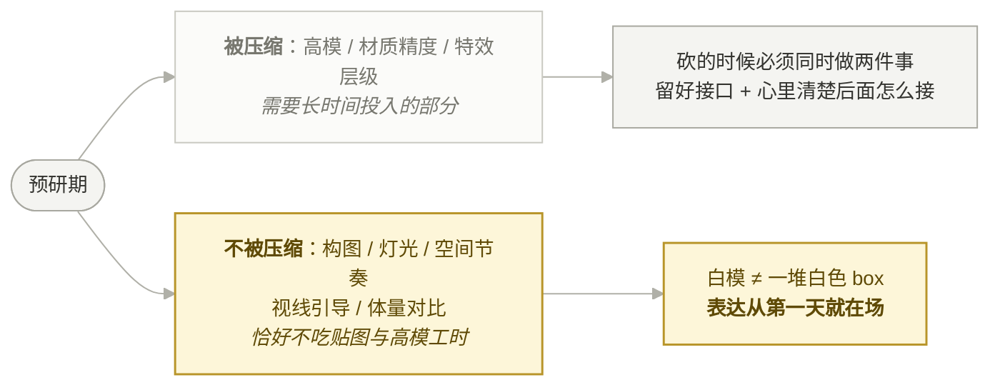

商城资源在这个阶段的动作也不是「随便拿个能跑的」，而是一个收敛循环：


*商城资源最大的问题不是质量，是**不统一** —— 某一部分恰好符合预期，其余大部分不符合。所以它只能当试错介质，不能当方向本身。*

分层轴的另一个好处是它能一句话说清 AI 时代变了什么 —— 变的是**其中一层的价格**。

---

## 3. AI 平权吃掉了哪一层

### 3.1 贬值的是「达到行业平均精美度」的能力

要说准：**技术壁垒不是消失了，是中位线被抬平了。**

这跟 Brynjolfsson / Li / Raymond 那篇客服 RCT 的结构一模一样：整体效率 +14%，**新手 +34～35%，熟手近乎不变**。

翻译成一句话：

> **「比平均水平好」这件事不再值钱了。**

对美术就是：达到「行业平均精美度」的能力从稀缺变成基础设施。会画得干净不再是护城河。

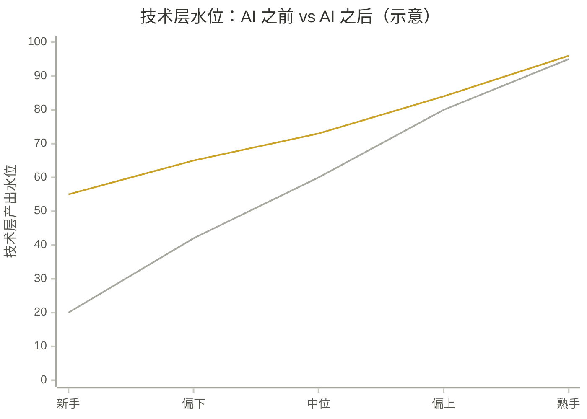

*两条线在最右端几乎重合，在最左端差出一倍多 —— **技术壁垒不是消失了，是中位线被抬平了**。
这跟客服 RCT 的结构一模一样：整体 +14%，新手 +34～35%，熟手近乎不变。
直接后果：**「比平均水平好」这件事不再值钱了。***

### 3.2 涨价链条

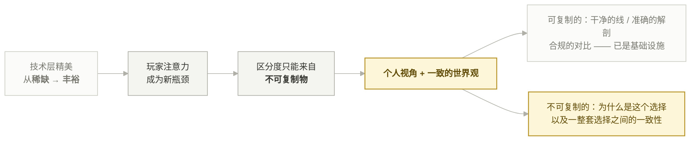


```text
技术层精美   从稀缺 → 丰裕
      ↓
玩家注意力   成为新瓶颈
      ↓
区分度       只能来自不可复制物
      ↓
个人视角 + 一致的世界观   ← 不可复制
```

---

## 4. 决策层的判据链

### 4.1 四步链条与反向验证法

正向：

```
意图  →  玩家需要读到什么  →  图像要传达的信息  →  选哪种技术手段
```

反向（这是本章的方法论，也是评审工具）：

> 任何一个色彩 / 剪影 / 构图决定，都要能回答：**「它让玩家读到了什么？」**
> 答不出来 —— 那是装饰，不是设计。

装饰不是罪，但装饰要**知道自己是装饰**，从而不占用注意力预算、不与判据信息抢读数。

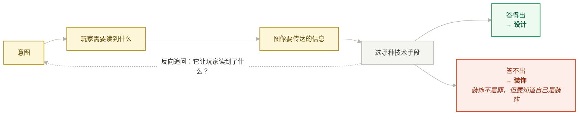

*正向是生产顺序，反向是评审工具。评审时只用反向那一条箭头 —— 它把「我觉得不好看」换成了一个可以回答的问题。*

### 4.2 策展式创作：选资源本身就是决策层行为

本项目美术全部来自 UE 商城，零自研。表面看这章没得讲，实际相反：

**当你不生产素材、只做筛选与组合时，技术层被完全外包了，剩下的动作 100% 是决策层。**

挑哪只怪、哪套武器、哪种氛围 —— 用的正是「玩家要读到什么」这把尺，只是把「画」换成了「选」。这不是退化版的创作，这是**AI 时代大多数人的真实位置**：素材过剩，判断稀缺。

> **策展是创作的一种形态。区别只在于解空间是别人给的，选择仍然是你的。**

---

## 5. 个人表达的空间在哪

「一切都要匹配意图」这句话容易被听成「美术没有自由」。不是。空间的位置可以说得很精确。

### 5.1 意图约束「读到什么」，不约束「用什么读法」

同一个信息 ——「这只怪很危险」—— 可以用完全不同的手段传达：

| 读法 | 手段 | 附带说了什么 |
|---|---|---|
| 体型压迫 | 放大轮廓、抬高视线 | 力量型、慢 |
| 色斑警戒 | 高饱和局部色 | 有毒、有机制 |
| 声音先行 | 出场前先听到 | 潜行压力、位置未知 |
| 肢体残缺 | 不对称、缺损 | 病变、悲剧感 |
| 移动节奏 | 抽搐、突进 | 不可预测 |

**五条都满足同一个判据，但它们说的不是同一件事。** 选哪一条，就是主美的表达 —— 而且这个表达是**可被追问、可被讨论**的，因为它有对照。

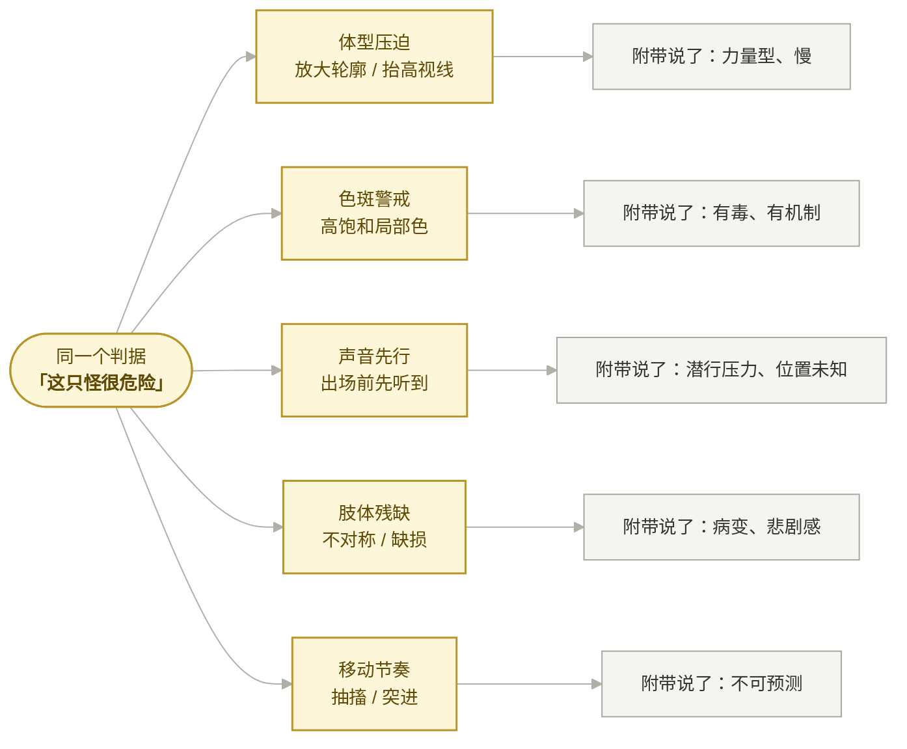

*判据只锁住左边那一格，五条路径都合法 —— **表达的空间就是这五条之间的选择**，而且因为有对照，它可被追问。*

所以结论不是「表达在约束之外」，而是：

> **表达 = 在同一约束下的解空间里选一条路径。**

这跟 Mark Rosewater 那条「**restrictions breed creativity**」是同一件事，也跟上田文人的「**减法设计**」同源 —— 砍掉的东西定义了剩下东西的意义。

### 5.2 无约束的表达无法被识别为表达

这条值得当金句：

> **没有约束，读者不知道你在做选择。**
> 一张纯自由创作的图，读者只能读到「作者会画画」；
> 一张在明确约束下做出取舍的图，读者能读到「作者选了这个，放弃了那个」—— **取舍才是信息。**

**约束越明确，表达越可辨认。** 这也解释了为什么 AI 出图看起来都「挺好」但没人记得住 —— 它没有取舍，因为它没有代价。

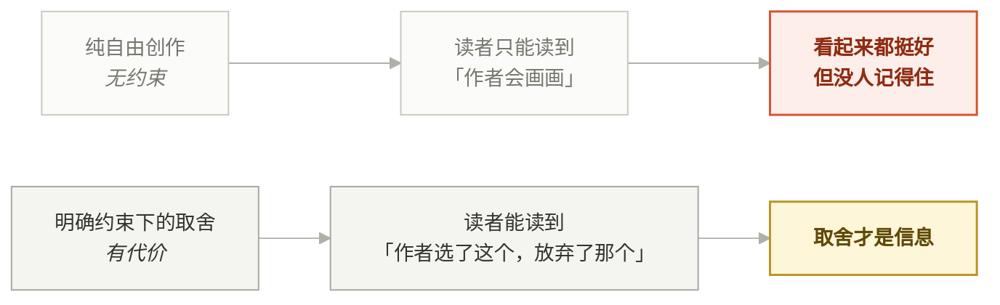

*没有约束，读者不知道你在做选择。AI 出图的问题正在这里：**它没有取舍，因为它没有代价。***

### 5.3 团队一致不靠风格描述，靠否决清单

「情绪表达与团队一致」这句在实践里最容易空转。一致靠什么落地？

| 形式 | 例子 | 能否逐张验 | 能否交给 AI |
|---|---|---|---|
| **风格描述** | 「暗黑写实」「压抑但不脏」 | ✗ 十个人十个理解 | ✗ |
| **参考集** | 一组标杆图 | △ 能对齐大方向，细节靠猜 | △ |
| **否决清单** | 「不出现纯饱和色」「剪影不对称」「感染相关必偏黄绿」「人形怪不加成套装甲」 | ✓ | ✓ |

不做这一步，AI 生成十张你会挑得很痛苦，而且**挑不稳** —— 因为你在用感觉当判据，而感觉不可复现，今天挑 A 明天挑 B。

这跟维度三（组织实践）的「判据成文」是同一件事：**把这一轮的不确定性，转化成下一轮的确定性。**

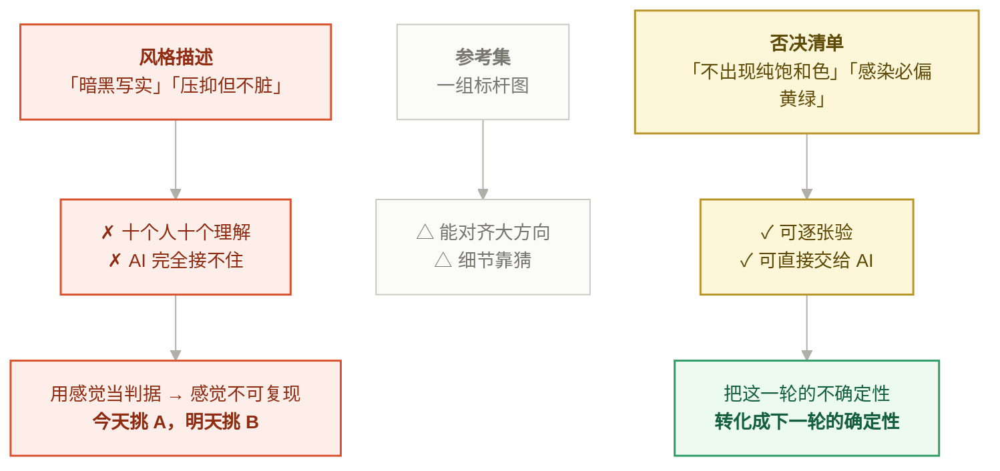

*三种形式都在说「我们要一致」，但只有第三种能被第二个人和 AI 执行。*

---

## 6. 落地物

本章不能只有观点。下面三件是我实际用来做判断和选择的东西：

### 6.1 否决清单（最高优先级）

- 形式：一句一条，**否定式**，可一眼判定。
- 数量：10～20 条足够，超过就没人记得。
- 硬要求：每条后面写**为什么** —— 否则半年后没人敢改，也没人敢用。

```text
✗ 感染相关的一切不使用红色      —— 红色已被「伤害/危险」占用，会串味
✗ 特殊怪剪影不得与普通怪同构    —— 剪影是「要不要协作」的唯一远距离读数
✗ 收益类 UI 不使用氛围化处理    —— 收益必须能被玩家算清，氛围会让它退化成猜
```

### 6.2 一致性锁

AI 时代新增的活。目标不是「画得快」，是**「控得住」**：

- 风格锚点（参考集 / LoRA / 固定提示片段）
- 命名与目录规范（本项目已有：模块前缀 + 职责域目录镜像）
- **配置单点化** —— 见 §7.4

### 6.3 选型清单：把「好看」从评分项里踢出去

商城资源选型看的是**接口**，不是观感：

| 评估项 | 类型 |
|---|---|
| 骨骼兼容性（能否复用现有 AnimBP / 动画集） | **一票否决** |
| 动画集是否齐（缺一个状态就要补一套） | **一票否决** |
| 许可范围（能否商用 / 能否修改） | **一票否决** |
| 能否拆分（模块化程度，能不能只取一部分） | 权重项 |
| **交互可读性**（玩家能否一眼读出怎么打） | 权重项，**本章新增** |
| 精美度 | 参考项，不参与否决 |

注意最后两行的位置关系：**交互可读性排在精美度之上。** 这一条是本章立论的直接后果。

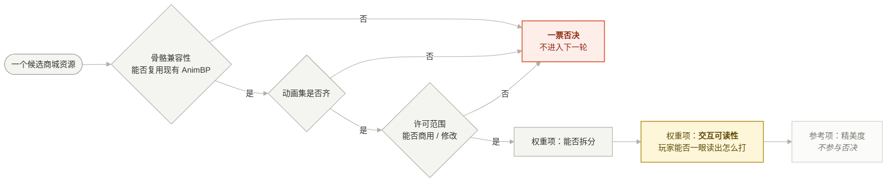

*漏斗的顺序就是结论：**接口一票否决 → 交互可读性 → 精美度垫底**。按「好看」选，返工会在两周后爆发。*

---

## 7. 与工程层的边界

维度二原本的工程叙事是「资产是约束条件，不是产出物」，流程是四步：

```text
① 先跑起来 → ② 明确功能与资产边界 → ③ 双向匹配 → ④ 迭代资产
```

这套跟本章的美术表达论**不冲突**，因为它们管的不是同一件事。

### 7.1 管道 vs 内容

| | 管的是 | 关键产物 |
|---|---|---|
| 结构先行 / 资产替身 | **管道** | 骨骼接口、Definition 字段、Cue 标签、命名规范 |
| 意图下的概念设计 | **内容** | 读到什么、怎么读、取舍 |

**替身资产占的是管道位置，不占表达位置。** 所以「先用商城资源跑起来」是在**内容进场之前先把管道验通**。

商城资源在预研期的真正价值也不是省钱，是：

> **把抽象设计变成一个可玩的错。** 设计的坑只在能跑的循环里显形，在文档里永远看不见。

### 7.2 两类资产，先画线再选

| 类型 | 内容 | 换掉的代价 |
|---|---|---|
| **结构性资产** | 骨骼、AnimBP 接口、动画状态集、命名前缀、Definition 字段、Cue 标签 | 高 —— 要动代码 |
| **可替换资产（替身）** | 模型、贴图、音效、特效 | 低 —— 只动数据 |

这条线画在哪，决定后面换资产要不要重写逻辑。**先画线，再选资产。**

### 7.3 唯一真冲突：结构性依赖长在替身的美术特征上

前面说两者不冲突，有一个例外，而且只有这一个：

> **当逻辑依赖了替身资产的美术特征时**（模型比例、挂点位置、动画时长、剪影轮廓、材质槽位数量），换正式资产就得动代码。

这才是反模式表里「替身资产当最终资产用」的**精确含义**。原来那条写得太含糊，建议改成这句 —— 含糊的规则等于没有规则。

判定方法很简单：问一句「**换掉这个资产，有几行代码要改？**」答案不是零，就说明依赖已经长进去了。

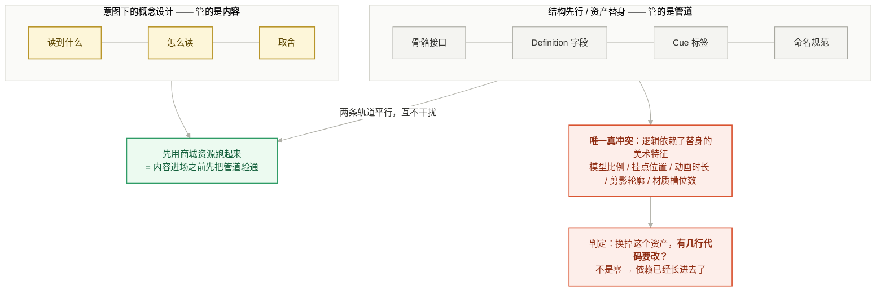

*「替身资产当最终资产用」这条反模式的精确含义就是右下那一格 —— 含糊的规则等于没有规则。*

### 7.4 技术兜底：配置单点化

本项目的做法：外观 / 动画 / 音效 / Cue 标签**全部集中在** `UBEWeaponDefinition` / `UBEItemDefinition` 数据资产里，代码从定义往下推（如 `ABEWeaponVisual::InitFromDefinition`）。

规范的唯一目的：**换资产时代码不改。**

一条硬规矩：

> **蓝图是 AI 的盲区。** 能放数据资产 / 代码的配置就不要放蓝图 —— 否则 AI 看不见、改不到，**而且不会告诉你它没看见。**

这条在美术侧尤其要紧：美术配置最容易被顺手塞进蓝图，然后一致性再也维持不住。

---

## 8. 反模式清单

| 反模式 | 后果 | 正确做法 |
|---|---|---|
| 用「好看 / 不好看」做评审语言 | 不可证伪，只能靠权威裁定，无法传递 | 问「玩家读到了什么」 |
| 精美但误导的画面 | 玩家相信画面，做错决定，回头骂设计 | 可读性排在精美度之前 |
| 风险信息给精确数字 | 压迫感退化成算术，张力消失 | 收益精确、风险氛围 |
| 用风格描述维持一致 | 十个人十个理解，AI 完全接不住 | 否决清单 |
| 按「好看」选商城资源 | 接口不兼容，返工在两周后爆发 | 选型清单，接口一票否决 |
| 商城资源原样拖进项目 | 目录命名被污染，AI 失去「照着旁边同类文件写」的能力 | 先立规范再入库 |
| 逻辑依赖替身资产的美术特征 | 换正式资产要改代码 | §7.3 的一句话判定 |
| 把美术配置塞进蓝图 | AI 盲区，一致性无法维持 | 配置单点化到 Definition |
| 把「AI 能出图」当成美术不重要 | 拿到一堆各画各的精美图，合集不成立 | 涨价的是视角，见 §3.3 |
